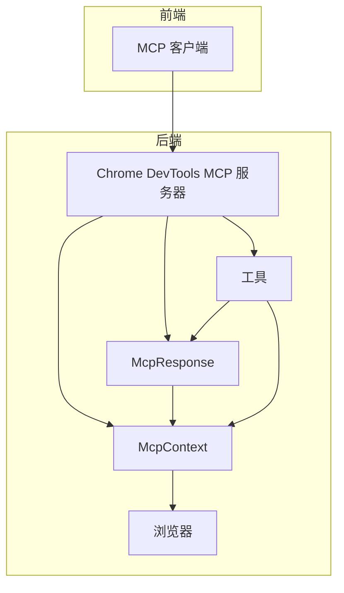
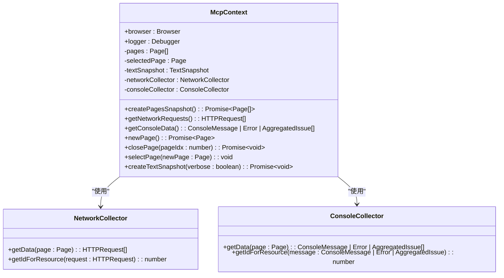
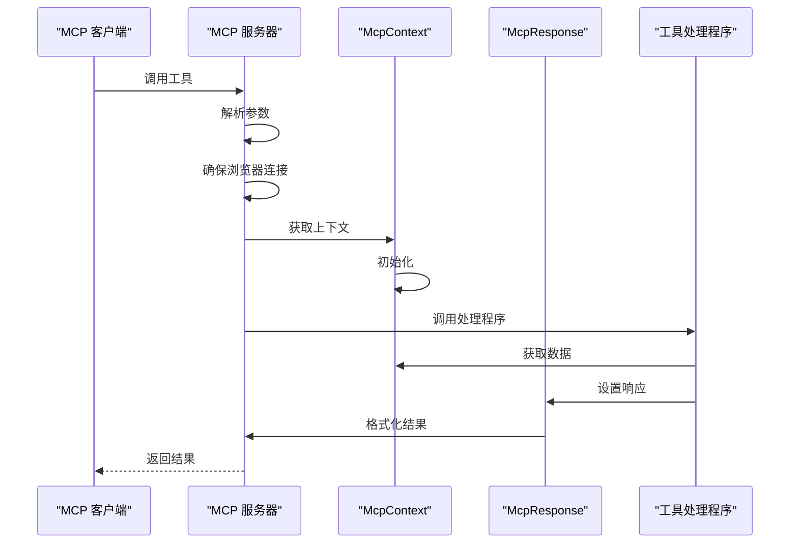
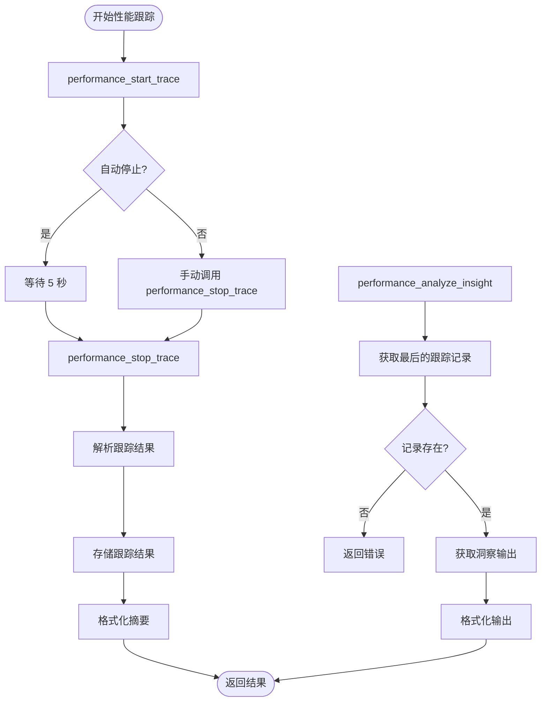

# AI 上下文系统

<cite>
**本文档中引用的文件**   
- [README.md](file://README.md)
- [McpContext.ts](file://src/McpContext.ts)
- [main.ts](file://src/main.ts)
- [browser.ts](file://src/browser.ts)
- [cli.ts](file://src/cli.ts)
- [McpResponse.ts](file://src/McpResponse.ts)
- [PageCollector.ts](file://src/PageCollector.ts)
- [DevtoolsUtils.ts](file://src/DevtoolsUtils.ts)
- [parse.ts](file://src/trace-processing/parse.ts)
- [pages.ts](file://src/tools/pages.ts)
- [snapshot.ts](file://src/tools/snapshot.ts)
- [performance.ts](file://src/tools/performance.ts)
</cite>

## 目录
1. [简介](#简介)
2. [项目结构](#项目结构)
3. [核心组件](#核心组件)
4. [架构概述](#架构概述)
5. [详细组件分析](#详细组件分析)
6. [依赖分析](#依赖分析)
7. [性能考虑](#性能考虑)
8. [故障排除指南](#故障排除指南)
9. [结论](#结论)

## 简介

`chrome-devtools-mcp` 是一个模型上下文协议（MCP）服务器，允许编码代理（如 Gemini、Claude、Cursor 或 Copilot）控制和检查实时 Chrome 浏览器。它通过提供对 Chrome DevTools 的完全访问权限，使 AI 编码助手能够进行可靠的自动化、深入的调试和性能分析。

该项目的主要功能包括：
- **获取性能洞察**：使用 Chrome DevTools 记录跟踪并提取可操作的性能洞察。
- **高级浏览器调试**：分析网络请求、截取屏幕截图并检查浏览器控制台。
- **可靠的自动化**：使用 Puppeteer 自动化 Chrome 中的操作，并自动等待操作结果。

**Section sources**
- [README.md](file://README.md#L1-L526)

## 项目结构

该项目具有清晰的模块化结构，主要分为以下几个目录：
- `docs/`：包含工具参考、故障排除等文档。
- `scripts/`：包含生成文档、构建后处理等脚本。
- `src/`：包含核心源代码，进一步细分为 formatters、tools、trace-processing、utils 等子目录。
- `tests/`：包含各种组件的测试文件。

核心源代码位于 `src/` 目录下，其中 `main.ts` 是入口点，`McpContext.ts` 是核心上下文管理类，`tools/` 目录包含各种功能工具的实现。

**Section sources**
- [README.md](file://README.md#L1-L526)

## 核心组件

`chrome-devtools-mcp` 的核心组件包括 `McpContext`、`McpResponse` 和各种工具定义。`McpContext` 类管理浏览器实例、页面状态和各种收集器（如网络和控制台收集器）。`McpResponse` 类负责格式化和返回工具调用的结果。工具定义位于 `src/tools/` 目录下，每个工具都通过 `defineTool` 函数注册，并具有描述、输入模式和处理程序。

**Section sources**
- [McpContext.ts](file://src/McpContext.ts#L1-L655)
- [McpResponse.ts](file://src/McpResponse.ts#L1-L579)
- [main.ts](file://src/main.ts#L1-L196)

## 架构概述

**Diagram sources **
- [main.ts](file://src/main.ts#L1-L196)
- [McpContext.ts](file://src/McpContext.ts#L1-L655)
- [McpResponse.ts](file://src/McpResponse.ts#L1-L579)

## 详细组件分析

### McpContext 分析

`McpContext` 类是 `chrome-devtools-mcp` 的核心，负责管理浏览器实例、页面状态和各种收集器。它提供了创建页面快照、获取网络请求和控制台数据、处理对话框等方法。

**Diagram sources **
- [McpContext.ts](file://src/McpContext.ts#L1-L655)
- [PageCollector.ts](file://src/PageCollector.ts#L1-L396)

### 工具调用流程分析

当 MCP 客户端调用一个工具时，`chrome-devtools-mcp` 服务器会执行以下步骤：
1. 解析命令行参数并初始化配置。
2. 确保浏览器已连接或启动。
3. 获取或创建 `McpContext` 实例。
4. 调用相应的工具处理程序。
5. 使用 `McpResponse` 格式化结果并返回给客户端。

**Diagram sources **
- [main.ts](file://src/main.ts#L1-L196)
- [McpContext.ts](file://src/McpContext.ts#L1-L655)
- [McpResponse.ts](file://src/McpResponse.ts#L1-L579)

### 性能分析工具分析

性能分析工具允许用户启动和停止性能跟踪，以及分析跟踪结果。`performance_start_trace` 工具启动跟踪，`performance_stop_trace` 工具停止跟踪并解析结果，`performance_analyze_insight` 工具提供对特定性能洞察的详细信息。

**Diagram sources **
- [performance.ts](file://src/tools/performance.ts#L1-L194)
- [parse.ts](file://src/trace-processing/parse.ts#L1-L131)

**Section sources**
- [McpContext.ts](file://src/McpContext.ts#L1-L655)
- [main.ts](file://src/main.ts#L1-L196)
- [performance.ts](file://src/tools/performance.ts#L1-L194)
- [parse.ts](file://src/trace-processing/parse.ts#L1-L131)

## 依赖分析

`chrome-devtools-mcp` 依赖于多个第三方库，包括 `puppeteer-core` 用于浏览器自动化，`yargs` 用于命令行参数解析，`zod` 用于数据验证，以及 `@modelcontextprotocol/sdk` 用于 MCP 服务器功能。这些依赖项在 `package.json` 中定义，并通过 `src/third_party/index.ts` 统一导出。

**Section sources**
- [package.json](file://package.json)
- [src/third_party/index.ts](file://src/third_party/index.ts#L1-L32)

## 性能考虑

`chrome-devtools-mcp` 在性能方面进行了多项优化，包括：
- 使用 `NetworkCollector` 和 `ConsoleCollector` 高效地收集网络和控制台数据。
- 通过 `WaitForHelper` 类自动等待操作结果，确保可靠的自动化。
- 支持 CPU 和网络节流，以模拟不同的网络条件。
- 使用分页功能处理大量网络请求和控制台消息。

**Section sources**
- [McpContext.ts](file://src/McpContext.ts#L1-L655)
- [WaitForHelper.ts](file://src/WaitForHelper.ts#L1-L100)
- [PageCollector.ts](file://src/PageCollector.ts#L1-L396)

## 故障排除指南

如果遇到问题，可以参考以下步骤进行故障排除：
1. 检查 Node.js 版本是否符合要求（v20.19 或更高版本）。
2. 确保 Chrome 浏览器已正确安装并运行。
3. 检查 MCP 客户端配置是否正确。
4. 查看日志文件以获取详细的错误信息。
5. 参考 `docs/troubleshooting.md` 中的故障排除指南。

**Section sources**
- [README.md](file://README.md#L1-L526)
- [docs/troubleshooting.md](file://docs/troubleshooting.md)

## 结论

`chrome-devtools-mcp` 是一个功能强大的工具，为 AI 编码助手提供了对 Chrome DevTools 的完全访问权限。通过其模块化的架构和丰富的功能集，它能够支持可靠的自动化、深入的调试和性能分析。该项目的设计考虑了可扩展性和易用性，使其成为集成到各种开发工作流中的理想选择。