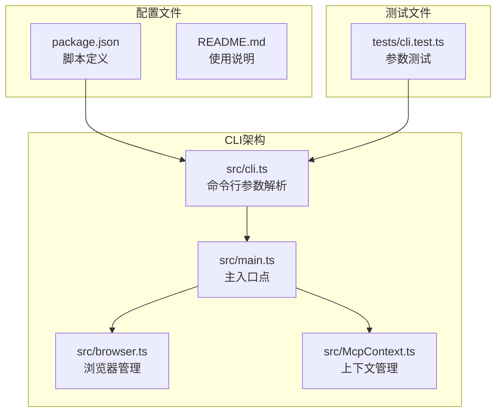
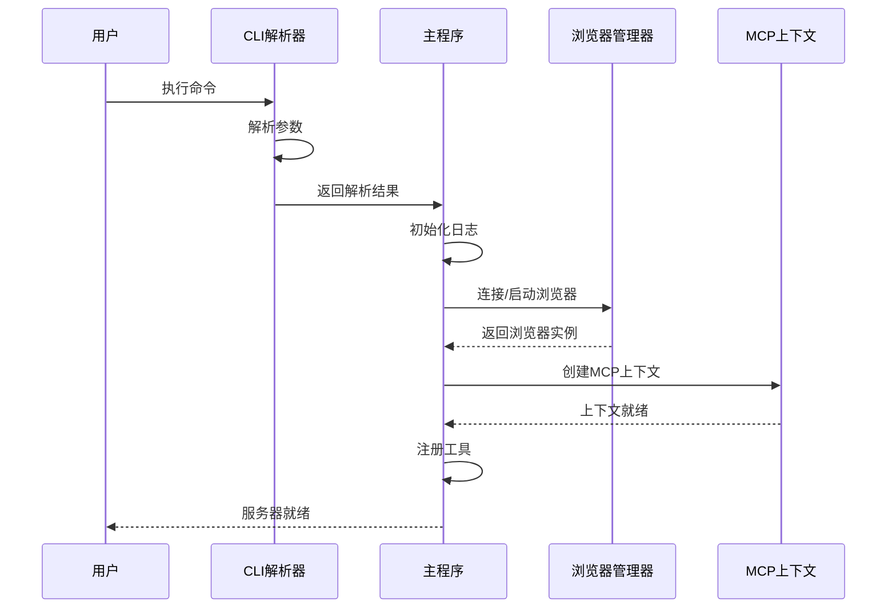
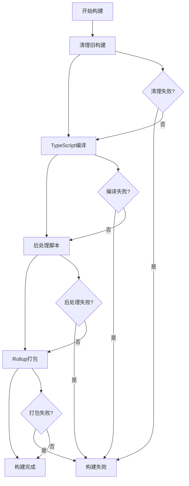
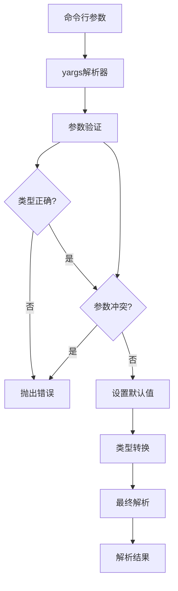
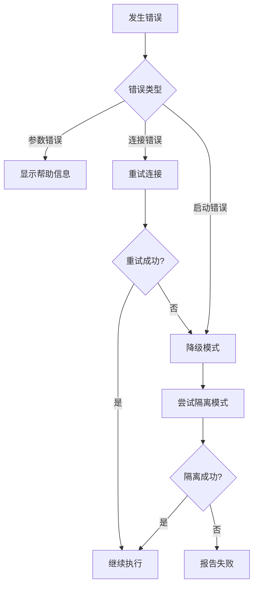

# 命令行参考

<cite>
**本文档中引用的文件**
- [src/cli.ts](file://src/cli.ts)
- [src/main.ts](file://src/main.ts)
- [src/browser.ts](file://src/browser.ts)
- [src/McpContext.ts](file://src/McpContext.ts)
- [package.json](file://package.json)
- [tests/cli.test.ts](file://tests/cli.test.ts)
- [README.md](file://README.md)
</cite>

## 更新摘要
**已更改内容**
- 在"浏览器配置参数"部分添加了新的`--user-data-dir`参数说明
- 更新了"高级使用示例"部分，添加了使用自定义用户数据目录的示例
- 在"故障排除指南"中更新了相关说明

## 目录
1. [简介](#简介)
2. [项目结构概览](#项目结构概览)
3. [核心CLI组件](#核心cli组件)
4. [start命令详解](#start命令详解)
5. [build和test命令](#build和test命令)
6. [参数详细说明](#参数详细说明)
7. [参数解析机制](#参数解析机制)
8. [高级使用示例](#高级使用示例)
9. [错误处理](#错误处理)
10. [故障排除指南](#故障排除指南)

## 简介

Chrome DevTools MCP是一个Model-Context-Protocol服务器，允许AI编码助手控制和检查实时Chrome浏览器。该工具提供了丰富的命令行接口，支持多种配置选项来定制浏览器实例的行为。

本文档详细说明了所有可用的命令行参数，包括它们的类型、默认值、描述和使用示例，帮助开发者充分利用这个强大的自动化工具。

## 项目结构概览



**图表来源**
- [src/cli.ts](file://src/cli.ts#L1-L217)
- [src/main.ts](file://src/main.ts#L1-L191)
- [src/browser.ts](file://src/browser.ts#L1-L184)

## 核心CLI组件

CLI系统的核心由以下组件构成：

### 参数定义模块
CLI参数通过`cliOptions`对象进行统一定义，使用yargs库进行解析和验证。

### 参数解析器
`parseArguments`函数负责：
- 解析命令行参数
- 设置默认值
- 验证参数冲突
- 提供使用示例

### 浏览器连接管理
根据参数决定是连接现有浏览器实例还是启动新的浏览器实例。

**章节来源**
- [src/cli.ts](file://src/cli.ts#L10-L158)
- [src/main.ts](file://src/main.ts#L38-L86)

## start命令详解

### 基本用法

```bash
npx chrome-devtools-mcp@latest [选项]
```

### 启动流程



**图表来源**
- [src/main.ts](file://src/main.ts#L38-L86)
- [src/browser.ts](file://src/browser.ts#L35-L60)

### 参数组合策略

系统支持多种参数组合方式：

1. **自动启动模式**：当没有指定连接参数时，自动启动Chrome浏览器
2. **连接现有实例**：通过`--browserUrl`或`--wsEndpoint`连接到运行中的浏览器
3. **自定义配置**：使用各种参数定制浏览器行为

**章节来源**
- [src/main.ts](file://src/main.ts#L45-L86)

## build和test命令

### build命令

构建过程包含以下步骤：



**图表来源**
- [package.json](file://package.json#L8-L12)

### test命令

测试系统提供全面的质量保证：

- **单元测试**：针对各个模块的功能测试
- **集成测试**：测试工具和服务的集成
- **端到端测试**：完整的工作流测试

**章节来源**
- [package.json](file://package.json#L13-L22)

## 参数详细说明

### 连接参数

| 参数名 | 类型 | 默认值 | 描述 |
|--------|------|--------|------|
| `--browserUrl` | string | - | 使用端口转发连接到运行中的Chrome实例 |
| `--wsEndpoint` | string | - | WebSocket端点连接到运行中的Chrome实例 |
| `--wsHeaders` | string | - | WebSocket连接的自定义JSON格式头部 |

#### browserUrl参数
- **用途**：连接到HTTP远程调试端口
- **示例**：`--browserUrl http://127.0.0.1:9222`
- **验证**：必须是有效的URL格式

#### wsEndpoint参数
- **用途**：直接连接到WebSocket调试端点
- **示例**：`--wsEndpoint ws://127.0.0.1:9222/devtools/browser/abc123`
- **协议要求**：必须使用`ws://`或`wss://`协议

#### wsHeaders参数
- **用途**：为WebSocket连接添加认证头部
- **格式**：JSON字符串
- **示例**：`--wsHeaders '{"Authorization":"Bearer token"}'`

### 浏览器配置参数

| 参数名 | 类型 | 默认值 | 描述 |
|--------|------|--------|------|
| `--headless` | boolean | `false` | 以无头模式运行（无UI界面） |
| `--executablePath` | string | - | 自定义Chrome可执行文件路径 |
| `--channel` | string | `'stable'` | 指定要使用的Chrome通道 |
| `--viewport` | string | - | 初始视口大小（如`1280x720`） |
| `--isolated` | boolean | `false` | 创建临时用户数据目录 |
| `--user-data-dir` | string | - | 指定自定义的Chrome用户数据目录路径 |

#### channel参数选项
- `stable`：稳定版Chrome（默认）
- `canary`：Chrome Canary
- `beta`：Chrome Beta
- `dev`：Chrome Dev

#### viewport参数
- **格式**：`宽度x高度`（如`1280x720`）
- **限制**：无头模式下最大尺寸为3840x2160像素
- **验证**：必须是有效的数字格式

#### user-data-dir参数
- **用途**：指定自定义的Chrome用户数据目录路径，用于存储浏览器配置、缓存、扩展等数据
- **默认值**：Linux/macOS为`$HOME/.cache/chrome-devtools-mcp/chrome-profile-$CHANNEL`，Windows为`%HOMEPATH%/.cache/chrome-devtools-mcp/chrome-profile-$CHANNEL`
- **示例**：`--user-data-dir=/tmp/custom-chrome-profile`
- **注意事项**：
  - 与`--isolated`参数互斥，不能同时使用
  - 与`--browserUrl`和`--wsEndpoint`参数互斥，不能同时使用
  - 如果指定的目录不存在，系统会自动创建
  - 该目录中的数据在会话结束后不会自动清除，除非使用`--isolated`模式

### 高级配置参数

| 参数名 | 类型 | 默认值 | 描述 |
|--------|------|--------|------|
| `--proxyServer` | string | - | 代理服务器配置 |
| `--acceptInsecureCerts` | boolean | - | 接受不安全证书 |
| `--chromeArg` | array | - | Chrome额外启动参数 |
| `--logFile` | string | - | 调试日志输出文件路径 |

#### chromeArg参数
- **用途**：传递给Chrome的额外启动参数
- **示例**：`--chrome-arg='--no-sandbox' --chrome-arg='--disable-setuid-sandbox'`
- **注意事项**：谨慎使用沙箱禁用参数

### 工具分类控制

| 参数名 | 类型 | 默认值 | 描述 |
|--------|------|--------|------|
| `--categoryEmulation` | boolean | `true` | 启用/禁用仿真类工具 |
| `--categoryPerformance` | boolean | `true` | 启用/禁用性能类工具 |
| `--categoryNetwork` | boolean | `true` | 启用/禁用网络类工具 |

**章节来源**
- [src/cli.ts](file://src/cli.ts#L10-L158)
- [src/main.ts](file://src/main.ts#L78-L79)
- [src/browser.ts](file://src/browser.ts#L82-L83)

## 参数解析机制

### yargs配置

CLI使用yargs库进行参数解析，具有以下特性：



**图表来源**
- [src/cli.ts](file://src/cli.ts#L158-L217)

### 错误处理机制

1. **语法错误**：无效的参数格式
2. **类型错误**：参数类型不匹配
3. **冲突检测**：互斥参数同时使用
4. **范围验证**：数值参数超出范围

### 参数冲突规则

- `browserUrl` 和 `wsEndpoint` 互斥
- `executablePath` 与远程连接参数互斥
- `channel` 与远程连接参数互斥
- `userDataDir` 与 `isolated`、`browserUrl` 和 `wsEndpoint` 互斥

**章节来源**
- [src/cli.ts](file://src/cli.ts#L158-L175)

## 高级使用示例

### 无头模式下模拟移动设备

```bash
npx chrome-devtools-mcp@latest \
  --headless \
  --viewport 375x667 \
  --chrome-arg='--user-agent="Mozilla/5.0 (iPhone; CPU iPhone OS 14_0 like Mac OS X) AppleWebKit/605.1.15 (KHTML, like Gecko) Version/14.0 Mobile/15E148 Safari/604.1"' \
  --category-emulation
```

### 连接到现有浏览器实例

```bash
# 启动Chrome调试模式
google-chrome --remote-debugging-port=9222 --user-data-dir=/tmp/chrome-profile

# 连接到运行中的实例
npx chrome-devtools-mcp@latest \
  --browserUrl http://127.0.0.1:9222 \
  --logFile /tmp/chrome-devtools.log
```

### 性能测试环境配置

```bash
npx chrome-devtools-mcp@latest \
  --channel canary \
  --isolated \
  --proxyServer http://proxy.company.com:8080 \
  --acceptInsecureCerts \
  --no-category-network \
  --logFile /var/log/chrome-devtools-mcp.log
```

### 开发调试配置

```bash
DEBUG=* npx chrome-devtools-mcp@latest \
  --headless \
  --logFile debug.log \
  --chrome-arg='--enable-logging' \
  --chrome-arg='--v=1'
```

### 使用自定义用户数据目录

```bash
# 使用自定义用户数据目录启动Chrome
npx chrome-devtools-mcp@latest \
  --user-data-dir=/path/to/custom/profile \
  --channel stable \
  --viewport 1920x1080 \
  --logFile /var/log/custom-profile.log
```

**章节来源**
- [tests/cli.test.ts](file://tests/cli.test.ts#L111-L200)
- [README.md](file://README.md#L482-L483)

## 错误处理

### 常见错误类型

1. **参数解析错误**
   - 无效的URL格式
   - JSON格式错误
   - 数字格式错误

2. **连接错误**
   - 端口被占用
   - WebSocket连接失败
   - 认证失败

3. **浏览器启动错误**
   - 可执行文件不存在
   - 权限不足
   - 内存不足

### 错误恢复策略



### 日志记录

系统提供详细的日志记录功能：
- **调试日志**：启用`DEBUG=*`环境变量
- **文件日志**：通过`--logFile`参数指定
- **错误追踪**：完整的堆栈跟踪信息

**章节来源**
- [src/main.ts](file://src/main.ts#L146-L189)

## 故障排除指南

### 连接问题

1. **检查端口状态**
   ```bash
   netstat -an | grep 9222
   ```

2. **验证防火墙设置**
   ```bash
   sudo ufw status
   ```

3. **检查Chrome版本兼容性**

### 性能问题

1. **内存使用监控**
   ```bash
   top -p $(pgrep chrome)
   ```

2. **CPU使用率分析**
   ```bash
   htop
   ```

3. **磁盘空间检查**
   ```bash
   df -h ~/.cache/chrome-devtools-mcp/
   ```

### 调试技巧

1. **启用详细日志**
   ```bash
   DEBUG=mcp:* npx chrome-devtools-mcp@latest --help
   ```

2. **使用隔离模式**
   ```bash
   npx chrome-devtools-mcp@latest --isolated --headless
   ```

3. **检查依赖版本**
   ```bash
   node --version
   npm list puppeteer
   ```

4. **使用自定义用户数据目录进行调试**
   ```bash
   # 使用临时目录避免影响主配置
   npx chrome-devtools-mcp@latest --user-data-dir=/tmp/debug-profile --headless
   ```

**章节来源**
- [README.md](file://README.md#L400-L483)

## 结论

Chrome DevTools MCP的命令行接口提供了强大而灵活的配置选项，支持从简单的浏览器启动到复杂的自动化场景。通过合理配置参数，开发者可以创建适合特定需求的浏览器实例，实现可靠的自动化测试和调试工作流。

建议在生产环境中使用隔离模式，并定期更新到最新版本以获得最佳性能和安全性。新添加的`--user-data-dir`参数为用户提供了更大的灵活性，可以指定自定义的用户数据目录，这对于需要保持特定浏览器配置或避免影响主配置的场景非常有用。