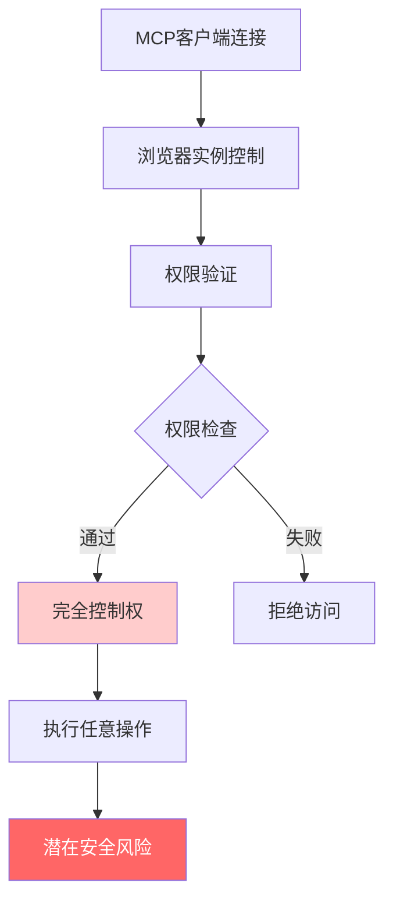
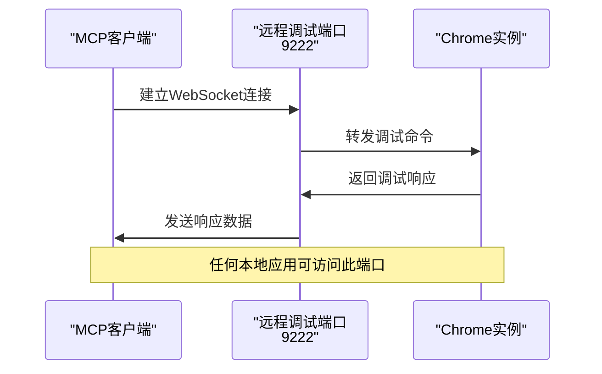
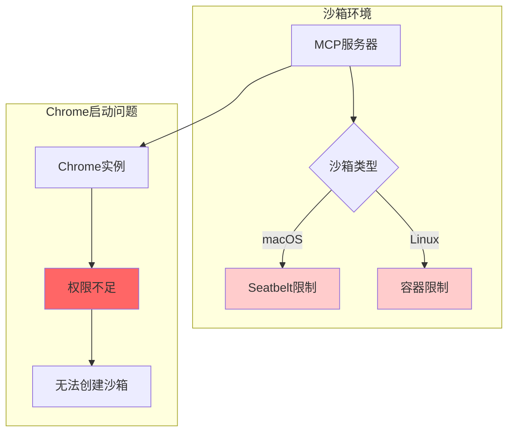
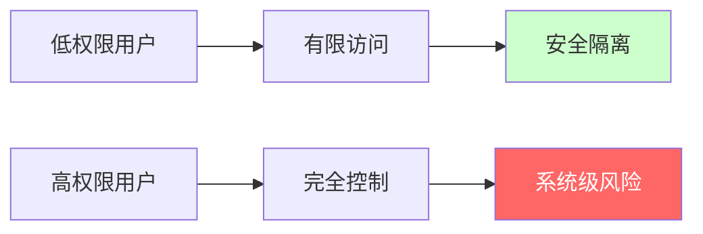
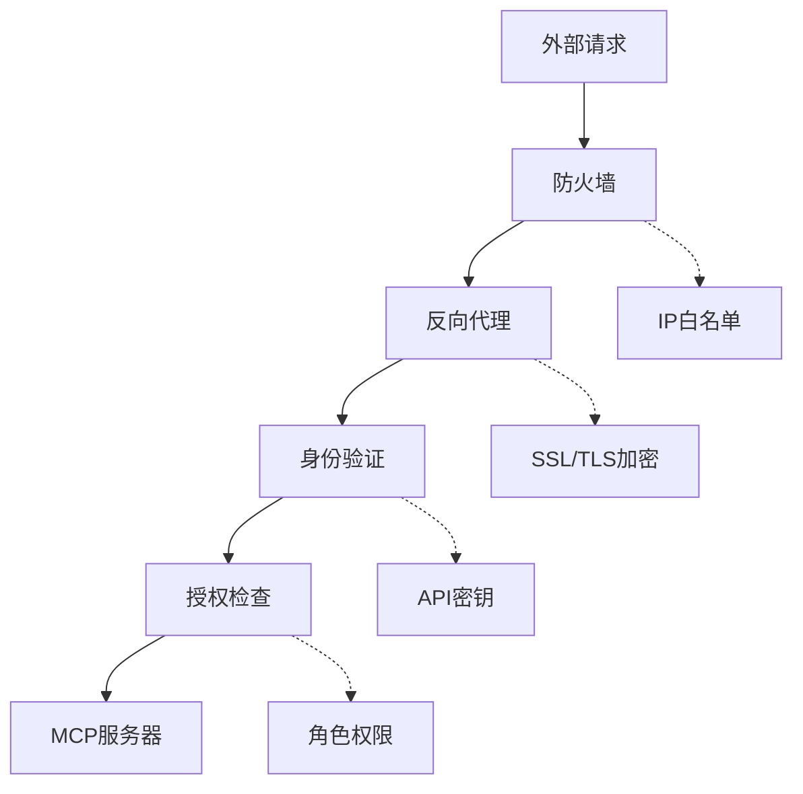
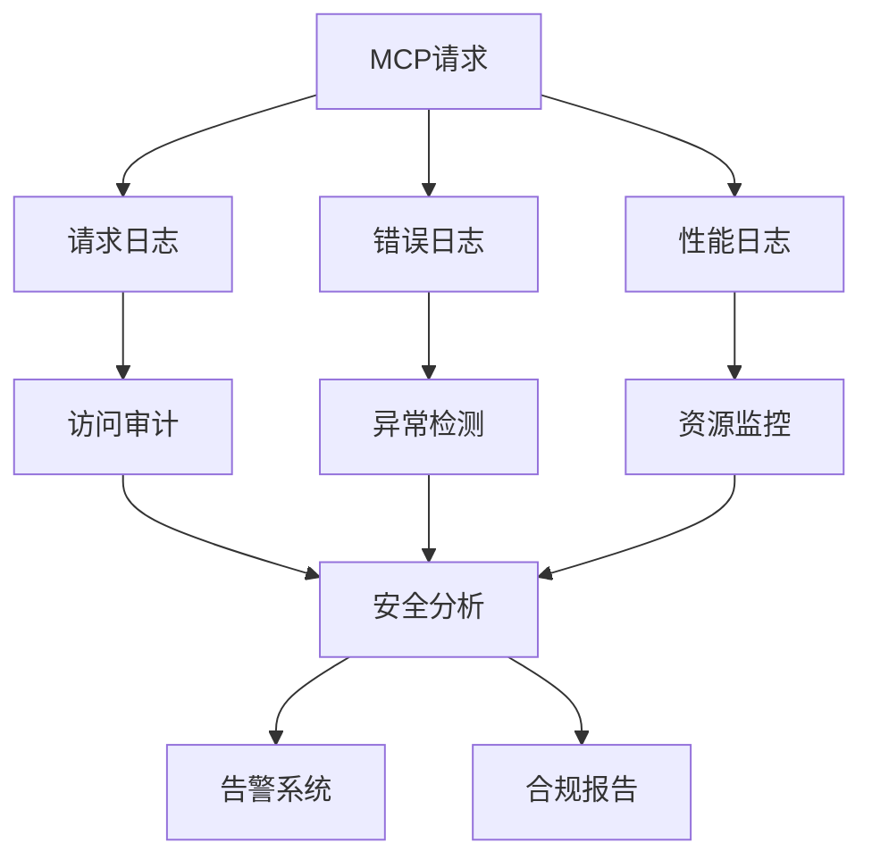
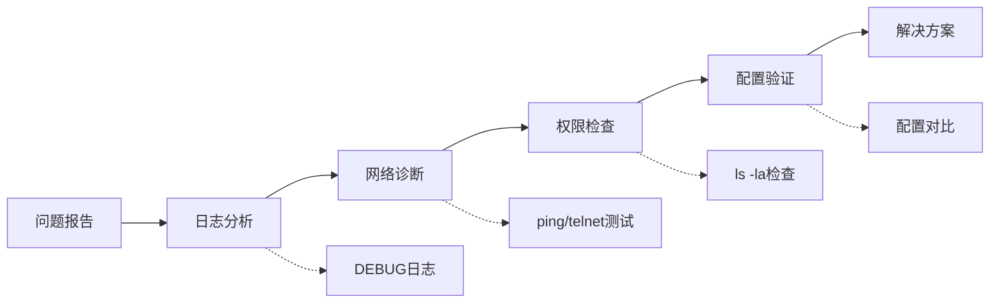

# 安全须知

<cite>
**本文档中引用的文件**
- [README.md](file://README.md)
- [SECURITY.md](file://SECURITY.md)
- [server.json](file://server.json)
- [package.json](file://package.json)
- [src/main.ts](file://src/main.ts)
- [src/browser.ts](file://src/browser.ts)
- [src/cli.ts](file://src/cli.ts)
- [src/logger.ts](file://src/logger.ts)
- [src/tools/input.ts](file://src/tools/input.ts)
- [src/tools/pages.ts](file://src/tools/pages.ts)
- [src/Mutex.ts](file://src/Mutex.ts)
- [CONTRIBUTING.md](file://CONTRIBUTING.md)
</cite>

## 目录
1. [简介](#简介)
2. [核心安全风险](#核心安全风险)
3. [完全浏览器控制权](#完全浏览器控制权)
4. [远程调试端口暴露](#远程调试端口暴露)
5. [沙箱环境最佳实践](#沙箱环境最佳实践)
6. [权限提升风险](#权限提升风险)
7. [安全配置建议](#安全配置建议)
8. [访问控制与认证](#访问控制与认证)
9. [审计与监控](#审计与监控)
10. [漏洞报告流程](#漏洞报告流程)
11. [故障排除指南](#故障排除指南)
12. [结论](#结论)

## 简介

Chrome DevTools MCP（Model-Context-Protocol）是一个强大的工具，允许AI编码助手通过Chrome DevTools协议控制和检查实时浏览器实例。虽然该工具提供了卓越的自动化能力和调试功能，但其设计特性也带来了重要的安全考虑。本安全须知文档旨在帮助用户充分理解潜在风险，并采取适当的防护措施。

## 核心安全风险

### 工具能力概述

Chrome DevTools MCP具有以下核心能力：
- **完全浏览器控制**：能够执行任何浏览器操作，包括导航、输入、截图等
- **深度调试访问**：可以检查和修改浏览器内部状态
- **网络请求拦截**：能够监控和修改所有网络通信
- **页面内容访问**：可以读取和修改页面DOM结构
- **自动化脚本执行**：支持复杂的用户交互自动化

### 潜在威胁场景

由于该工具拥有对浏览器的完全控制权，攻击者可能利用以下方式造成损害：

1. **恶意自动化**：执行钓鱼攻击、数据窃取或系统破坏
2. **敏感信息泄露**：访问登录凭据、个人数据或企业机密
3. **系统入侵**：利用浏览器漏洞进行横向移动
4. **资源滥用**：消耗计算资源或发起DDoS攻击

## 完全浏览器控制权

### 权限范围

Chrome DevTools MCP服务器启动后，MCP客户端将获得对浏览器实例的完全控制权限。这种控制包括但不限于：

- **页面导航**：任意URL跳转和历史记录操作
- **用户输入**：模拟键盘输入、鼠标点击和拖拽操作
- **表单操作**：自动填写表单、上传文件和提交数据
- **网络通信**：拦截、修改或阻止网络请求
- **开发者工具**：直接访问和修改开发工具功能

### 风险评估



**图表来源**
- [src/main.ts](file://src/main.ts#L80-L120)
- [src/browser.ts](file://src/browser.ts#L40-L80)

### 敏感信息保护

**重要警告**：使用Chrome DevTools MCP时，请避免处理任何敏感或个人信息，因为这些信息将暴露给MCP客户端。

**章节来源**
- [README.md](file://README.md#L25-L30)
- [src/main.ts](file://src/main.ts#L85-L95)

## 远程调试端口暴露

### 端口调试机制

Chrome DevTools MCP支持通过远程调试端口连接到现有Chrome实例。这种机制虽然提供了灵活性，但也带来了显著的安全风险。

### 危险配置示例



**图表来源**
- [src/browser.ts](file://src/browser.ts#L40-L60)
- [src/cli.ts](file://src/cli.ts#L15-L35)

### 安全配置要求

启用远程调试端口时必须遵循以下安全准则：

1. **使用非默认用户数据目录**：防止常规浏览数据暴露
2. **限制网络访问**：仅监听本地接口（127.0.0.1）
3. **实施身份验证**：使用自定义头部进行访问控制
4. **定期清理会话**：及时关闭不再需要的调试连接

**章节来源**
- [README.md](file://README.md#L436-L440)
- [src/browser.ts](file://src/browser.ts#L45-L85)

## 沙箱环境最佳实践

### 操作系统沙箱限制

某些MCP客户端支持使用macOS Seatbelt或Linux容器对MCP服务器进行沙箱化。然而，Chrome DevTools MCP存在以下限制：



**图表来源**
- [README.md](file://README.md#L470-L482)

### 解决方案策略

1. **禁用沙箱**：在MCP客户端中为chrome-devtools-mcp禁用沙箱
2. **外部启动**：手动启动Chrome实例并使用`--browser-url`连接
3. **权限调整**：确保MCP服务器有足够的系统权限

**章节来源**
- [README.md](file://README.md#L470-L482)

## 权限提升风险

### 高权限运行风险

当Chrome DevTools MCP服务器以高权限用户（如root或管理员）运行时，存在严重的权限提升风险：

### 权限级别影响



### 风险缓解措施

1. **最小权限原则**：以普通用户权限运行MCP服务器
2. **进程隔离**：使用专用用户账户运行服务
3. **资源限制**：设置CPU和内存使用上限
4. **网络隔离**：限制网络访问权限

## 安全配置建议

### 推荐配置参数

以下是生产环境推荐的安全配置：

| 配置项 | 推荐值 | 安全理由 |
|--------|--------|----------|
| `--headless` | `true` | 减少UI攻击面 |
| `--isolated` | `true` | 防止数据持久化 |
| `--channel` | `stable` | 使用稳定版本 |
| `--logFile` | `/var/log/chrome-mcp.log` | 启用审计日志 |
| `--acceptInsecureCerts` | `false` | 禁用不安全证书 |

### 配置示例

```bash
# 生产环境安全配置
npx chrome-devtools-mcp@latest \
  --headless=true \
  --isolated=true \
  --channel=stable \
  --logFile=/var/log/chrome-mcp.log \
  --categoryEmulation=false \
  --categoryPerformance=false
```

**章节来源**
- [src/cli.ts](file://src/cli.ts#L15-L120)
- [src/browser.ts](file://src/browser.ts#L85-L120)

### 网络配置安全

对于需要网络访问的场景，建议配置代理服务器：

```bash
# 代理服务器配置
npx chrome-devtools-mcp@latest \
  --proxyServer="http://proxy.company.com:8080" \
  --chromeArg="--no-proxy-server"
```

## 访问控制与认证

### 多层防护架构



### 实施建议

1. **网络层防护**
   - 仅允许必要的IP地址访问
   - 使用VPN或专用网络连接
   - 配置防火墙规则限制端口访问

2. **传输层安全**
   - 启用HTTPS/WSS加密
   - 使用强TLS版本（TLS 1.3+）
   - 实施证书固定（Certificate Pinning）

3. **应用层认证**
   - 实施API密钥认证
   - 使用OAuth 2.0令牌
   - 配置JWT令牌验证

### WebSocket头部认证

```json
{
  "mcpServers": {
    "chrome-devtools": {
      "command": "npx",
      "args": [
        "chrome-devtools-mcp@latest",
        "--wsEndpoint=ws://127.0.0.1:9222/devtools/browser/abc123",
        "--wsHeaders={\"Authorization\":\"Bearer YOUR_TOKEN\"}"
      ]
    }
  }
}
```

**章节来源**
- [src/cli.ts](file://src/cli.ts#L40-L60)
- [src/browser.ts](file://src/browser.ts#L50-L70)

## 审计与监控

### 日志记录策略

Chrome DevTools MCP提供了完整的日志记录功能，用于安全监控和事件追踪：

### 日志配置



**图表来源**
- [src/logger.ts](file://src/logger.ts#L10-L30)

### 关键监控指标

| 监控类别 | 关键指标 | 告警阈值 |
|----------|----------|----------|
| 访问频率 | 请求量/分钟 | >1000 |
| 错误率 | 失败请求比例 | >5% |
| 资源使用 | CPU使用率 | >80% |
| 内存占用 | 内存使用量 | >2GB |
| 连接数 | 并发连接数 | >50 |

### 日志分析建议

1. **实时监控**：部署SIEM系统进行实时分析
2. **异常检测**：识别异常访问模式
3. **合规审计**：定期审查访问日志
4. **取证分析**：保留足够的日志证据

**章节来源**
- [src/logger.ts](file://src/logger.ts#L15-L30)
- [src/main.ts](file://src/main.ts#L180-L190)

## 漏洞报告流程

### 安全政策

Chrome DevTools MCP项目高度重视安全性，采用与Chromium项目相同的漏洞报告流程。

### 报告渠道

**重要提示**：请使用Chromium的安全漏洞报告流程：

- **官方网站**：[https://www.chromium.org/Home/chromium-security/reporting-security-bugs/](https://www.chromium.org/Home/chromium-security/reporting-security-bugs/)
- **安全邮件**：发送至专门的安全邮箱
- **负责任披露**：遵循负责任的漏洞披露原则

### 报告内容要求

提交安全漏洞时应包含以下信息：

1. **漏洞描述**：详细说明发现的问题
2. **影响范围**：评估潜在的安全影响
3. **复现步骤**：提供完整的重现方法
4. **技术细节**：包括相关代码片段和配置
5. **修复建议**：如有，提供临时缓解措施

**章节来源**
- [SECURITY.md](file://SECURITY.md#L1-L3)

## 故障排除指南

### 常见安全问题

#### 1. 权限不足错误

**症状**：无法启动Chrome实例或访问受限功能

**解决方案**：
- 检查用户权限设置
- 验证沙箱配置
- 确认Chrome可执行文件权限

#### 2. 网络连接问题

**症状**：无法建立WebSocket连接或连接超时

**解决方案**：
- 验证防火墙设置
- 检查端口可用性
- 确认网络路由配置

#### 3. 性能问题

**症状**：响应缓慢或资源使用过高

**解决方案**：
- 启用头模式运行
- 限制并发连接数
- 优化日志级别

### 诊断工具



**章节来源**
- [CONTRIBUTING.md](file://CONTRIBUTING.md#L60-L80)

## 结论

Chrome DevTools MCP是一个功能强大但需要谨慎使用的工具。通过理解其安全特性和潜在风险，用户可以采取适当的安全措施来保护系统和数据安全。

### 关键安全原则

1. **最小权限原则**：仅授予必要的最小权限
2. **纵深防御**：实施多层安全控制
3. **持续监控**：保持实时安全监控
4. **及时更新**：定期更新到最新安全版本
5. **负责任披露**：发现漏洞时及时报告

### 最终建议

- 在生产环境中始终启用日志记录
- 使用隔离的沙箱环境进行测试
- 定期审查和更新安全配置
- 建立完善的应急响应计划
- 参与社区安全讨论和最佳实践分享

通过遵循本安全须知中的指导原则，用户可以在充分利用Chrome DevTools MCP强大功能的同时，最大限度地降低安全风险。