# 安装指南

<cite>
**本文档中引用的文件**
- [package.json](file://package.json)
- [README.md](file://README.md)
- [scripts/prepare.ts](file://scripts/prepare.ts)
- [src/cli.ts](file://src/cli.ts)
- [src/main.ts](file://src/main.ts)
- [rollup.config.mjs](file://rollup.config.mjs)
- [tsconfig.json](file://tsconfig.json)
- [server.json](file://server.json)
- [CONTRIBUTING.md](file://CONTRIBUTING.md)
</cite>

## 目录
1. [简介](#简介)
2. [系统要求](#系统要求)
3. [快速开始](#快速开始)
4. [安装方式详解](#安装方式详解)
5. [自动化脚本说明](#自动化脚本说明)
6. [不同操作系统安装示例](#不同操作系统安装示例)
7. [权限问题解决方案](#权限问题解决方案)
8. [验证安装](#验证安装)
9. [企业环境部署](#企业环境部署)
10. [故障排除](#故障排除)

## 简介

Chrome DevTools MCP 是一个强大的 Model-Context-Protocol (MCP) 服务器，它让您的代码代理（如 Gemini、Claude、Cursor 或 Copilot）能够控制和检查实时的 Chrome 浏览器。该工具作为 Chrome DevTools 的扩展，为 AI 编程助手提供了完整的功能，用于可靠的自动化、深入的调试和性能分析。

## 系统要求

### Node.js 版本要求

项目对 Node.js 版本有严格的要求：
- **最低版本**: Node.js v20.19.0
- **推荐版本**: 最新的维护 LTS 版本（参见 [Node.js 发布计划](https://github.com/nodejs/Release#release-schedule)）
- **兼容版本**: ^20.19.0 || ^22.12.0 || >=23

### 浏览器要求

- **Chrome 浏览器**: 当前稳定版本或更新版本
- **npm**: 包管理器（随 Node.js 一起安装）

### 硬件要求

- **内存**: 至少 2GB RAM（推荐 4GB+）
- **存储空间**: 至少 500MB 可用磁盘空间
- **网络**: 稳定的互联网连接（首次安装时需要下载依赖）

**章节来源**
- [package.json](file://package.json#L65-L67)
- [README.md](file://README.md#L28-L33)

## 快速开始

### 使用 npx 直接运行（推荐）

最简单的安装方式是使用 npx 直接运行最新版本：

```bash
npx chrome-devtools-mcp@latest
```

这将自动下载并运行最新版本的 Chrome DevTools MCP 服务器，无需本地安装。

### 配置 MCP 客户端

在您的 MCP 客户端配置中添加以下设置：

```json
{
  "mcpServers": {
    "chrome-devtools": {
      "command": "npx",
      "args": ["-y", "chrome-devtools-mcp@latest"]
    }
  }
}
```

**重要提示**: 使用 `chrome-devtools-mcp@latest` 确保您的 MCP 客户端始终使用最新版本的 Chrome DevTools MCP 服务器。

**章节来源**
- [README.md](file://README.md#L35-L40)

## 安装方式详解

### 方式一：通过 npx 直接运行

这是最简单的方式，适合一次性使用或测试：

```bash
# 运行最新版本
npx chrome-devtools-mcp@latest

# 指定特定版本
npx chrome-devtools-mcp@0.9.0

# 带参数运行
npx chrome-devtools-mcp@latest --headless=true --channel=stable
```

**特点**:
- 无需本地安装
- 自动下载最新版本
- 适合临时使用和测试
- 占用磁盘空间最小

### 方式二：全局安装

如果您需要频繁使用，可以进行全局安装：

```bash
# 全局安装最新版本
npm install -g chrome-devtools-mcp

# 安装特定版本
npm install -g chrome-devtools-mcp@0.9.0

# 运行已安装的版本
chrome-devtools-mcp
```

**特点**:
- 可以在任何位置运行
- 启动速度更快
- 支持版本管理
- 适合长期使用

### 方式三：本地项目安装

对于项目特定的使用场景：

```bash
# 在项目目录中安装
npm install chrome-devtools-mcp

# 添加到 package.json
npm install --save-dev chrome-devtools-mcp
```

**章节来源**
- [package.json](file://package.json#L1-L10)

## 自动化脚本说明

### prepare.ts 脚本

项目包含一个重要的准备脚本，负责清理和优化依赖：

```mermaid
flowchart TD
Start([开始 prepare.ts]) --> CleanUp["清理 chrome-devtools-frontend<br/>移除不需要的文件"]
CleanUp --> RemoveFiles["移除以下文件:<br/>• package.json<br/>• lantern/testing<br/>• codemirror.next.js"]
RemoveFiles --> FixTypes["修复 TypeScript 类型定义"]
FixTypes --> Complete([清理完成])
style Start fill:#e1f5fe
style Complete fill:#c8e6c9
style RemoveFiles fill:#fff3e0
style FixTypes fill:#fce4ec
</mermaid>
**图表来源**
- [scripts/prepare.ts](file://scripts/prepare.ts#L15-L35)
**脚本功能**:
1. **清理依赖**: 移除 chrome-devtools-frontend 中不必要的文件
2. **优化大小**: 减少项目体积约 90%
3. **修复类型**: 解决 URLPattern 类型定义问题
4. **提高性能**: 减少编译时间和构建体积
### 构建过程
项目使用多阶段构建流程：
```mermaid
sequenceDiagram
    participant NPM as "npm run build"
    participant Clean as "清理旧构建"
    participant TS as "TypeScript 编译"
    participant Post as "后处理脚本"
    participant Rollup as "打包工具"
    
    NPM->>Clean: 删除 build 目录
    Clean->>TS: 执行 tsc 编译
    TS->>Post: 生成中间文件
    Post->>Rollup: 执行 Rollup 打包
    Rollup->>NPM: 生成最终可执行文件
    
    Note over NPM,Rollup: 整个过程约 30-60 秒
```

**图表来源**
- [package.json](file://package.json#L11-L13)
- [rollup.config.mjs](file://rollup.config.mjs#L1-L20)

**章节来源**
- [scripts/prepare.ts](file://scripts/prepare.ts#L1-L59)
- [package.json](file://package.json#L11-L13)

## 不同操作系统安装示例

### macOS 安装

```bash
# 检查 Node.js 版本
node --version  # 应该 >= v20.19.0

# 安装 Chrome DevTools MCP
npx chrome-devtools-mcp@latest

# 或者全局安装
npm install -g chrome-devtools-mcp
chrome-devtools-mcp

# 如果遇到权限问题
sudo npm install -g chrome-devtools-mcp
```

### Linux 安装

```bash
# Ubuntu/Debian 系统
curl -fsSL https://deb.nodesource.com/setup_lts.x | sudo -E bash -
sudo apt-get install -y nodejs

# CentOS/RHEL 系统
curl -fsSL https://rpm.nodesource.com/setup_lts.x | sudo bash -
sudo yum install -y nodejs

# 安装 Chrome
wget https://dl.google.com/linux/direct/google-chrome-stable_current_amd64.deb
sudo dpkg -i google-chrome-stable_current_amd64.deb

# 安装 MCP 服务器
npx chrome-devtools-mcp@latest
```

### Windows 安装

```powershell
# 使用 PowerShell (管理员权限)
# 安装 Node.js (从官网下载 LTS 版本)
# 下载并安装 Chrome 浏览器

# 安装 MCP 服务器
npx chrome-devtools-mcp@latest

# 对于 Windows 11 用户，需要特殊配置
# 在 .codex/config.toml 中添加:
# [mcp_servers.chrome-devtools]
# command = "cmd"
# args = ["/c", "npx", "-y", "chrome-devtools-mcp@latest"]
# env = { SystemRoot="C:\\Windows", PROGRAMFILES="C:\\Program Files" }
# startup_timeout_ms = 20_000
```

**章节来源**
- [README.md](file://README.md#L35-L40)

## 权限问题解决方案

### 常见权限问题

#### 1. 全局安装权限不足

**错误信息**:
```
Error: EACCES: permission denied
```

**解决方案**:
```bash
# 方法1: 使用 sudo（不推荐）
sudo npm install -g chrome-devtools-mcp

# 方法2: 修改 npm 全局路径（推荐）
mkdir ~/.npm-global
npm config set prefix '~/.npm-global'
export PATH=~/.npm-global/bin:$PATH
source ~/.bashrc

npm install -g chrome-devtools-mcp
```

#### 2. Chrome 启动权限问题

**错误信息**:
```
Failed to launch chrome!
```

**解决方案**:
```bash
# Linux/macOS
sudo sysctl kernel.unprivileged_userns_clone=1

# 或使用 --no-sandbox 参数（仅测试环境）
npx chrome-devtools-mcp@latest --chrome-arg='--no-sandbox'
```

#### 3. 网络访问权限

**错误信息**:
```
ERR_PROXY_CONNECTION_FAILED
```

**解决方案**:
```bash
# 设置代理
export HTTP_PROXY=http://proxy.company.com:8080
export HTTPS_PROXY=http://proxy.company.com:8080

# 或使用 --proxy-server 参数
npx chrome-devtools-mcp@latest --proxy-server=http://proxy.company.com:8080
```

### 权限问题诊断流程

```mermaid
flowchart TD
Start([启动失败]) --> CheckNode{检查 Node.js<br/>版本}
CheckNode --> |版本过低| UpgradeNode[升级 Node.js]
CheckNode --> |版本正确| CheckChrome{检查 Chrome<br/>是否可用}
CheckChrome --> |Chrome未找到| InstallChrome[安装 Chrome]
CheckChrome --> |Chrome可用| CheckPerms{检查权限<br/>问题}
CheckPerms --> |权限不足| FixPerms[修复权限问题]
CheckPerms --> |权限正常| CheckNetwork{检查网络<br/>连接}
CheckNetwork --> |网络问题| FixNetwork[配置代理]
CheckNetwork --> |网络正常| CheckLogs[查看详细日志]
UpgradeNode --> Retry[重新尝试]
InstallChrome --> Retry
FixPerms --> Retry
FixNetwork --> Retry
CheckLogs --> ContactSupport[联系技术支持]
Retry --> Success([安装成功])
ContactSupport --> End([问题解决])
```



**章节来源**
- [README.md](file://README.md#L436-L437)

## 验证安装

### 版本检查

验证安装是否成功最简单的方法是检查版本信息：

```bash
# 检查 npx 运行的版本
npx chrome-devtools-mcp@latest --version
# 输出: Starting Chrome DevTools MCP Server v0.9.0

# 检查帮助信息
npx chrome-devtools-mcp@latest --help
# 应显示所有可用的命令行选项
```

### 功能验证

1. **基本连接测试**:
```bash
# 启动服务器
npx chrome-devtools-mcp@latest --headless=true

# 在另一个终端测试连接
curl -X POST http://localhost:8080/api/tools/list
```

2. **完整功能测试**:
```bash
# 运行性能分析测试
npx chrome-devtools-mcp@latest &
sleep 2  # 等待服务器启动
curl -X POST http://localhost:8080/api/tools/invoke \
  -H "Content-Type: application/json" \
  -d '{"name": "performance_analyze_insight", "arguments": {"url": "https://developers.chrome.com"}}'
```

### 日志验证

启用详细日志记录来验证安装：

```bash
# 启用调试日志
DEBUG=* npx chrome-devtools-mcp@latest --logFile=./debug.log

# 检查日志文件
cat debug.log | grep "Chrome DevTools MCP Server connected"
# 应该看到类似 "Chrome DevTools MCP Server connected" 的消息
```

### 集成测试

```bash
# 使用 MCP 客户端测试集成
# 例如，在 VS Code 中添加以下配置：
{
  "mcpServers": {
    "chrome-devtools": {
      "command": "npx",
      "args": ["-y", "chrome-devtools-mcp@latest"]
    }
  }
}

# 然后在聊天界面输入:
# "检查 https://developers.chrome.com 的性能"
```

**章节来源**
- [src/cli.ts](file://src/cli.ts#L180-L216)
- [src/main.ts](file://src/main.ts#L40-L50)

## 企业环境部署

### 离线环境安装

对于无法访问互联网的企业环境：

```bash
# 1. 在有网络的环境中下载
npm pack chrome-devtools-mcp@0.9.0

# 2. 将 tarball 复制到目标机器
scp chrome-devtools-mcp-0.9.0.tgz target-machine:/path/to/

# 3. 在目标机器上安装
npm install -g chrome-devtools-mcp-0.9.0.tgz

# 4. 验证安装
chrome-devtools-mcp --version
```

### Docker 部署

创建 Dockerfile:

```dockerfile
FROM node:20-alpine

# 安装 Chrome
RUN apk add --no-cache \
    chromium \
    nss \
    freetype \
    freetype-dev \
    harfbuzz \
    ca-certificates \
    ttf-freefont \
    && addgroup -g 1000 node \
    && adduser -G node -g node -s /bin/sh -D node

# 设置 Chrome 启动参数
ENV CHROME_BIN=/usr/bin/chromium-browser
ENV CHROME_PATH=/usr/lib/chromium/

# 安装 MCP 服务器
USER node
RUN mkdir -p /home/node/app
WORKDIR /home/node/app

COPY --chown=node:node package*.json ./
RUN npm ci --only=production

COPY --chown=node:node . .
RUN npm run build

EXPOSE 8080
CMD ["node", "build/src/index.js"]
```

### 企业配置模板

```json
{
  "mcpServers": {
    "chrome-devtools-enterprise": {
      "command": "node",
      "args": [
        "/opt/mcp/chrome-devtools-mcp/build/src/index.js",
        "--headless=true",
        "--channel=stable",
        "--isolated=true",
        "--logFile=/var/log/mcp/chrome-devtools.log",
        "--viewport=1920x1080"
      ],
      "env": {
        "NODE_TLS_REJECT_UNAUTHORIZED": "0",
        "HTTP_PROXY": "http://proxy.company.com:8080",
        "HTTPS_PROXY": "http://proxy.company.com:8080"
      }
    }
  }
}
```

### 监控和维护

```bash
#!/bin/bash
# 监控脚本

PID_FILE="/var/run/chrome-devtools.pid"
LOG_FILE="/var/log/mcp/chrome-devtools.log"

start_server() {
    echo "Starting Chrome DevTools MCP server..."
    nohup npx chrome-devtools-mcp@latest > $LOG_FILE 2>&1 &
    echo $! > $PID_FILE
    sleep 5
    echo "Server started with PID $(cat $PID_FILE)"
}

check_health() {
    if [ -f $PID_FILE ]; then
        PID=$(cat $PID_FILE)
        if ps -p $PID > /dev/null; then
            echo "Server is running (PID: $PID)"
            return 0
        else
            echo "Server PID file exists but process not running"
            return 1
        fi
    else
        echo "Server not running"
        return 1
    fi
}

case "$1" in
    start)
        start_server
        ;;
    stop)
        if [ -f $PID_FILE ]; then
            kill $(cat $PID_FILE)
            rm $PID_FILE
            echo "Server stopped"
        fi
        ;;
    restart)
        $0 stop
        sleep 2
        $0 start
        ;;
    status)
        check_health
        ;;
    *)
        echo "Usage: $0 {start|stop|restart|status}"
        exit 1
        ;;
esac
```

**章节来源**
- [README.md](file://README.md#L436-L482)

## 故障排除

### 常见问题及解决方案

#### 1. Node.js 版本不兼容

**症状**: 启动时出现版本错误
```
Error: The engine "node" is incompatible with this module
```

**解决方案**:
```bash
# 检查当前版本
node --version

# 升级 Node.js
# 方法1: 使用 nvm
nvm install --lts
nvm use --lts

# 方法2: 从官网下载最新 LTS 版本
# https://nodejs.org/
```

#### 2. Chrome 无法启动

**症状**: 出现 "Failed to launch chrome!" 错误

**解决方案**:
```bash
# 检查 Chrome 是否安装
google-chrome --version  # Linux/macOS
"C:\Program Files\Google\Chrome\Application\chrome.exe" --version  # Windows

# 使用自定义 Chrome 路径
npx chrome-devtools-mcp@latest --executablePath=/path/to/chrome

# 在无头模式下运行
npx chrome-devtools-mcp@latest --headless=true
```

#### 3. 端口冲突

**症状**: 端口被占用错误

**解决方案**:
```bash
# 查找占用端口的进程
lsof -i :8080  # Linux/macOS
netstat -ano | findstr :8080  # Windows

# 终止占用进程或使用其他端口
npx chrome-devtools-mcp@latest --port=8081
```

#### 4. 内存不足

**症状**: 运行时出现内存溢出错误

**解决方案**:
```bash
# 增加 Node.js 内存限制
export NODE_OPTIONS="--max-old-space-size=4096"
npx chrome-devtools-mcp@latest

# 或使用更小的视图区域
npx chrome-devtools-mcp@latest --viewport=1280x720
```

### 调试技巧

#### 启用详细日志

```bash
# 启用所有调试信息
DEBUG=* npx chrome-devtools-mcp@latest

# 启用特定模块的日志
DEBUG=mcp:* npx chrome-devtools-mcp@latest

# 将日志保存到文件
npx chrome-devtools-mcp@latest --logFile=./mcp-debug.log
```

#### 性能监控

```bash
# 监控资源使用情况
top -p $(pgrep -f "chrome-devtools-mcp")

# 使用 htop（需要安装）
htop -p $(pgrep -f "chrome-devtools-mcp")
```

### 社区支持

如果遇到无法解决的问题：

1. **查看官方文档**: https://github.com/ChromeDevTools/chrome-devtools-mcp
2. **提交 Issue**: https://github.com/ChromeDevTools/chrome-devtools-mcp/issues
3. **社区讨论**: 加入相关技术论坛或 Discord 群组
4. **提供详细信息**: 包括错误日志、系统信息和复现步骤

**章节来源**
- [README.md](file://README.md#L480-L482)
- [CONTRIBUTING.md](file://CONTRIBUTING.md#L80-L89)

## 结论

Chrome DevTools MCP 提供了灵活多样的安装方式，从简单的 npx 直接运行到复杂的企业环境部署。通过本指南，您应该能够：

- 成功安装和配置 Chrome DevTools MCP
- 理解不同安装方式的优缺点
- 解决常见的安装和运行问题
- 在企业环境中安全可靠地部署

记住定期更新到最新版本以获得最佳的功能和安全性。如果您在安装过程中遇到任何问题，请参考故障排除部分或寻求社区支持。