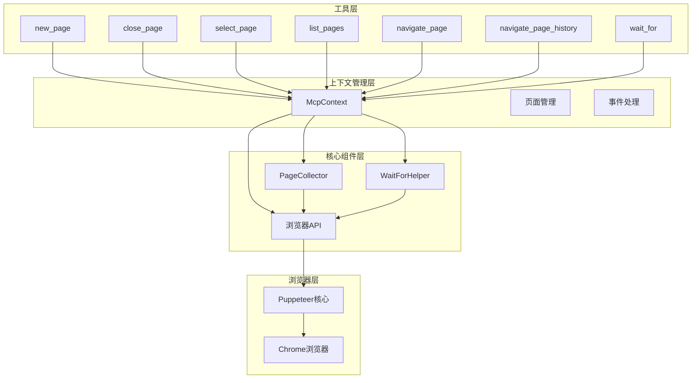
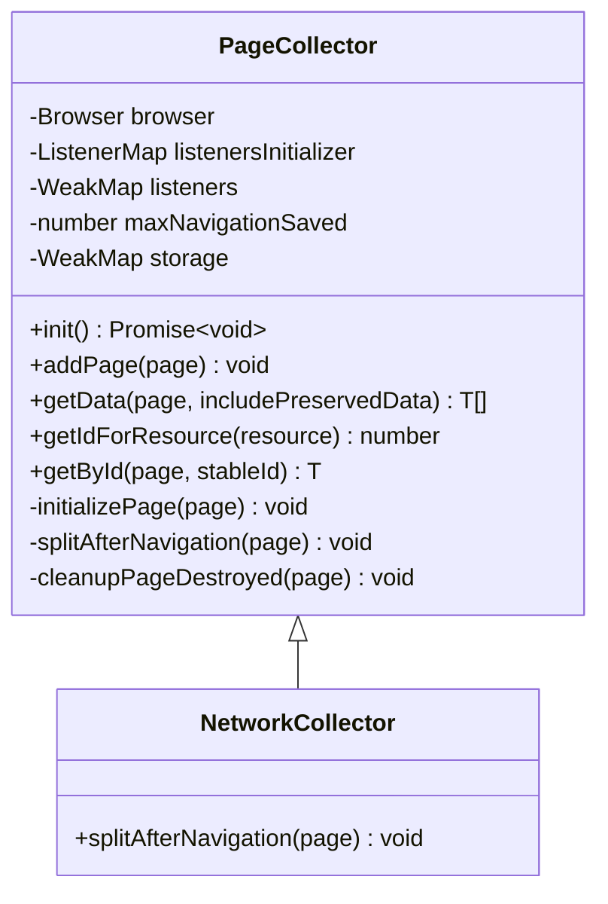
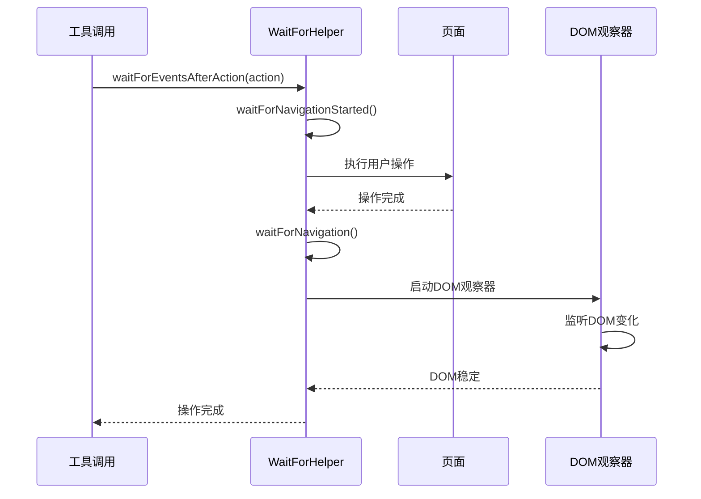
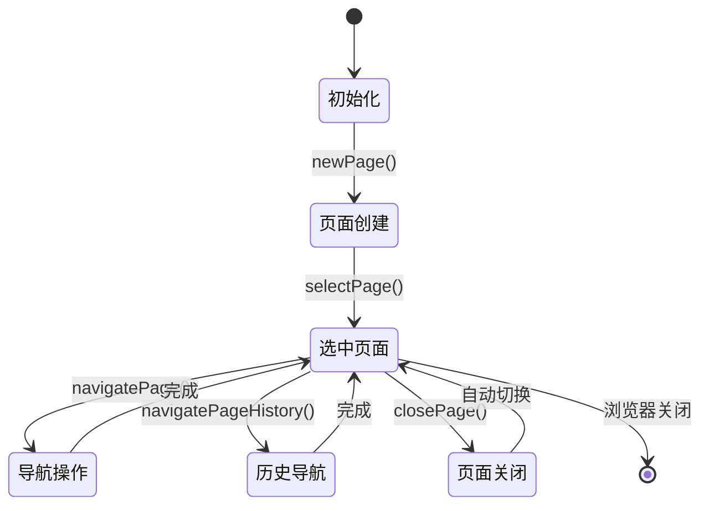
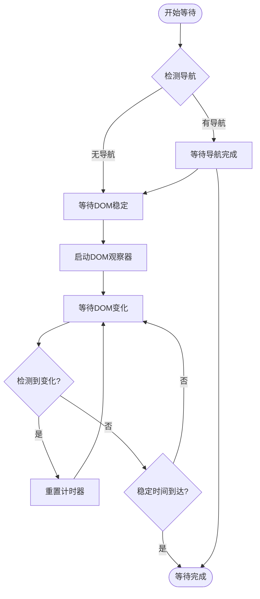
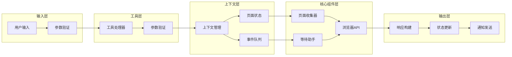

# 导航自动化工具参考文档

<cite>
**本文档中引用的文件**
- [src/PageCollector.ts](file://src/PageCollector.ts)
- [src/WaitForHelper.ts](file://src/WaitForHelper.ts)
- [src/tools/pages.ts](file://src/tools/pages.ts)
- [src/McpContext.ts](file://src/McpContext.ts)
- [src/tools/ToolDefinition.ts](file://src/tools/ToolDefinition.ts)
- [tests/tools/pages.test.ts](file://tests/tools/pages.test.ts)
</cite>

## 目录
1. [简介](#简介)
2. [项目架构概览](#项目架构概览)
3. [核心组件分析](#核心组件分析)
4. [导航工具详解](#导航工具详解)
5. [页面管理机制](#页面管理机制)
6. [等待机制与条件同步](#等待机制与条件同步)
7. [典型使用场景](#典型使用场景)
8. [工具间数据流](#工具间数据流)
9. [性能考虑](#性能考虑)
10. [故障排除指南](#故障排除指南)
11. [总结](#总结)

## 简介

Chrome DevTools MCP导航自动化工具提供了一套完整的浏览器页面管理功能，支持多标签页操作、页面导航、历史记录管理和智能等待机制。该系统通过PageCollector和WaitForHelper两个核心组件，实现了可靠的页面状态跟踪和事件同步机制。

导航自动化工具包含以下7个主要工具：
- `new_page`: 创建新页面
- `close_page`: 关闭指定页面
- `select_page`: 选择当前活动页面
- `list_pages`: 列出所有打开的页面
- `navigate_page`: 在当前页面导航到指定URL
- `navigate_page_history`: 在页面历史记录中前进或后退
- `wait_for`: 等待特定条件满足

## 项目架构概览

导航自动化系统采用分层架构设计，核心组件包括页面收集器、等待助手和工具定义层。



**图表来源**
- [src/tools/pages.ts](file://src/tools/pages.ts#L1-L234)
- [src/McpContext.ts](file://src/McpContext.ts#L1-L487)
- [src/PageCollector.ts](file://src/PageCollector.ts#L1-L218)
- [src/WaitForHelper.ts](file://src/WaitForHelper.ts#L1-L161)

## 核心组件分析

### PageCollector页面收集器

PageCollector是导航自动化系统的核心组件，负责跟踪页面状态和导航历史。



**图表来源**
- [src/PageCollector.ts](file://src/PageCollector.ts#L25-L218)

PageCollector的主要特性：
- **页面生命周期管理**: 自动初始化和清理页面监听器
- **导航历史跟踪**: 维护每个页面的导航历史记录
- **资源ID生成**: 为每个收集的资源分配唯一稳定ID
- **内存优化**: 使用WeakMap避免内存泄漏

**章节来源**
- [src/PageCollector.ts](file://src/PageCollector.ts#L25-L150)

### WaitForHelper等待助手

WaitForHelper提供智能等待机制，确保页面操作完成后再继续执行后续步骤。



**图表来源**
- [src/WaitForHelper.ts](file://src/WaitForHelper.ts#L124-L161)

WaitForHelper的关键功能：
- **导航检测**: 智能检测页面导航开始
- **DOM稳定性等待**: 等待DOM渲染完成
- **超时控制**: 多层次的超时机制
- **异步取消**: 支持AbortController中断等待

**章节来源**
- [src/WaitForHelper.ts](file://src/WaitForHelper.ts#L124-L161)

## 导航工具详解

### new_page - 创建新页面

创建新页面并导航到指定URL，支持超时配置。

**参数说明**:
- `url` (string): 要加载的新页面URL
- `timeout` (number, 可选): 最大等待时间（毫秒）

**返回值**: 包含新页面信息的响应对象

**使用示例场景**:
```typescript
// 基本页面创建
await newPage.handler({
  params: { url: 'https://example.com' }
}, response, context);

// 带超时设置的页面创建
await newPage.handler({
  params: { 
    url: 'https://slow-site.com', 
    timeout: 10000 
  }
}, response, context);
```

**章节来源**
- [src/tools/pages.ts](file://src/tools/pages.ts#L65-L85)

### close_page - 关闭页面

关闭指定索引的页面，确保不会关闭最后一个打开的页面。

**参数说明**:
- `pageIdx` (number): 要关闭的页面索引

**特殊行为**:
- 不允许关闭最后一个打开的页面
- 自动切换到第一个页面
- 触发页面状态更新

**错误处理**:
- 当尝试关闭最后一个页面时抛出CLOSE_PAGE_ERROR

**章节来源**
- [src/tools/pages.ts](file://src/tools/pages.ts#L40-L64)

### select_page - 选择页面

选择指定索引的页面作为当前活动页面。

**参数说明**:
- `pageIdx` (number): 要选择的页面索引

**操作流程**:
1. 获取指定索引的页面
2. 将页面置于前台
3. 更新上下文中的选中页面索引
4. 设置页面超时和网络条件

**章节来源**
- [src/tools/pages.ts](file://src/tools/pages.ts#L20-L39)

### list_pages - 列出页面

获取浏览器中所有打开页面的信息列表。

**参数说明**: 无参数

**返回内容**:
- 页面列表及其索引信息
- 当前选中页面标识
- 页面状态信息

**章节来源**
- [src/tools/pages.ts](file://src/tools/pages.ts#L12-L19)

### navigate_page - 导航页面

在当前选中的页面导航到指定URL。

**参数说明**:
- `url` (string): 目标URL
- `timeout` (number, 可选): 导航超时时间

**执行流程**:
1. 获取当前选中的页面
2. 执行导航操作
3. 等待导航完成
4. 等待DOM稳定
5. 更新页面状态

**章节来源**
- [src/tools/pages.ts](file://src/tools/pages.ts#L87-L107)

### navigate_page_history - 导航历史

在当前页面的历史记录中前进或后退。

**参数说明**:
- `navigate` (enum): 'back' 或 'forward'
- `timeout` (number, 可选): 导航超时时间

**支持的操作**:
- 后退导航 (`navigate: 'back'`)
- 前进导航 (`navigate: 'forward'`)

**错误处理**:
- 当历史记录不可用时返回错误信息

**章节来源**
- [src/tools/pages.ts](file://src/tools/pages.ts#L109-L140)

### wait_for - 等待条件

等待特定条件满足，通常用于等待页面元素出现或状态改变。

**参数说明**: 具体参数取决于等待条件类型

**使用场景**:
- 等待文本出现在页面上
- 等待元素可点击
- 等待网络请求完成

**章节来源**
- [src/tools/pages.ts](file://src/tools/pages.ts#L142-L170)

## 页面管理机制

### 页面状态跟踪

McpContext维护完整的页面状态信息，包括页面列表、选中状态和超时设置。



**图表来源**
- [src/McpContext.ts](file://src/McpContext.ts#L150-L200)

### 页面生命周期管理

页面生命周期包括创建、初始化、使用和销毁四个阶段：

1. **创建阶段**: 通过`newPage()`方法创建新页面
2. **初始化阶段**: 注册事件监听器和设置初始状态
3. **使用阶段**: 处理页面交互和状态更新
4. **销毁阶段**: 清理资源和移除监听器

**章节来源**
- [src/McpContext.ts](file://src/McpContext.ts#L150-L200)

### 页面索引管理

系统使用索引系统管理多个页面：

- **选中页面索引**: `#selectedPageIdx`跟踪当前活动页面
- **页面列表**: `#pages`数组存储所有打开的页面
- **自动切换**: 关闭页面时自动切换到第一个页面

**章节来源**
- [src/McpContext.ts](file://src/McpContext.ts#L150-L180)

## 等待机制与条件同步

### WaitForHelper工作原理

WaitForHelper通过多层次的等待机制确保操作完成：



**图表来源**
- [src/WaitForHelper.ts](file://src/WaitForHelper.ts#L28-L122)

### 超时配置机制

WaitForHelper根据CPU和网络条件动态调整超时时间：

- **基础超时**: 3000ms × CPU倍数
- **DOM稳定时间**: 100ms × CPU倍数
- **导航预期时间**: 100ms × CPU倍数
- **导航超时**: 3000ms × 网络倍数

**章节来源**
- [src/WaitForHelper.ts](file://src/WaitForHelper.ts#L15-L26)

### 异步取消机制

系统支持通过AbortController中断等待操作：

- **信号监听**: 监听`AbortController.signal`事件
- **资源清理**: 中断时自动清理DOM观察器和Promise
- **异常处理**: 确保中断操作不会导致资源泄漏

**章节来源**
- [src/WaitForHelper.ts](file://src/WaitForHelper.ts#L45-L65)

## 典型使用场景

### 多标签页切换场景

```typescript
// 场景：在多个页面间切换进行并行操作
async function multiTabWorkflow() {
  // 创建三个页面
  await newPage.handler({ params: { url: 'https://site1.com' } }, response, context);
  await newPage.handler({ params: { url: 'https://site2.com' } }, response, context);
  await newPage.handler({ params: { url: 'https://site3.com' } }, response, context);
  
  // 在不同页面执行操作
  await selectPage.handler({ params: { pageIdx: 0 } }, response, context);
  await navigatePage.handler({ params: { url: 'https://updated-site1.com' } }, response, context);
  
  await selectPage.handler({ params: { pageIdx: 1 } }, response, context);
  await navigatePage.handler({ params: { url: 'https://updated-site2.com' } }, response, context);
}
```

### 页面导航与历史操作

```typescript
// 场景：模拟用户浏览行为
async function simulateUserBrowsing() {
  // 导航到起始页面
  await navigatePage.handler({ 
    params: { url: 'https://main-site.com' } 
  }, response, context);
  
  // 访问子页面
  await navigatePage.handler({ 
    params: { url: 'https://main-site.com/products' } 
  }, response, context);
  
  // 返回主页面
  await navigatePageHistory.handler({ 
    params: { navigate: 'back' } 
  }, response, context);
  
  // 前进到产品页面
  await navigatePageHistory.handler({ 
    params: { navigate: 'forward' } 
  }, response, context);
}
```

### 条件等待场景

```typescript
// 场景：等待页面元素加载完成
async function waitForElementLoading() {
  await navigatePage.handler({ 
    params: { url: 'https://dynamic-site.com' } 
  }, response, context);
  
  // 等待特定文本出现
  try {
    await waitForTextOnPage({ 
      text: '页面加载完成', 
      timeout: 10000 
    });
    console.log('元素已加载');
  } catch (error) {
    console.log('等待超时');
  }
}
```

## 工具间数据流

### 数据流向图



**图表来源**
- [src/tools/pages.ts](file://src/tools/pages.ts#L1-L234)
- [src/McpContext.ts](file://src/McpContext.ts#L1-L487)

### 状态同步机制

系统通过以下机制确保状态一致性：

1. **事件驱动更新**: 页面事件触发状态自动更新
2. **上下文同步**: McpContext维护全局状态
3. **响应式通知**: 状态变更时发送通知
4. **幂等性保证**: 确保重复操作的安全性

**章节来源**
- [src/McpContext.ts](file://src/McpContext.ts#L150-L200)

### 错误传播机制

工具间的错误传播遵循以下规则：

- **异常捕获**: 每个工具都捕获并处理自身异常
- **错误包装**: 将内部错误转换为标准格式
- **状态回滚**: 发生错误时恢复到之前状态
- **日志记录**: 记录详细的错误信息用于调试

**章节来源**
- [src/tools/pages.ts](file://src/tools/pages.ts#L40-L64)

## 性能考虑

### 内存管理

系统采用多种策略优化内存使用：

- **WeakMap使用**: 避免页面对象的内存泄漏
- **事件监听器清理**: 自动移除不再需要的监听器
- **资源池化**: 复用WaitForHelper实例
- **延迟初始化**: 按需创建组件实例

### 并发控制

系统通过以下机制控制并发访问：

- **互斥锁**: 使用Mutex确保关键操作的原子性
- **队列管理**: 按顺序处理页面操作
- **超时保护**: 防止操作无限期挂起
- **资源限制**: 限制同时运行的操作数量

**章节来源**
- [src/Mutex.ts](file://src/Mutex.ts)

### 性能监控

系统内置性能监控功能：

- **操作计时**: 记录各操作的执行时间
- **资源使用**: 监控内存和CPU使用情况
- **错误统计**: 统计失败操作的数量和类型
- **性能指标**: 提供详细的性能报告

## 故障排除指南

### 常见问题及解决方案

#### 页面无法选择

**症状**: `select_page`工具报错"No page found"

**原因**: 
- 页面索引超出范围
- 页面已被关闭
- 页面列表未正确更新

**解决方案**:
1. 使用`list_pages`确认页面索引
2. 检查页面是否已关闭
3. 重新创建页面连接

#### 导航超时

**症状**: `navigate_page`操作超时

**原因**:
- 目标网站响应缓慢
- 网络连接不稳定
- 页面加载复杂资源

**解决方案**:
1. 增加`timeout`参数值
2. 检查网络连接
3. 使用`wait_for`等待特定条件

#### DOM等待失败

**症状**: `waitForStableDom`超时

**原因**:
- 页面存在持续的DOM动画
- JavaScript仍在执行
- 页面结构过于复杂

**解决方案**:
1. 增加DOM稳定时间
2. 暂停页面上的动画
3. 使用更精确的选择器

**章节来源**
- [tests/tools/pages.test.ts](file://tests/tools/pages.test.ts#L1-L305)

### 调试技巧

#### 启用详细日志

```typescript
// 设置环境变量启用调试日志
process.env.DEBUG = '*';
```

#### 检查页面状态

```typescript
// 获取当前页面信息
const pages = context.getPages();
const selectedPage = context.getSelectedPage();
const selectedIndex = context.getSelectedPageIdx();
```

#### 监控事件流

```typescript
// 添加事件监听器
page.on('framenavigated', (frame) => {
  console.log('页面导航:', frame.url());
});
```

## 总结

Chrome DevTools MCP导航自动化工具提供了一套完整而强大的页面管理解决方案。通过PageCollector的智能状态跟踪和WaitForHelper的可靠等待机制，系统能够处理复杂的多页面场景和异步操作。

### 主要优势

1. **可靠性**: 通过多层次的等待机制确保操作完成
2. **易用性**: 简化的API设计降低使用门槛
3. **扩展性**: 模块化架构支持功能扩展
4. **性能**: 优化的内存管理和并发控制
5. **稳定性**: 完善的错误处理和恢复机制

### 最佳实践建议

1. **合理设置超时**: 根据目标网站特点调整超时时间
2. **使用条件等待**: 优先使用`wait_for`等待特定条件
3. **监控资源使用**: 注意内存和CPU的使用情况
4. **错误处理**: 实现完善的错误处理和重试机制
5. **状态检查**: 定期检查页面状态确保操作成功

这套导航自动化工具为AI代理提供了强大的浏览器控制能力，使其能够在复杂的Web环境中执行可靠的自动化任务。