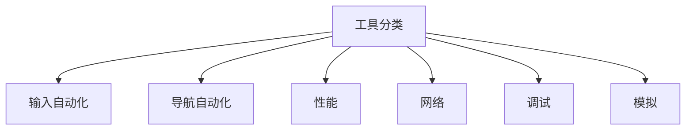
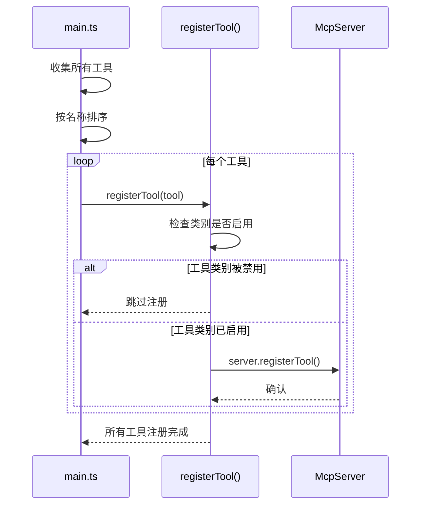
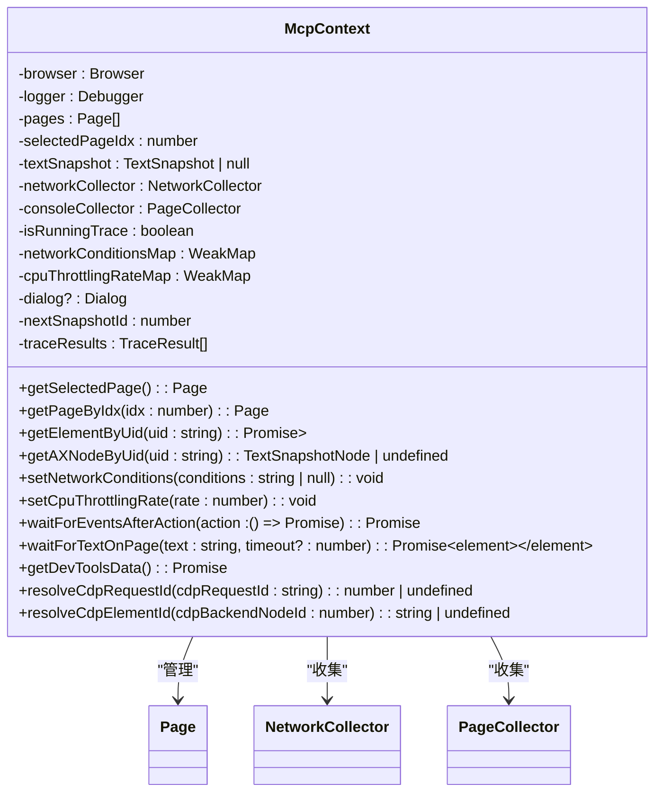
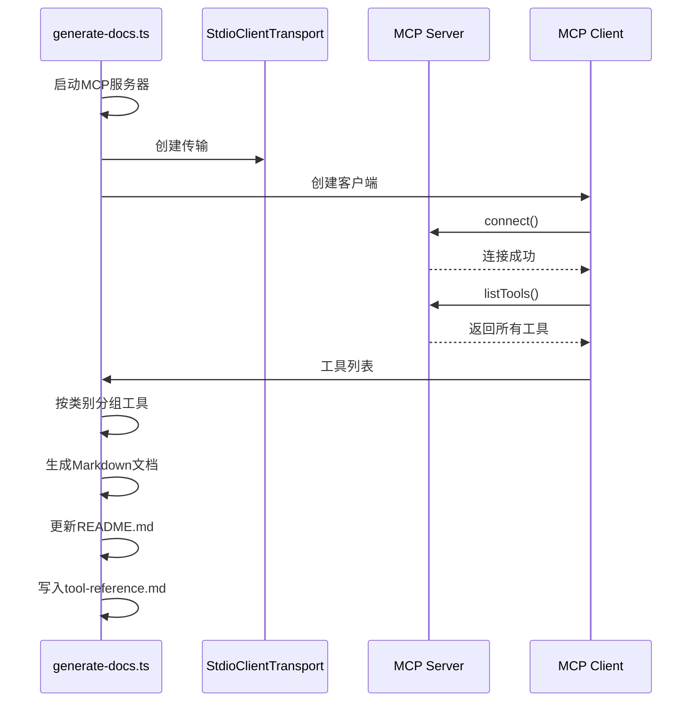

# 工具参考

<cite>
**本文档中引用的文件**   
- [categories.ts](file://src/tools/categories.ts)
- [ToolDefinition.ts](file://src/tools/ToolDefinition.ts)
- [McpContext.ts](file://src/McpContext.ts)
- [McpResponse.ts](file://src/McpResponse.ts)
- [generate-docs.ts](file://scripts/generate-docs.ts)
- [main.ts](file://src/main.ts)
- [input.ts](file://src/tools/input.ts)
- [pages.ts](file://src/tools/pages.ts)
- [performance.ts](file://src/tools/performance.ts)
- [network.ts](file://src/tools/network.ts)
- [console.ts](file://src/tools/console.ts)
- [emulation.ts](file://src/tools/emulation.ts)
- [screenshot.ts](file://src/tools/screenshot.ts)
- [script.ts](file://src/tools/script.ts)
- [snapshot.ts](file://src/tools/snapshot.ts)
</cite>

## 目录
1. [简介](#简介)
2. [工具分类](#工具分类)
3. [核心概念](#核心概念)
4. [输入自动化工具](#输入自动化工具)
5. [导航自动化工具](#导航自动化工具)
6. [性能工具](#性能工具)
7. [网络工具](#网络工具)
8. [调试工具](#调试工具)
9. [模拟工具](#模拟工具)
10. [文档生成机制](#文档生成机制)

## 简介
本工具参考文档系统化地记录了通过MCP协议暴露的所有功能工具。这些工具允许开发者通过程序化方式与Chrome DevTools进行交互，实现浏览器自动化、性能分析、网络监控和调试等功能。文档根据`categories.ts`中的分类，将28个工具分为六大类别：输入自动化、导航自动化、性能、网络、调试和模拟。每个工具都提供了精确的接口定义、参数模式、返回值结构和功能描述，确保内容与源码严格一致，成为开发者集成和使用这些功能的必备手册。

**Section sources**
- [main.ts](file://src/main.ts#L1-L190)
- [categories.ts](file://src/tools/categories.ts#L1-L23)

## 工具分类
根据`categories.ts`文件中的定义，所有工具被分为六个主要类别。这种分类有助于开发者快速定位所需功能。



**Diagram sources**
- [categories.ts](file://src/tools/categories.ts#L1-L23)

**Section sources**
- [categories.ts](file://src/tools/categories.ts#L1-L23)

## 核心概念
理解工具的工作机制需要掌握几个核心概念：`ToolDefinition`接口定义了工具的结构，`McpContext`提供了运行时的浏览器状态访问，而工具通过`McpServer.registerTool`方法进行注册。

### 工具定义接口
`ToolDefinition`接口是所有工具的基础，它定义了工具的名称、描述、参数模式和处理函数。

```mermaid
classDiagram
class ToolDefinition {
+name : string
+description : string
+annotations : {title? : string, category : ToolCategory, readOnlyHint : boolean}
+schema : zod.ZodRawShape
+handler : (request, response, context) => Promise<void>
}
class Request {
+params : object
}
class Response {
+appendResponseLine(value : string) : void
+setIncludePages(value : boolean) : void
+setIncludeNetworkRequests(value : boolean, options?) : void
+setIncludeConsoleData(value : boolean, options?) : void
+includeSnapshot(params? : SnapshotParams) : void
+attachImage(value : ImageContentData) : void
+attachNetworkRequest(reqid : number) : void
+attachConsoleMessage(msgid : number) : void
+attachDevToolsData(data : DevToolsData) : void
}
class Context {
+isRunningPerformanceTrace() : boolean
+setIsRunningPerformanceTrace(x : boolean) : void
+recordedTraces() : TraceResult[]
+storeTraceRecording(result : TraceResult) : void
+getSelectedPage() : Page
+getDialog() : Dialog | undefined
+clearDialog() : void
+getPageByIdx(idx : number) : Page
+newPage() : Promise<Page>
+closePage(pageIdx : number) : Promise<void>
+setSelectedPageIdx(idx : number) : void
+getElementByUid(uid : string) : Promise<ElementHandle<Element>>
+getAXNodeByUid(uid : string) : TextSnapshotNode | undefined
+setNetworkConditions(conditions : string | null) : void
+setCpuThrottlingRate(rate : number) : void
+saveTemporaryFile(data : Uint8Array, mimeType : 'image/png' | 'image/jpeg' | 'image/webp') : Promise<{filename : string}>
+saveFile(data : Uint8Array, filename : string) : Promise<{filename : string}>
+waitForEventsAfterAction(action : () => Promise<unknown>) : Promise<void>
+waitForTextOnPage(params : {text : string, timeout? : number}) : Promise<Element>
+getDevToolsData() : Promise<DevToolsData>
+resolveCdpRequestId(cdpRequestId : string) : number | undefined
+resolveCdpElementId(cdpBackendNodeId : number) : string | undefined
}
ToolDefinition --> Request : "使用"
ToolDefinition --> Response : "使用"
ToolDefinition --> Context : "使用"
```

**Diagram sources**
- [ToolDefinition.ts](file://src/tools/ToolDefinition.ts#L1-L143)

**Section sources**
- [ToolDefinition.ts](file://src/tools/ToolDefinition.ts#L1-L143)

### 工具注册机制
所有工具在`main.ts`文件中被收集并注册到MCP服务器。注册过程包含条件检查，允许通过命令行参数禁用特定类别的工具。



**Diagram sources**
- [main.ts](file://src/main.ts#L82-L189)

**Section sources**
- [main.ts](file://src/main.ts#L82-L189)

### 运行时上下文
`McpContext`类提供了工具执行时所需的浏览器状态和辅助方法，是连接工具逻辑与浏览器实例的桥梁。



**Diagram sources**
- [McpContext.ts](file://src/McpContext.ts#L1-L655)

**Section sources**
- [McpContext.ts](file://src/McpContext.ts#L1-L655)

## 输入自动化工具
输入自动化工具类别包含与页面元素进行交互的工具，如点击、悬停、填写表单等。

### click
**Description:** 点击提供的元素

**Parameters:**
- **uid** (string) **(required)**: 页面内容快照中元素的uid
- **dblClick** (boolean) _(optional)_: 设置为true表示双击。默认为false。

**Section sources**
- [input.ts](file://src/tools/input.ts#L10-L48)

### hover
**Description:** 悬停在提供的元素上

**Parameters:**
- **uid** (string) **(required)**: 页面内容快照中元素的uid

**Section sources**
- [input.ts](file://src/tools/input.ts#L50-L78)

### fill
**Description:** 在输入框、文本区域中输入文本或从<select>元素中选择一个选项。

**Parameters:**
- **uid** (string) **(required)**: 页面内容快照中元素的uid
- **value** (string) **(required)**: 要填充的值

**Section sources**
- [input.ts](file://src/tools/input.ts#L79-L144)

### drag
**Description:** 将一个元素拖动到另一个元素上

**Parameters:**
- **from_uid** (string) **(required)**: 要拖动的元素的uid
- **to_uid** (string) **(required)**: 要放入的元素的uid

**Section sources**
- [input.ts](file://src/tools/input.ts#L146-L184)

### fill_form
**Description:** 一次填充多个表单元素

**Parameters:**
- **elements** (object[]) **(required)**: 要填充的快照中的元素。
  - **uid** (string) **(required)**: 要填充的元素的uid
  - **value** (string) **(required)**: 元素的值

**Section sources**
- [input.ts](file://src/tools/input.ts#L186-L224)

### upload_file
**Description:** 通过提供的元素上传文件。

**Parameters:**
- **uid** (string) **(required)**: 文件输入元素的uid或将在页面内容快照中打开文件选择器的元素
- **filePath** (string) **(required)**: 要上传文件的本地路径

**Section sources**
- [input.ts](file://src/tools/input.ts#L226-L269)

### press_key
**Description:** 按下键或组合键。当其他输入方法（如fill()）无法使用时使用此方法（例如，键盘快捷键、导航键或特殊组合键）。

**Parameters:**
- **key** (string) **(required)**: 键或组合（例如，“Enter”、“Control+A”、“Control++”、“Control+Shift+R”）。修饰符：Control、Shift、Alt、Meta

**Section sources**
- [input.ts](file://src/tools/input.ts#L271-L309)

## 导航自动化工具
导航自动化工具类别包含管理浏览器页面和导航的工具。

### list_pages
**Description:** 获取浏览器中打开的页面列表。

**Parameters:** None

**Section sources**
- [pages.ts](file://src/tools/pages.ts#L10-L23)

### select_page
**Description:** 选择一个页面作为未来工具调用的上下文。

**Parameters:**
- **pageIdx** (number) **(required)**: 要选择的页面的索引。调用list_pages以列出页面。

**Section sources**
- [pages.ts](file://src/tools/pages.ts#L25-L42)

### close_page
**Description:** 按其索引关闭页面。最后一个打开的页面无法关闭。

**Parameters:**
- **pageIdx** (number) **(required)**: 要关闭的页面的索引。调用list_pages以列出页面。

**Section sources**
- [pages.ts](file://src/tools/pages.ts#L44-L68)

### new_page
**Description:** 创建一个新页面

**Parameters:**
- **url** (string) **(required)**: 在新页面中加载的URL。
- **timeout** (number) _(optional)_: 最大等待时间（毫秒）。如果设置为0，则使用默认超时。

**Section sources**
- [pages.ts](file://src/tools/pages.ts#L70-L93)

### navigate_page
**Description:** 将当前选定的页面导航到URL。

**Parameters:**
- **url** (string) **(required)**: 要将页面导航到的URL
- **timeout** (number) _(optional)_: 最大等待时间（毫秒）。如果设置为0，则使用默认超时。

**Section sources**
- [pages.ts](file://src/tools/pages.ts#L95-L118)

### navigate_page_history
**Description:** 导航当前选定的页面。

**Parameters:**
- **navigate** (enum: "back", "forward") **(required)**: 是在选定页面的历史记录中向后导航还是向前导航
- **timeout** (number) _(optional)_: 最大等待时间（毫秒）。如果设置为0，则使用默认超时。

**Section sources**
- [pages.ts](file://src/tools/pages.ts#L120-L155)

### resize_page
**Description:** 调整选定页面窗口的大小，使页面具有指定的尺寸

**Parameters:**
- **width** (number) **(required)**: 页面宽度
- **height** (number) **(required)**: 页面高度

**Section sources**
- [pages.ts](file://src/tools/pages.ts#L157-L180)

### handle_dialog
**Description:** 如果打开了浏览器对话框，请使用此命令处理它

**Parameters:**
- **action** (enum: "accept", "dismiss") **(required)**: 是关闭还是接受对话框
- **promptText** (string) _(optional)_: 要输入到对话框中的可选提示文本。

**Section sources**
- [pages.ts](file://src/tools/pages.ts#L182-L233)

### wait_for
**Description:** 等待指定的文本出现在选定的页面上。

**Parameters:**
- **text** (string) **(required)**: 要出现在页面上的文本
- **timeout** (number) _(optional)_: 最大等待时间（毫秒）。如果设置为0，则使用默认超时。

**Section sources**
- [snapshot.ts](file://src/tools/snapshot.ts#L35-L53)

## 性能工具
性能工具类别包含启动和停止性能跟踪以及分析性能洞察的工具。

### performance_start_trace
**Description:** 在选定的页面上开始性能跟踪记录。这可用于查找性能问题和改进页面性能的见解。它还将报告页面的核心网页指标（CWV）分数。

**Parameters:**
- **reload** (boolean) **(required)**: 确定一旦开始跟踪，页面是否应自动重新加载。
- **autoStop** (boolean) **(required)**: 确定跟踪记录是否应自动停止。

**Section sources**
- [performance.ts](file://src/tools/performance.ts#L10-L118)

### performance_stop_trace
**Description:** 停止在选定页面上活动的性能跟踪记录。

**Parameters:** None

**Section sources**
- [performance.ts](file://src/tools/performance.ts#L120-L138)

### performance_analyze_insight
**Description:** 提供有关跟踪记录结果中突出显示的特定性能洞察的更详细信息。

**Parameters:**
- **insightName** (string) **(required)**: 您想要更多信息的洞察名称。例如：“DocumentLatency”或“LCPBreakdown”

**Section sources**
- [performance.ts](file://src/tools/performance.ts#L140-L187)

## 网络工具
网络工具类别包含列出和获取网络请求的工具。

### list_network_requests
**Description:** 列出自上次导航以来当前选定页面的所有请求。

**Parameters:**
- **pageSize** (number) _(optional)_: 要返回的最大请求数。省略时，返回所有请求。
- **pageIdx** (number) _(optional)_: 要返回的页码（基于0）。省略时，返回第一页。
- **resourceTypes** (string[]) _(optional)_: 过滤请求，仅返回指定资源类型的请求。省略或为空时，返回所有请求。
- **includePreservedRequests** (boolean) _(optional)_: 设置为true以返回过去3次导航中保留的请求。

**Section sources**
- [network.ts](file://src/tools/network.ts#L18-L79)

### get_network_request
**Description:** 通过URL获取网络请求。您可以通过调用list_network_requests来获取所有请求。

**Parameters:**
- **reqid** (number) **(required)**: 列出的网络请求中页面上请求的reqid

**Section sources**
- [network.ts](file://src/tools/network.ts#L81-L100)

## 调试工具
调试工具类别包含与控制台消息、快照和脚本执行相关的工具。

### list_console_messages
**Description:** 列出自上次导航以来当前选定页面的所有控制台消息。

**Parameters:**
- **pageSize** (number) _(optional)_: 要返回的最大消息数。省略时，返回所有请求。
- **pageIdx** (number) _(optional)_: 要返回的页码（基于0）。省略时，返回第一页。
- **types** (string[]) _(optional)_: 过滤消息，仅返回指定资源类型的消息。省略或为空时，返回所有消息。
- **includePreservedMessages** (boolean) _(optional)_: 设置为true以返回过去3次导航中保留的消息。

**Section sources**
- [console.ts](file://src/tools/console.ts#L18-L76)

### get_console_message
**Description:** 通过其ID获取控制台消息。您可以通过调用list_console_messages来获取所有消息。

**Parameters:**
- **msgid** (number) **(required)**: 列出的控制台消息中页面上控制台消息的msgid

**Section sources**
- [console.ts](file://src/tools/console.ts#L78-L104)

### take_screenshot
**Description:** 拍摄页面或元素的屏幕截图。

**Parameters:**
- **format** (enum: "png", "jpeg", "webp") _(optional)_: 保存屏幕截图的格式类型。默认为“png”
- **quality** (number) _(optional)_: JPEG和WebP格式的压缩质量（0-100）。值越高，质量越好，但文件大小越大。PNG格式忽略此参数。
- **uid** (string) _(optional)_: 页面内容快照中元素的uid。如果省略，则拍摄页面的屏幕截图。
- **fullPage** (boolean) _(optional)_: 如果设置为true，则拍摄整个页面的屏幕截图，而不是当前可见的视口。与uid不兼容。
- **filePath** (string) _(optional)_: 保存屏幕截图的绝对路径，或相对于当前工作目录的路径，而不是将其附加到响应中。

**Section sources**
- [screenshot.ts](file://src/tools/screenshot.ts#L10-L101)

### evaluate_script
**Description:** 在当前选定的页面内评估JavaScript函数。以JSON形式返回响应，因此返回值必须是JSON可序列化的。

**Parameters:**
- **function** (string) **(required)**: 要由工具在当前选定页面中执行的JavaScript函数声明。示例无参数：`() => { return document.title }` 或 `async () => { return await fetch("example.com") }`。带参数的示例：`(el) => { return el.innerText; }`
- **args** (object[]) _(optional)_: 传递给函数的可选参数列表。
  - **uid** (string) **(required)**: 页面内容快照中元素的uid

**Section sources**
- [script.ts](file://src/tools/script.ts#L10-L86)

### take_snapshot
**Description:** 基于a11y树获取当前选定页面的文本快照。快照列出了页面元素及其唯一标识符（uid）。始终使用最新的快照。优先使用快照而不是屏幕截图。

**Parameters:**
- **verbose** (boolean) _(optional)_: 是否包含完整a11y树中所有可能的信息。默认为false。
- **filePath** (string) _(optional)_: 保存快照的绝对路径，或相对于当前工作目录的路径，而不是将其附加到响应中。

**Section sources**
- [snapshot.ts](file://src/tools/snapshot.ts#L12-L40)

## 模拟工具
模拟工具类别包含模拟网络和CPU条件的工具。

### emulate_network
**Description:** 模拟选定页面上的网络条件，如节流或离线模式。

**Parameters:**
- **throttlingOption** (enum: "No emulation", "Offline", "Fast 4G", "Slow 4G", "Fast 3G", "Slow 3G") **(required)**: 要模拟的网络节流选项。可用的节流选项有：No emulation, Offline, Fast 4G, Slow 4G, Fast 3G, Slow 3G。设置为“No emulation”以禁用。设置为“Offline”以模拟离线网络条件。

**Section sources**
- [emulation.ts](file://src/tools/emulation.ts#L10-L58)

### emulate_cpu
**Description:** 通过减慢选定页面的执行来模拟CPU节流。

**Parameters:**
- **throttlingRate** (number) **(required)**: 表示1-20倍减速因子的CPU节流率。将速率设置为1以禁用节流

**Section sources**
- [emulation.ts](file://src/tools/emulation.ts#L60-L87)

## 文档生成机制
`generate-docs.ts`脚本实现了文档的自动化生成，通过连接到MCP服务器并查询所有可用工具来创建最新的参考文档。



**Diagram sources**
- [generate-docs.ts](file://scripts/generate-docs.ts#L173-L208)

**Section sources**
- [generate-docs.ts](file://scripts/generate-docs.ts#L1-L334)