# 性能分析

<cite>
**本文档中引用的文件**
- [src/tools/performance.ts](file://src/tools/performance.ts)
- [src/trace-processing/parse.ts](file://src/trace-processing/parse.ts)
- [src/McpContext.ts](file://src/McpContext.ts)
- [tests/tools/performance.test.ts](file://tests/tools/performance.test.ts)
- [tests/trace-processing/parse.test.ts](file://tests/trace-processing/parse.test.ts)
- [tests/trace-processing/fixtures/load.ts](file://tests/trace-processing/fixtures/load.ts)
- [README.md](file://README.md)
</cite>

## 目录
1. [简介](#简介)
2. [项目结构](#项目结构)
3. [核心组件](#核心组件)
4. [架构概览](#架构概览)
5. [详细组件分析](#详细组件分析)
6. [性能追踪生命周期](#性能追踪生命周期)
7. [TraceResult数据结构](#traceresult数据结构)
8. [事件收集机制](#事件收集机制)
9. [性能洞察生成逻辑](#性能洞察生成逻辑)
10. [端到端使用示例](#端到端使用示例)
11. [实现细节](#实现细节)
12. [故障排除指南](#故障排除指南)
13. [结论](#结论)

## 简介

Chrome DevTools MCP性能分析工具是一个强大的性能监控和分析系统，专门用于自动化网页性能评估。该工具集成了Chrome DevTools前端框架，提供了完整的性能追踪、数据分析和洞察生成功能。通过三个核心工具：`performance_start_trace`、`performance_stop_trace`和`performance_analyze_insight`，开发者可以轻松地捕获页面性能数据、分析关键性能指标，并获得可操作的优化建议。

该系统特别专注于Core Web Vitals（核心Web指标）的分析，包括最大内容绘制（LCP）、首次输入延迟（FID）和累积布局偏移（CLS）等关键性能指标。通过与Chrome DevTools引擎的深度集成，该工具能够提供精确的性能洞察，帮助开发者识别和解决页面性能瓶颈。

## 项目结构

性能分析工具在项目中的组织结构体现了清晰的职责分离和模块化设计：

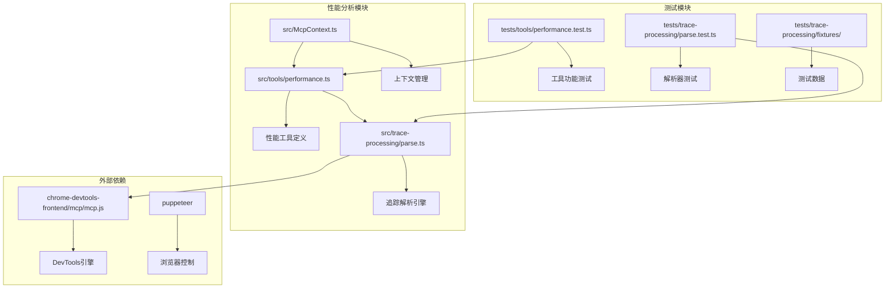

**图表来源**
- [src/tools/performance.ts](file://src/tools/performance.ts#L1-L188)
- [src/trace-processing/parse.ts](file://src/trace-processing/parse.ts#L1-L141)
- [src/McpContext.ts](file://src/McpContext.ts#L1-L487)

**章节来源**
- [src/tools/performance.ts](file://src/tools/performance.ts#L1-L50)
- [src/trace-processing/parse.ts](file://src/trace-processing/parse.ts#L1-L30)

## 核心组件

性能分析系统由三个主要组件构成，每个组件都有明确的职责和功能边界：

### 性能追踪控制器
负责启动、停止和管理性能追踪会话，处理页面导航和自动停止逻辑。

### 追踪解析引擎
使用Chrome DevTools引擎解析原始追踪数据，提取结构化性能信息和洞察。

### 上下文管理系统
维护追踪状态、存储历史记录，并协调各个组件之间的交互。

这些组件通过McP（Model-Context-Protocol）协议进行通信，确保了系统的可扩展性和一致性。

**章节来源**
- [src/tools/performance.ts](file://src/tools/performance.ts#L15-L188)
- [src/trace-processing/parse.ts](file://src/trace-processing/parse.ts#L10-L50)
- [src/McpContext.ts](file://src/McpContext.ts#L60-L120)

## 架构概览

性能分析系统采用分层架构设计，确保了良好的可维护性和扩展性：

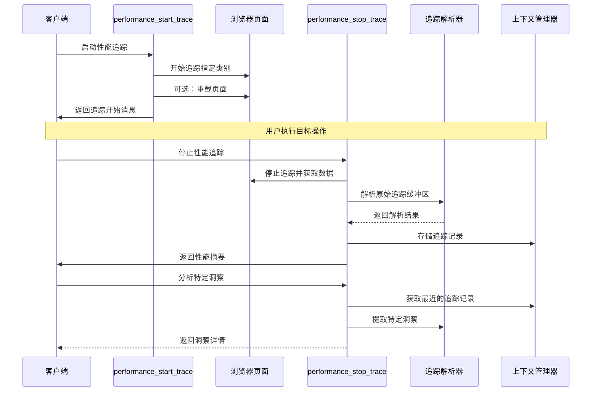

**图表来源**
- [src/tools/performance.ts](file://src/tools/performance.ts#L25-L120)
- [src/trace-processing/parse.ts](file://src/trace-processing/parse.ts#L30-L80)
- [src/McpContext.ts](file://src/McpContext.ts#L450-L487)

## 详细组件分析

### performance_start_trace工具

该工具是性能分析流程的入口点，负责初始化性能追踪会话：

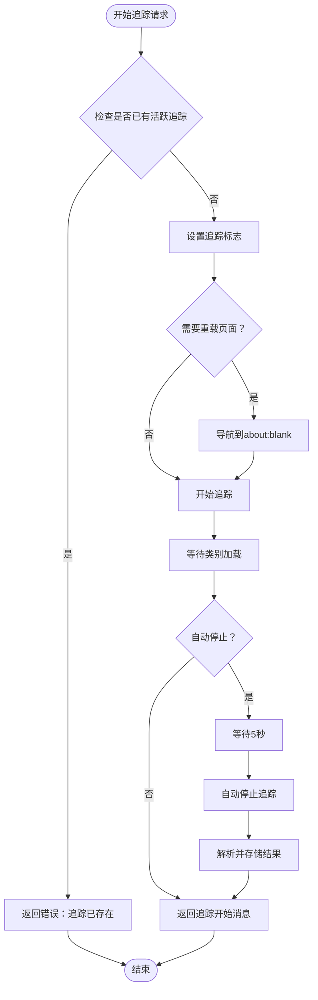

**图表来源**
- [src/tools/performance.ts](file://src/tools/performance.ts#L25-L100)

该工具支持两种运行模式：
- **手动模式**：启动追踪后保持活动状态，等待用户手动停止
- **自动模式**：启动追踪后等待5秒，自动停止并生成报告

追踪类别经过精心选择，涵盖了关键的性能监控领域，包括渲染、网络、JavaScript执行和内存使用等。

**章节来源**
- [src/tools/performance.ts](file://src/tools/performance.ts#L25-L100)

### performance_stop_trace工具

该工具负责优雅地终止性能追踪会话并处理结果：

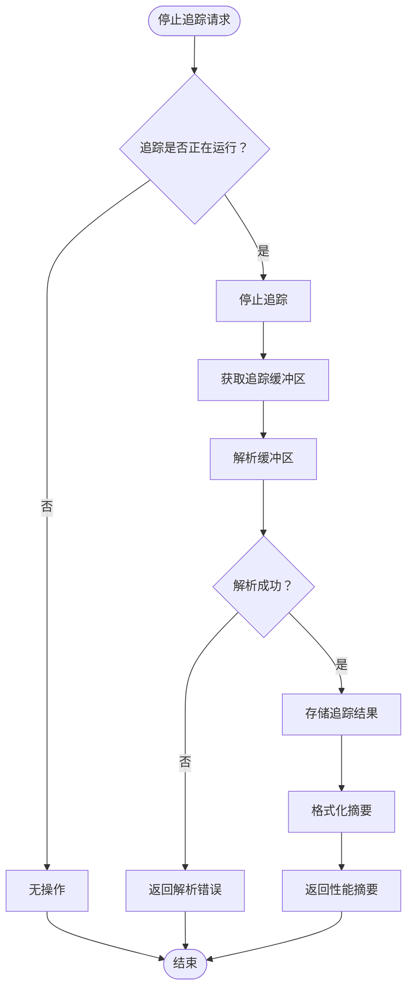

**图表来源**
- [src/tools/performance.ts](file://src/tools/performance.ts#L102-L120)

**章节来源**
- [src/tools/performance.ts](file://src/tools/performance.ts#L102-L188)

### performance_analyze_insight工具

该工具提供深入的性能洞察分析，允许用户探索特定的性能问题：

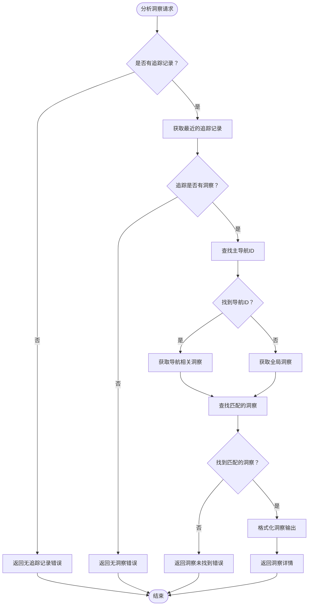

**图表来源**
- [src/tools/performance.ts](file://src/tools/performance.ts#L122-L150)

**章节来源**
- [src/tools/performance.ts](file://src/tools/performance.ts#L122-L188)

## 性能追踪生命周期

性能追踪的生命周期管理是整个系统的核心，涉及多个阶段的状态转换和数据流转：

### 初始化阶段
系统首先验证当前没有活跃的追踪会话，然后设置追踪标志位，准备开始新的追踪会话。

### 配置阶段
根据用户配置确定追踪参数，包括是否重载页面、是否自动停止等。系统会预加载必要的追踪类别，确保覆盖所有关键性能指标。

### 执行阶段
追踪开始后，系统会监控各种性能事件，包括：
- 页面加载事件
- JavaScript执行时间
- 网络请求响应
- 渲染性能指标
- 内存使用情况

### 收集阶段
追踪过程中，系统持续收集各种性能数据，形成完整的性能时间线。

### 终止阶段
追踪停止时，系统会立即解析收集的数据，生成初步的性能摘要。

### 分析阶段
用户可以选择深入分析特定的性能洞察，系统会提供详细的解释和优化建议。

**章节来源**
- [src/tools/performance.ts](file://src/tools/performance.ts#L25-L120)
- [src/McpContext.ts](file://src/McpContext.ts#L180-L200)

## TraceResult数据结构

TraceResult是性能分析系统的核心数据结构，封装了解析后的追踪数据和相关的性能洞察：

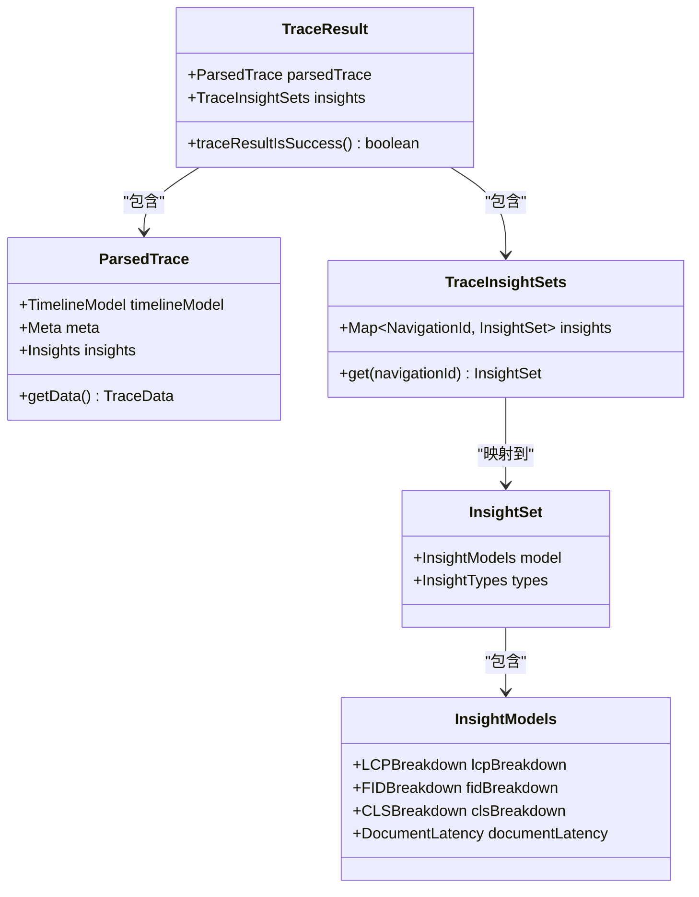

**图表来源**
- [src/trace-processing/parse.ts](file://src/trace-processing/parse.ts#L12-L25)

### 数据结构特性

TraceResult结构具有以下关键特性：

1. **类型安全**：使用TypeScript接口确保数据完整性
2. **可扩展性**：支持未来添加新的性能指标
3. **错误处理**：提供统一的错误处理机制
4. **元数据支持**：包含完整的追踪元数据

### 解析流程

追踪数据的解析过程遵循严格的验证流程：

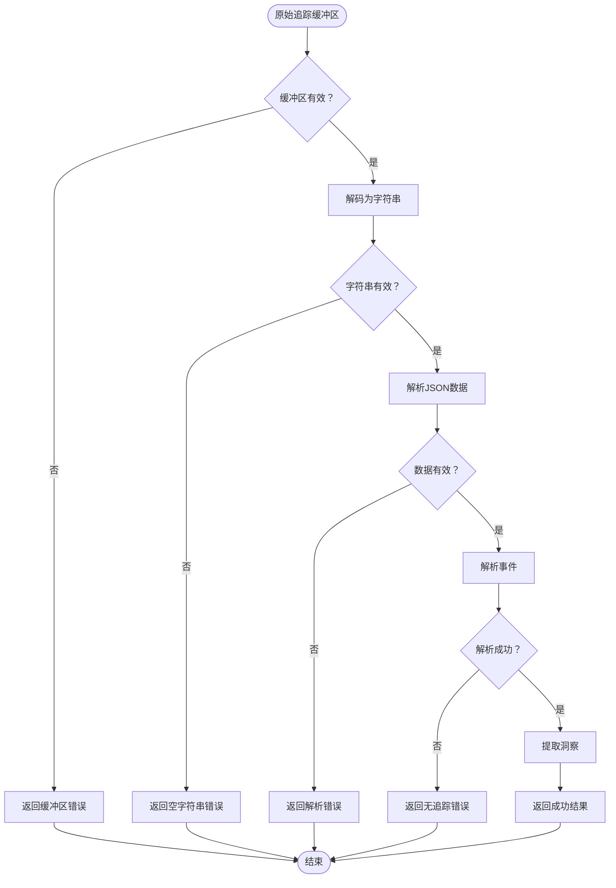

**图表来源**
- [src/trace-processing/parse.ts](file://src/trace-processing/parse.ts#L30-L80)

**章节来源**
- [src/trace-processing/parse.ts](file://src/trace-processing/parse.ts#L12-L80)

## 事件收集机制

性能追踪系统使用Chrome DevTools的事件收集机制，通过精心配置的追踪类别来捕获关键性能数据：

### 追踪类别配置

系统使用一组经过优化的追踪类别，确保覆盖所有重要的性能监控领域：

| 类别名称 | 描述 | 性能影响 |
|---------|------|----------|
| -* | 排除所有默认类别 | 最小化开销 |
| blink.console | 控制台事件 | 轻微开销 |
| blink.user_timing | 用户时间标记 | 轻微开销 |
| devtools.timeline | DevTools时间线 | 中等开销 |
| disabled-by-default-devtools.screenshot | 截图事件 | 较高开销 |
| disabled-by-default-devtools.timeline | 详细时间线 | 较高开销 |
| disabled-by-default-v8.cpu_profiler | V8 CPU分析器 | 较高开销 |
| latencyInfo | 延迟信息 | 轻微开销 |
| loading | 加载事件 | 中等开销 |
| v8.execute | V8执行事件 | 中等开销 |

### 时间戳同步机制

为了确保性能数据的准确性，系统实现了精密的时间戳同步机制：

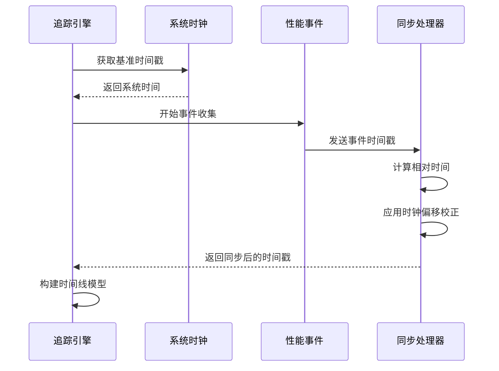

**图表来源**
- [src/tools/performance.ts](file://src/tools/performance.ts#L60-L80)

### 事件过滤策略

系统实现了智能的事件过滤机制，只保留对性能分析有用的事件：

1. **类别过滤**：基于预定义的追踪类别进行过滤
2. **优先级过滤**：优先保留高优先级的性能事件
3. **重复过滤**：避免重复事件的干扰
4. **噪声过滤**：过滤掉对性能分析无意义的事件

**章节来源**
- [src/tools/performance.ts](file://src/tools/performance.ts#L60-L100)
- [src/trace-processing/parse.ts](file://src/trace-processing/parse.ts#L30-L80)

## 性能洞察生成逻辑

性能洞察生成是系统的核心功能，通过复杂的算法分析追踪数据，提取有价值的性能信息：

### 洞察类型分类

系统支持多种类型的性能洞察：

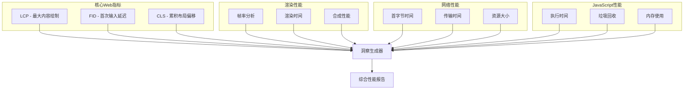

**图表来源**
- [src/trace-processing/parse.ts](file://src/trace-processing/parse.ts#L95-L140)

### 关键性能指标提取

系统能够自动识别和计算以下关键性能指标：

| 指标名称 | 计算方法 | 优化建议 |
|---------|----------|----------|
| LCP (最大内容绘制) | 最后加载的可见元素的渲染时间 | 减少资源大小，使用CDN |
| FID (首次输入延迟) | 用户首次交互到响应的时间 | 优化JavaScript执行，减少阻塞 |
| CLS (累积布局偏移) | 页面布局变化的总和 | 使用固定尺寸，预分配空间 |
| TTFB (首字节时间) | 请求到接收第一个字节的时间 | 优化服务器响应，使用缓存 |
| FP (首次绘制) | 页面首次渲染的时间 | 优化关键资源加载 |

### 洞察分析算法

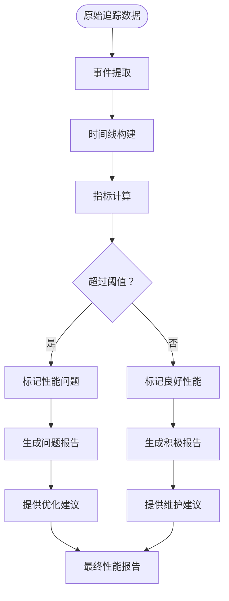

**图表来源**
- [src/trace-processing/parse.ts](file://src/trace-processing/parse.ts#L95-L140)

**章节来源**
- [src/trace-processing/parse.ts](file://src/trace-processing/parse.ts#L95-L141)

## 端到端使用示例

以下是一个完整的性能分析工作流程示例，展示了从启动追踪到获取分析结果的全过程：

### 示例场景：电商网站性能分析

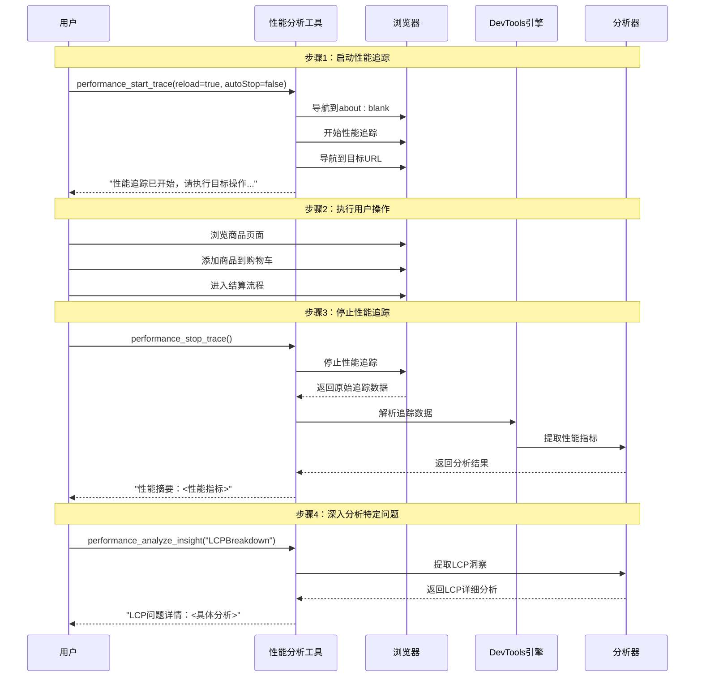

**图表来源**
- [tests/tools/performance.test.ts](file://tests/tools/performance.test.ts#L25-L100)

### 实际代码示例

以下是具体的使用示例，展示了如何在实际项目中集成性能分析功能：

#### 启动性能追踪
```typescript
// 启动追踪并重载页面
await performance_start_trace({
  reload: true,
  autoStop: false
});
```

#### 自动停止追踪
```typescript
// 启动追踪并自动停止
await performance_start_trace({
  reload: false,
  autoStop: true
});
```

#### 分析特定洞察
```typescript
// 分析LCP问题
await performance_analyze_insight({
  insightName: "LCPBreakdown"
});
```

**章节来源**
- [tests/tools/performance.test.ts](file://tests/tools/performance.test.ts#L25-L200)

## 实现细节

### 资源开销优化

性能分析系统在设计时充分考虑了资源开销问题，采用了多种优化策略：

#### 追踪类别优化
- 使用`-*`排除默认类别，最小化不必要的事件收集
- 仅启用关键的性能监控类别
- 动态调整追踪级别以平衡精度和性能

#### 内存管理
- 及时释放解析后的追踪数据
- 使用弱引用避免内存泄漏
- 实现数据压缩以减少内存占用

#### CPU使用优化
- 异步处理追踪数据
- 使用流式处理减少CPU峰值
- 智能调度避免长时间阻塞

### 错误处理机制

系统实现了完善的错误处理机制：

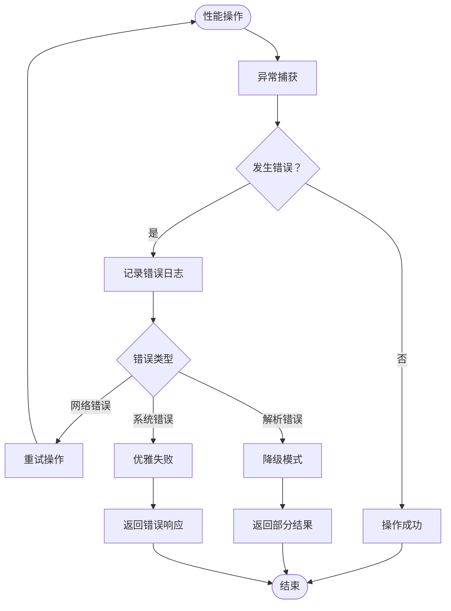

**图表来源**
- [src/tools/performance.ts](file://src/tools/performance.ts#L150-L188)

### 时间戳精度保证

为了确保性能测量的准确性，系统实现了多层时间戳精度保证机制：

1. **硬件时间戳**：使用高精度计时器
2. **软件校正**：补偿系统时钟漂移
3. **事件同步**：确保事件间的正确时序
4. **抖动过滤**：去除时间戳的随机波动

**章节来源**
- [src/tools/performance.ts](file://src/tools/performance.ts#L150-L188)
- [src/trace-processing/parse.ts](file://src/trace-processing/parse.ts#L30-L80)

## 故障排除指南

### 常见问题及解决方案

#### 追踪启动失败
**症状**：`Error: a performance trace is already running`
**原因**：尝试启动多个并发追踪
**解决方案**：确保先调用`performance_stop_trace`再启动新追踪

#### 解析错误
**症状**：追踪数据无法解析
**可能原因**：
- 网络连接中断导致数据不完整
- 浏览器版本不兼容
- 追踪数据损坏

**解决方案**：
1. 检查网络连接稳定性
2. 更新浏览器到最新版本
3. 重新启动浏览器实例

#### 洞察分析失败
**症状**：无法获取特定洞察
**可能原因**：
- 追踪数据中缺少相关信息
- 洞察名称拼写错误
- 追踪时间过短

**解决方案**：
1. 确保追踪包含足够的时间范围
2. 验证洞察名称的正确性
3. 增加追踪时间或重新录制

### 性能优化建议

#### 减少追踪开销
- 使用自动停止模式避免长时间追踪
- 限制追踪类别以减少数据量
- 在生产环境中谨慎使用详细追踪

#### 提高分析准确性
- 确保网络环境稳定
- 避免在追踪期间进行其他密集操作
- 使用一致的测试环境

**章节来源**
- [tests/tools/performance.test.ts](file://tests/tools/performance.test.ts#L100-L200)
- [src/tools/performance.ts](file://src/tools/performance.ts#L150-L188)

## 结论

Chrome DevTools MCP性能分析工具提供了一个完整、可靠的性能监控解决方案。通过`performance_start_trace`、`performance_stop_trace`和`performance_analyze_insight`三个核心工具，开发者可以轻松地捕获和分析网页性能数据。

该系统的主要优势包括：

1. **完整的性能指标覆盖**：支持Core Web Vitals和其他关键性能指标
2. **精确的事件收集**：通过精心设计的追踪类别确保数据质量
3. **智能的洞察生成**：自动识别性能问题并提供优化建议
4. **灵活的使用方式**：支持手动和自动两种追踪模式
5. **强大的错误处理**：确保系统稳定性和用户体验

通过合理使用这些工具，开发团队可以显著提升网页性能，改善用户体验，并建立可靠的性能监控体系。随着Web应用复杂性的不断增加，这样的性能分析工具将成为现代Web开发不可或缺的重要组成部分。