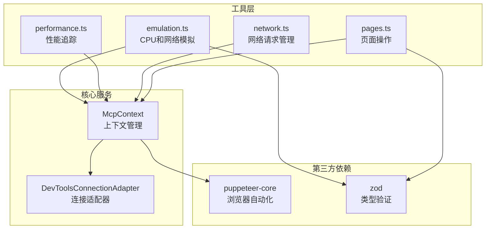
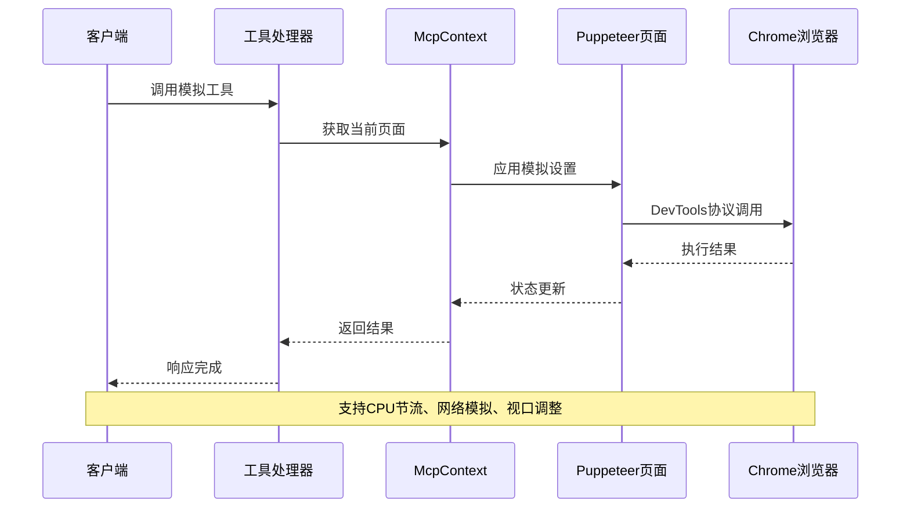
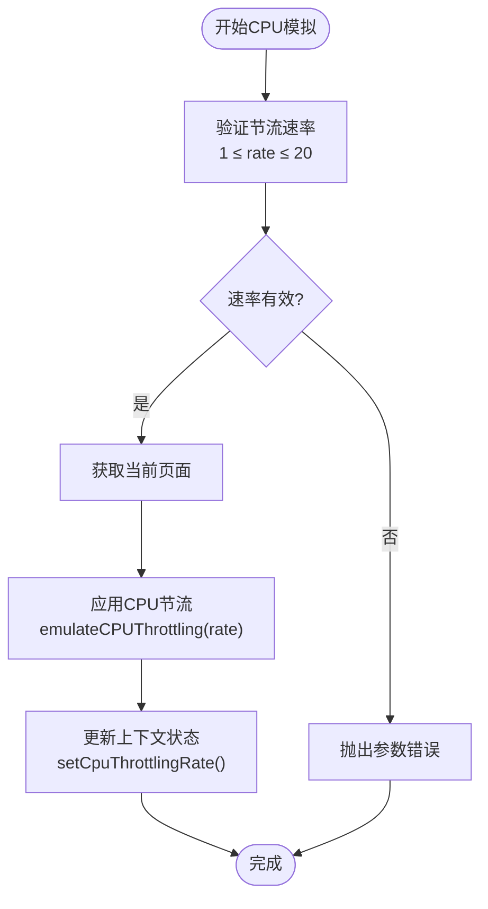
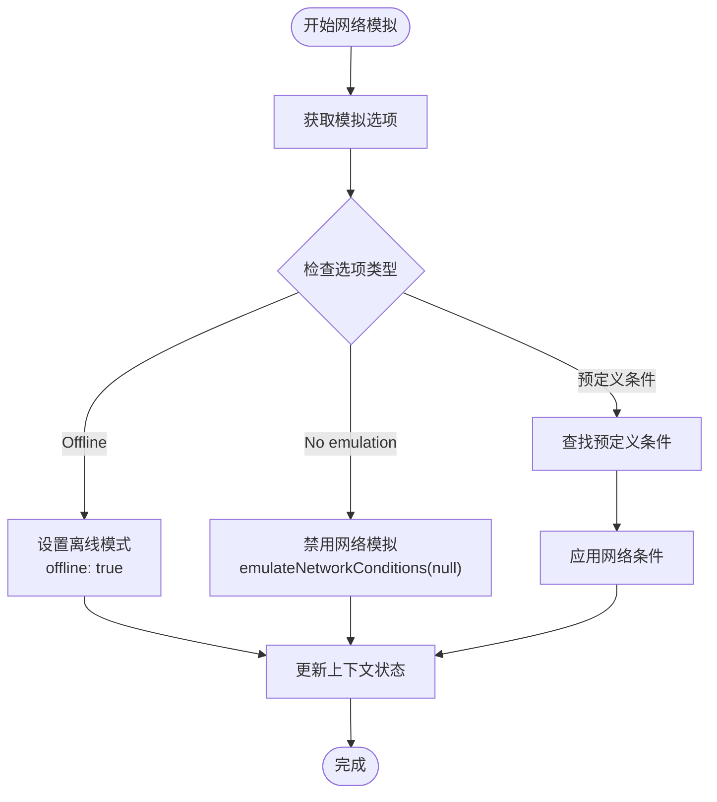
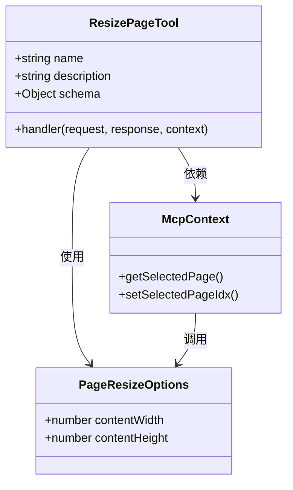
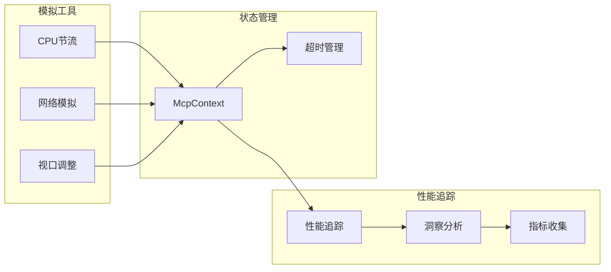
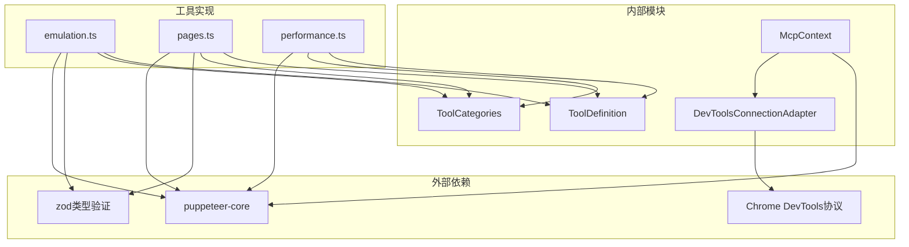
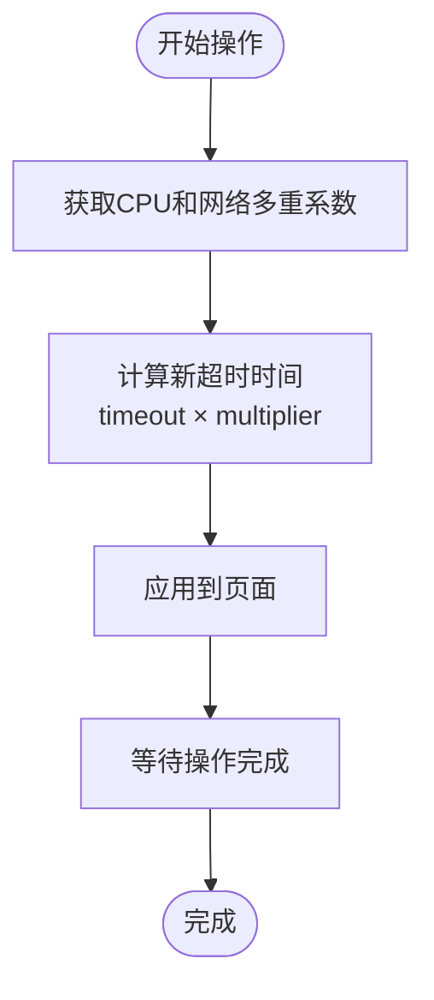

# 环境模拟

<cite>
**本文档中引用的文件**
- [src/tools/emulation.ts](file://src/tools/emulation.ts)
- [src/tools/performance.ts](file://src/tools/performance.ts)
- [src/tools/pages.ts](file://src/tools/pages.ts)
- [src/tools/network.ts](file://src/tools/network.ts)
- [src/tools/categories.ts](file://src/tools/categories.ts)
- [src/tools/ToolDefinition.ts](file://src/tools/ToolDefinition.ts)
- [src/third_party/index.ts](file://src/third_party/index.ts)
- [src/McpContext.ts](file://src/McpContext.ts)
- [src/DevToolsConnectionAdapter.ts](file://src/DevToolsConnectionAdapter.ts)
- [tests/tools/emulation.test.ts](file://tests/tools/emulation.test.ts)
- [tests/tools/pages.test.ts](file://tests/tools/pages.test.ts)
</cite>

## 目录
1. [简介](#简介)
2. [项目结构](#项目结构)
3. [核心组件](#核心组件)
4. [架构概览](#架构概览)
5. [详细组件分析](#详细组件分析)
6. [依赖关系分析](#依赖关系分析)
7. [性能考虑](#性能考虑)
8. [故障排除指南](#故障排除指南)
9. [结论](#结论)

## 简介

环境模拟工具是Chrome DevTools MCP项目中的核心功能模块，提供了强大的浏览器环境模拟能力。该模块包含三个主要工具：`emulate_cpu`用于CPU节流模拟、`emulate_network`用于网络条件模拟，以及`resize_page`用于页面视口调整。这些工具通过DevTools协议实现底层控制，并与Puppeteer的emulation API深度集成，为性能测试和用户体验评估提供了精确的环境控制能力。

## 项目结构

环境模拟工具在项目中的组织结构体现了清晰的职责分离和模块化设计：

**图表来源**
- [src/tools/emulation.ts](file://src/tools/emulation.ts#L1-L88)
- [src/tools/performance.ts](file://src/tools/performance.ts#L1-L188)
- [src/tools/pages.ts](file://src/tools/pages.ts#L1-L234)
- [src/McpContext.ts](file://src/McpContext.ts#L1-L487)

**章节来源**
- [src/tools/emulation.ts](file://src/tools/emulation.ts#L1-L88)
- [src/tools/performance.ts](file://src/tools/performance.ts#L1-L188)
- [src/tools/pages.ts](file://src/tools/pages.ts#L1-L234)

## 核心组件

环境模拟系统由以下核心组件构成：

### 模拟工具定义
每个模拟工具都遵循统一的接口规范，确保一致的行为模式和错误处理机制。

### 上下文管理系统
McpContext负责管理所有模拟状态，包括网络条件、CPU节流率和页面状态，提供跨工具的状态同步能力。

### DevTools协议适配器
DevToolsConnectionAdapter桥接了MCP服务器与Chrome DevTools协议，实现了底层浏览器控制的透明化。

**章节来源**
- [src/tools/emulation.ts](file://src/tools/emulation.ts#L1-L88)
- [src/McpContext.ts](file://src/McpContext.ts#L1-L487)
- [src/DevToolsConnectionAdapter.ts](file://src/DevToolsConnectionAdapter.ts#L1-L43)

## 架构概览

环境模拟系统的整体架构展现了分层设计和事件驱动的交互模式：

**图表来源**
- [src/tools/emulation.ts](file://src/tools/emulation.ts#L25-L86)
- [src/tools/pages.ts](file://src/tools/pages.ts#L154-L182)
- [src/McpContext.ts](file://src/McpContext.ts#L150-L180)

## 详细组件分析

### CPU节流模拟 (emulate_cpu)

CPU节流模拟工具通过`emulateCPUThrottling`方法实现对页面执行速度的精确控制。

#### 配置参数
- **throttlingRate**: 数值类型，范围1-20，表示减速倍数。1表示禁用节流，2表示2倍减速，依此类推。

#### 实现机制

**图表来源**
- [src/tools/emulation.ts](file://src/tools/emulation.ts#L60-L86)
- [src/McpContext.ts](file://src/McpContext.ts#L150-L160)

#### 性能影响
CPU节流直接影响页面的JavaScript执行速度、渲染性能和用户交互响应时间。高倍数节流会显著增加页面加载时间和资源消耗。

**章节来源**
- [src/tools/emulation.ts](file://src/tools/emulation.ts#L47-L86)
- [tests/tools/emulation.test.ts](file://tests/tools/emulation.test.ts#L85-L110)

### 网络条件模拟 (emulate_network)

网络模拟工具支持多种预定义的网络条件和离线模式，通过`emulateNetworkConditions`方法实现。

#### 配置选项
- **No emulation**: 禁用网络模拟，使用正常网络条件
- **Offline**: 模拟完全离线状态
- **预定义网络条件**: Fast 4G、Slow 4G、Fast 3G、Slow 3G等

#### 网络条件映射表

| 条件名称 | 下载速度 | 上传速度 | 延迟 | 多重系数 |
|---------|---------|---------|------|---------|
| Fast 4G | 10 Mbps | 10 Mbps | 20ms | 1x |
| Slow 4G | 1.6 Mbps | 750 Kbps | 300ms | 2.5x |
| Fast 3G | 1.6 Mbps | 750 Kbps | 50ms | 5x |
| Slow 3G | 375 Kbps | 75 Kbps | 200ms | 10x |

#### 实现流程

**图表来源**
- [src/tools/emulation.ts](file://src/tools/emulation.ts#L25-L58)
- [src/McpContext.ts](file://src/McpContext.ts#L130-L150)

#### 错误处理
网络模拟工具包含严格的参数验证机制，确保只接受有效的预定义条件。

**章节来源**
- [src/tools/emulation.ts](file://src/tools/emulation.ts#L25-L58)
- [tests/tools/emulation.test.ts](file://tests/tools/emulation.test.ts#L40-L60)

### 页面视口调整 (resize_page)

视口调整工具允许动态修改页面窗口大小，支持响应式设计测试和移动端模拟。

#### 配置参数
- **width**: 页面宽度像素值
- **height**: 页面高度像素值

#### 实现机制

**图表来源**
- [src/tools/pages.ts](file://src/tools/pages.ts#L154-L182)
- [src/tools/ToolDefinition.ts](file://src/tools/ToolDefinition.ts#L15-L35)

#### 视口变化影响
页面尺寸调整会影响CSS媒体查询、布局计算、元素定位和触摸事件处理。

**章节来源**
- [src/tools/pages.ts](file://src/tools/pages.ts#L154-L182)
- [tests/tools/pages.test.ts](file://tests/tools/pages.test.ts#L183-L214)

### 性能追踪集成

环境模拟工具与性能追踪系统紧密集成，提供全面的性能监控能力。

**图表来源**
- [src/tools/performance.ts](file://src/tools/performance.ts#L25-L100)
- [src/McpContext.ts](file://src/McpContext.ts#L180-L220)

**章节来源**
- [src/tools/performance.ts](file://src/tools/performance.ts#L25-L188)
- [src/McpContext.ts](file://src/McpContext.ts#L180-L220)

## 依赖关系分析

环境模拟系统的依赖关系展现了清晰的层次结构：

**图表来源**
- [src/third_party/index.ts](file://src/third_party/index.ts#L1-L27)
- [src/tools/ToolDefinition.ts](file://src/tools/ToolDefinition.ts#L1-L124)
- [src/McpContext.ts](file://src/McpContext.ts#L1-L50)

**章节来源**
- [src/third_party/index.ts](file://src/third_party/index.ts#L1-L27)
- [src/tools/ToolDefinition.ts](file://src/tools/ToolDefinition.ts#L1-L124)

## 性能考虑

### 节流设置对性能分析的影响

不同的节流设置会对性能分析结果产生显著影响：

#### CPU节流影响
- **低倍数节流（1-4x）**: 对性能测试影响较小，主要用于模拟低端设备
- **中倍数节流（5-10x）**: 显著影响页面响应时间和交互体验
- **高倍数节流（11-20x）**: 可能导致页面功能异常或测试失败

#### 网络节流影响
- **Fast 4G**: 接近真实移动网络体验，适合大多数应用场景
- **Slow 3G**: 极限网络条件，用于测试边缘情况
- **Offline**: 完全离线状态，测试缓存和离线功能

### 超时管理策略

系统根据模拟设置自动调整超时时间：

**图表来源**
- [src/McpContext.ts](file://src/McpContext.ts#L200-L220)

## 故障排除指南

### 常见错误及解决方案

#### 参数验证错误
- **问题**: 无效的节流速率或视口尺寸
- **原因**: 参数超出允许范围
- **解决方案**: 检查参数范围，确保1-20的节流速率和合理的尺寸值

#### 页面状态错误
- **问题**: 尝试操作已关闭的页面
- **原因**: 页面被意外关闭或未正确选择
- **解决方案**: 使用`list_pages`查看可用页面，重新选择正确的页面索引

#### 网络条件错误
- **问题**: 设置不存在的网络条件
- **原因**: 使用了无效的预定义条件名称
- **解决方案**: 使用`No emulation`或`Offline`作为默认选项

### 调试技巧

1. **状态检查**: 使用`list_pages`确认当前页面状态
2. **条件查询**: 检查当前的网络条件和CPU节流设置
3. **日志分析**: 启用详细日志记录以跟踪模拟状态变化

**章节来源**
- [tests/tools/emulation.test.ts](file://tests/tools/emulation.test.ts#L56-L85)
- [tests/tools/pages.test.ts](file://tests/tools/pages.test.ts#L100-L130)

## 结论

环境模拟工具为Chrome DevTools MCP项目提供了全面的浏览器环境控制能力。通过`emulate_cpu`、`emulate_network`和`resize_page`三个核心工具，开发者可以精确模拟各种设备和网络条件，进行深入的性能测试和用户体验评估。

这些工具不仅提供了直观的配置接口，还通过智能的超时管理和状态同步机制，确保了在复杂测试场景下的稳定性和可靠性。与Puppeteer和DevTools协议的深度集成，使得环境模拟成为了一个既强大又易于使用的功能模块。

未来的发展方向包括扩展更多的模拟选项、优化性能监控精度，以及提供更丰富的调试和分析工具，进一步提升开发者的测试效率和产品质量。