# 网络监控

<cite>
**本文档中引用的文件**
- [src/tools/network.ts](file://src/tools/network.ts)
- [src/formatters/networkFormatter.ts](file://src/formatters/networkFormatter.ts)
- [src/PageCollector.ts](file://src/PageCollector.ts)
- [src/utils/pagination.ts](file://src/utils/pagination.ts)
- [src/McpResponse.ts](file://src/McpResponse.ts)
- [src/tools/ToolDefinition.ts](file://src/tools/ToolDefinition.ts)
- [src/utils/types.ts](file://src/utils/types.ts)
- [tests/tools/network.test.ts](file://tests/tools/network.test.ts)
- [tests/formatters/networkFormatter.test.ts](file://tests/formatters/networkFormatter.test.ts)
- [tests/McpResponse.test.ts](file://tests/McpResponse.test.ts)
- [tests/utils.ts](file://tests/utils.ts)
</cite>

## 目录
1. [简介](#简介)
2. [项目结构](#项目结构)
3. [核心组件](#核心组件)
4. [架构概览](#架构概览)
5. [详细组件分析](#详细组件分析)
6. [网络请求捕获机制](#网络请求捕获机制)
7. [请求格式化与展示](#请求格式化与展示)
8. [过滤与分页策略](#过滤与分页策略)
9. [实际应用案例](#实际应用案例)
10. [性能考虑](#性能考虑)
11. [故障排除指南](#故障排除指南)
12. [结论](#结论)

## 简介

Chrome DevTools MCP网络监控工具是一个强大的网络请求分析系统，提供了完整的网络请求捕获、过滤、格式化和调试功能。该系统通过PageCollector监听浏览器页面的网络事件，使用networkFormatter将原始请求数据转换为MCP兼容的响应格式，并提供了灵活的过滤选项和分页策略。

## 项目结构

网络监控功能的核心文件组织如下：

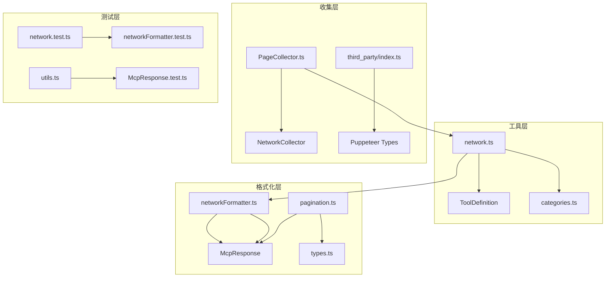

**图表来源**
- [src/tools/network.ts](file://src/tools/network.ts#L1-L101)
- [src/formatters/networkFormatter.ts](file://src/formatters/networkFormatter.ts#L1-L104)
- [src/PageCollector.ts](file://src/PageCollector.ts#L1-L218)

**章节来源**
- [src/tools/network.ts](file://src/tools/network.ts#L1-L101)
- [src/formatters/networkFormatter.ts](file://src/formatters/networkFormatter.ts#L1-L104)
- [src/PageCollector.ts](file://src/PageCollector.ts#L1-L218)

## 核心组件

网络监控系统由以下核心组件构成：

### 1. 网络工具定义
- **listNetworkRequests**: 列出当前页面的所有网络请求
- **getNetworkRequest**: 获取指定ID的单个网络请求详情

### 2. 请求收集器
- **PageCollector**: 基础页面事件收集器
- **NetworkCollector**: 专门的网络请求收集器

### 3. 数据格式化器
- **networkFormatter**: 将网络请求数据格式化为MCP兼容格式
- **pagination**: 处理请求列表的分页逻辑

### 4. 响应处理器
- **McpResponse**: 处理网络请求相关的响应格式化

**章节来源**
- [src/tools/network.ts](file://src/tools/network.ts#L34-L101)
- [src/PageCollector.ts](file://src/PageCollector.ts#L180-L218)
- [src/formatters/networkFormatter.ts](file://src/formatters/networkFormatter.ts#L1-L104)

## 架构概览

网络监控系统采用事件驱动的架构模式，通过多层抽象实现网络请求的捕获、处理和展示：

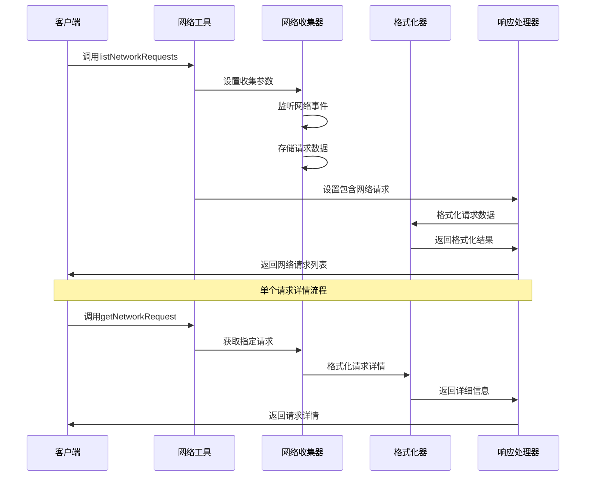

**图表来源**
- [src/tools/network.ts](file://src/tools/network.ts#L34-L101)
- [src/PageCollector.ts](file://src/PageCollector.ts#L40-L120)
- [src/McpResponse.ts](file://src/McpResponse.ts#L30-L84)

## 详细组件分析

### 网络工具定义分析

网络工具定义了两个主要的网络监控功能：

#### listNetworkRequests 工具
该工具提供全面的网络请求列表功能，支持多种过滤和分页选项：

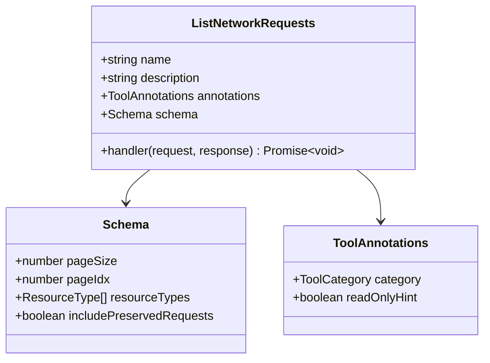

**图表来源**
- [src/tools/network.ts](file://src/tools/network.ts#L34-L80)

#### getNetworkRequest 工具
该工具用于获取特定网络请求的详细信息：

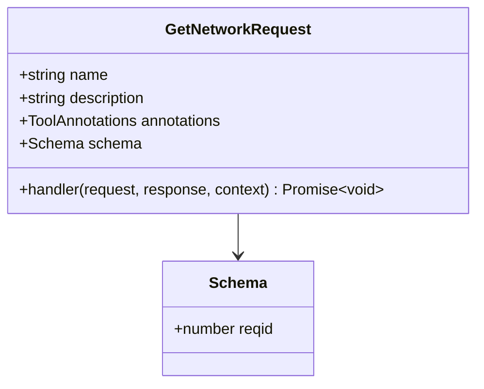

**图表来源**
- [src/tools/network.ts](file://src/tools/network.ts#L82-L101)

**章节来源**
- [src/tools/network.ts](file://src/tools/network.ts#L34-L101)

### PageCollector 分析

PageCollector是网络请求收集的基础类，提供了页面事件监听和数据存储功能：

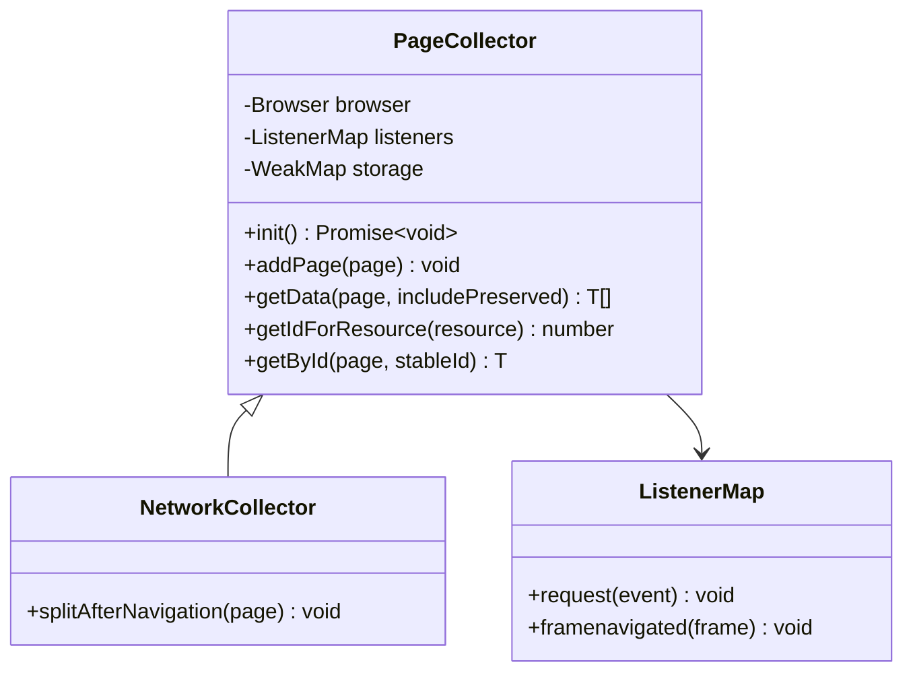

**图表来源**
- [src/PageCollector.ts](file://src/PageCollector.ts#L30-L120)

NetworkCollector继承自PageCollector，专门处理网络请求的特殊逻辑：

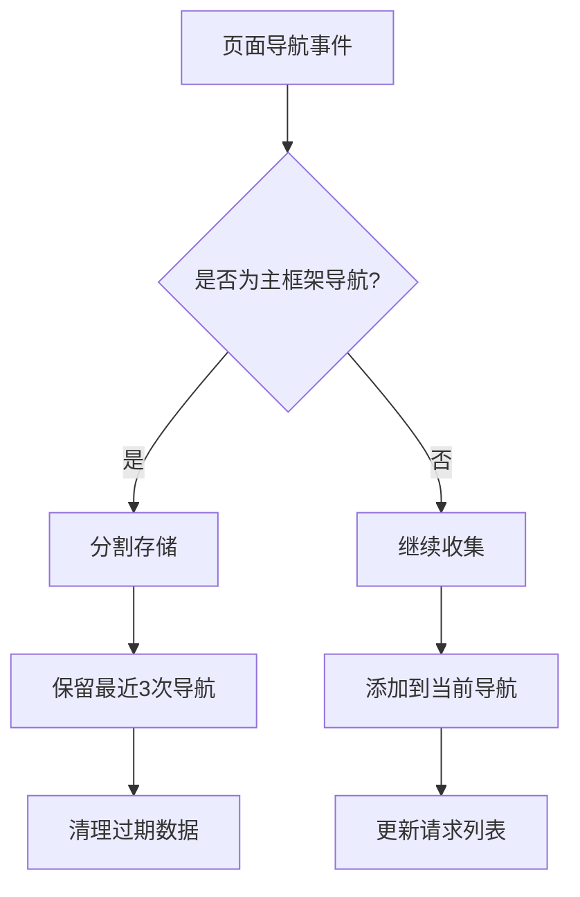

**图表来源**
- [src/PageCollector.ts](file://src/PageCollector.ts#L180-L218)

**章节来源**
- [src/PageCollector.ts](file://src/PageCollector.ts#L30-L218)

### networkFormatter 分析

networkFormatter负责将网络请求数据转换为可读的格式：

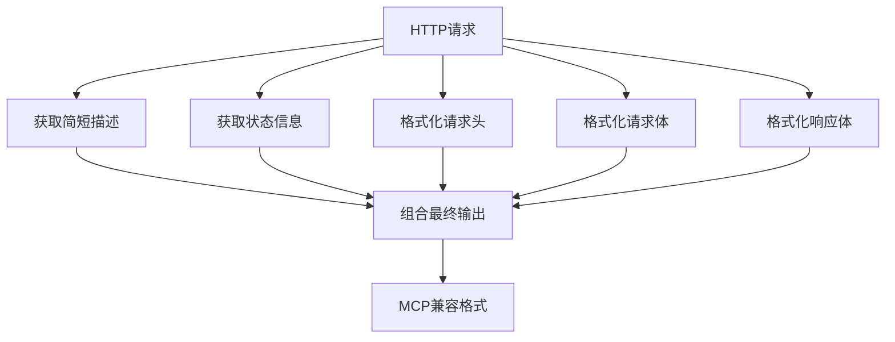

**图表来源**
- [src/formatters/networkFormatter.ts](file://src/formatters/networkFormatter.ts#L10-L104)

**章节来源**
- [src/formatters/networkFormatter.ts](file://src/formatters/networkFormatter.ts#L1-L104)

## 网络请求捕获机制

### 事件监听机制

网络请求捕获通过PageCollector的事件监听机制实现：

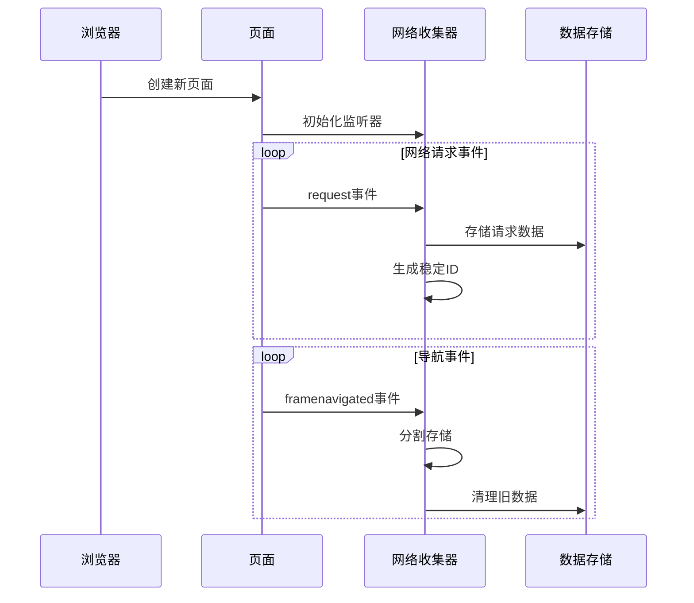

**图表来源**
- [src/PageCollector.ts](file://src/PageCollector.ts#L40-L120)

### 请求生命周期管理

网络收集器维护请求的完整生命周期：

1. **请求创建**: 监听`request`事件捕获新请求
2. **导航分割**: 主框架导航时分割存储
3. **数据保留**: 保留最近3次导航的请求数据
4. **内存管理**: 自动清理过期数据

**章节来源**
- [src/PageCollector.ts](file://src/PageCollector.ts#L40-L120)
- [src/PageCollector.ts](file://src/PageCollector.ts#L180-L218)

## 请求格式化与展示

### 状态检测机制

networkFormatter实现了智能的状态检测：

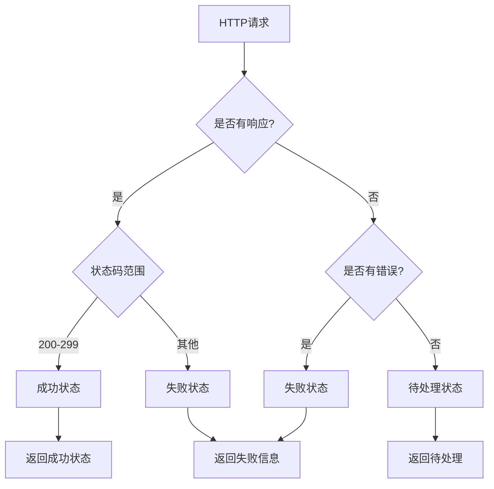

**图表来源**
- [src/formatters/networkFormatter.ts](file://src/formatters/networkFormatter.ts#L20-L35)

### 请求体和响应体处理

系统支持多种数据格式的处理：

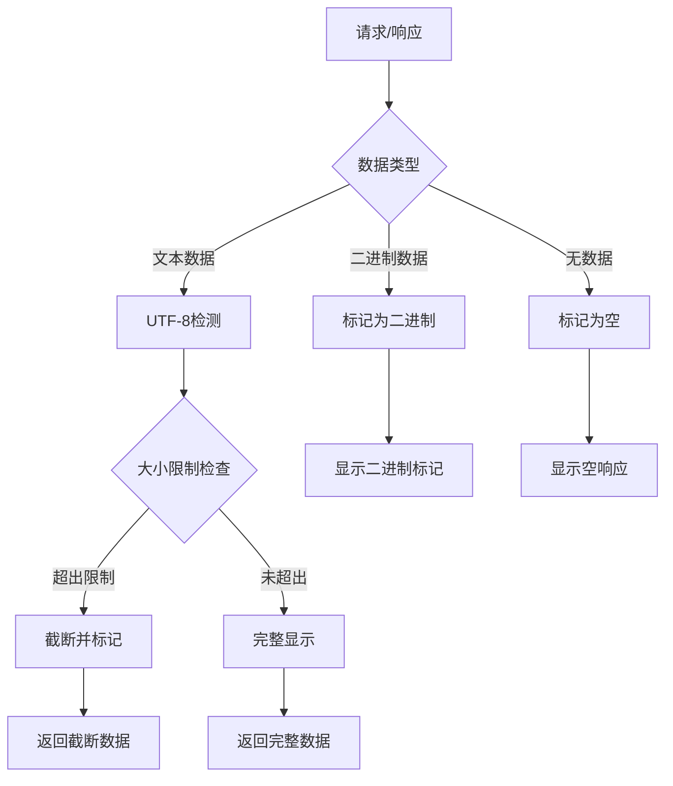

**图表来源**
- [src/formatters/networkFormatter.ts](file://src/formatters/networkFormatter.ts#L40-L104)

**章节来源**
- [src/formatters/networkFormatter.ts](file://src/formatters/networkFormatter.ts#L20-L104)

## 过滤与分页策略

### 资源类型过滤

系统支持按资源类型进行精确过滤：

| 资源类型 | 描述 | 用途 |
|---------|------|------|
| document | HTML文档 | 页面加载分析 |
| stylesheet | CSS样式表 | 样式加载优化 |
| image | 图像资源 | 图片性能分析 |
| script | JavaScript脚本 | 脚本加载监控 |
| xhr/fetch | 异步请求 | API调用跟踪 |
| websocket | WebSocket连接 | 实时通信监控 |

### 分页实现

分页功能通过独立的pagination模块实现：

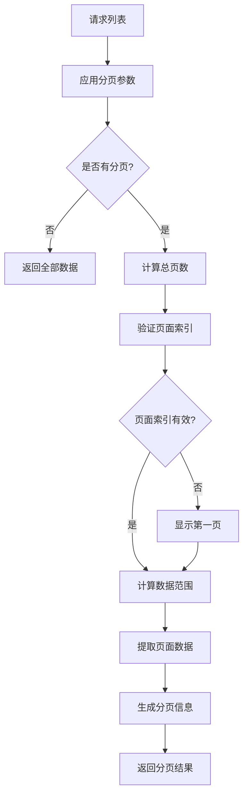

**图表来源**
- [src/utils/pagination.ts](file://src/utils/pagination.ts#L20-L84)

### 分页配置选项

| 参数 | 类型 | 默认值 | 描述 |
|------|------|--------|------|
| pageSize | number | 20 | 每页最大条目数 |
| pageIdx | number | 0 | 当前页索引(0-based) |
| resourceTypes | string[] | [] | 资源类型过滤器 |
| includePreservedRequests | boolean | false | 是否包含历史请求 |

**章节来源**
- [src/utils/pagination.ts](file://src/utils/pagination.ts#L1-L85)
- [src/tools/network.ts](file://src/tools/network.ts#L45-L75)

## 实际应用案例

### 案例1：分析页面加载性能

使用网络监控工具分析页面加载性能的典型场景：

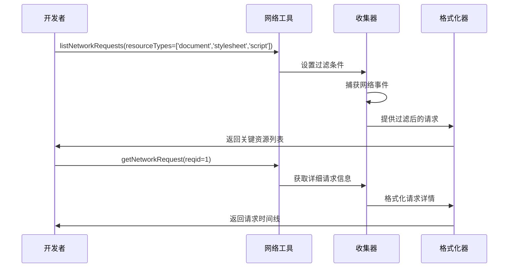

### 案例2：调试API请求问题

当API请求出现问题时的调试流程：

1. **列出所有请求**: 使用`listNetworkRequests()`获取所有网络活动
2. **筛选API请求**: 应用过滤器`resourceTypes=['xhr','fetch']`
3. **定位问题请求**: 查找状态码异常的请求
4. **获取详细信息**: 使用`getNetworkRequest()`获取请求详情
5. **分析错误原因**: 检查请求头、响应体和错误信息

### 案例3：监控资源加载效率

分析网站资源加载效率的最佳实践：

```mermaid
flowchart TD
A[开始监控] --> B[设置过滤器]
B --> C[resourceTypes=['image','script','stylesheet']]
C --> D[收集请求数据]
D --> E[分析加载时间]
E --> F[识别瓶颈资源]
F --> G[生成优化建议]
H[重定向链分析] --> I[检查redirectChain]
I --> J[优化重定向路径]
```

**章节来源**
- [tests/tools/network.test.ts](file://tests/tools/network.test.ts#L15-L166)
- [tests/McpResponse.test.ts](file://tests/McpResponse.test.ts#L364-L521)

## 性能考虑

### 内存管理策略

网络监控系统采用了多项内存优化措施：

1. **弱引用存储**: 使用WeakMap避免内存泄漏
2. **自动清理**: 限制保存最近3次导航的请求数据
3. **懒加载**: 按需加载请求体和响应体数据
4. **大小限制**: 对大型响应体进行截断处理

### 数据处理优化

- **异步处理**: 所有I/O操作采用异步方式
- **流式处理**: 大文件数据采用流式读取
- **缓存机制**: 避免重复计算相同的数据

### 并发控制

系统通过PageCollector的并发控制确保数据一致性：

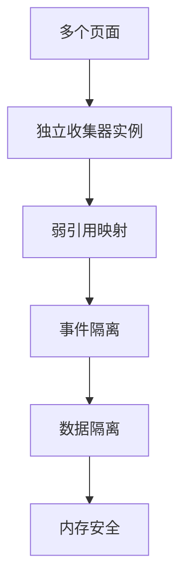

## 故障排除指南

### 常见问题及解决方案

#### 1. 请求未被捕获
**症状**: 调用`listNetworkRequests()`返回空列表
**可能原因**:
- 页面尚未完成导航
- 网络事件监听器未正确初始化
- 请求发生在历史导航中

**解决方案**:
- 等待页面完全加载后再调用
- 检查`includePreservedRequests`参数
- 使用浏览器开发者工具确认网络活动

#### 2. 请求体无法显示
**症状**: 请求详情中缺少请求体或响应体
**可能原因**:
- Puppeteer协议错误
- 数据已过期
- 编码格式不支持

**解决方案**:
- 检查网络请求是否仍在有效期内
- 验证数据编码格式
- 查看错误日志获取更多信息

#### 3. 分页结果不正确
**症状**: 分页显示的条目数量或顺序错误
**可能原因**:
- 分页参数设置错误
- 数据过滤导致结果变化
- 并发修改影响数据完整性

**解决方案**:
- 验证分页参数的有效性
- 检查过滤条件的影响
- 确保数据收集过程的原子性

### 调试技巧

1. **启用详细日志**: 在开发环境中启用调试模式
2. **使用快照测试**: 参考测试用例验证功能正常
3. **监控内存使用**: 定期检查内存占用情况
4. **验证数据完整性**: 确保请求ID的唯一性和一致性

**章节来源**
- [tests/McpResponse.test.ts](file://tests/McpResponse.test.ts#L364-L521)
- [tests/tools/network.test.ts](file://tests/tools/network.test.ts#L15-L166)

## 结论

Chrome DevTools MCP网络监控工具提供了一个完整、高效的网络请求分析解决方案。通过PageCollector的事件驱动架构、networkFormatter的智能数据处理、以及灵活的过滤和分页功能，开发者可以深入分析网页的网络行为，快速定位性能问题，并优化资源加载策略。

该系统的模块化设计使其易于扩展和维护，而完善的测试覆盖确保了功能的可靠性和稳定性。无论是日常开发调试还是生产环境监控，这套网络监控工具都能提供有价值的洞察和分析能力。