# 调试工具

<cite>
**本文档中引用的文件**
- [src/tools/script.ts](file://src/tools/script.ts)
- [src/tools/console.ts](file://src/tools/console.ts)
- [src/tools/screenshot.ts](file://src/tools/screenshot.ts)
- [src/tools/snapshot.ts](file://src/tools/snapshot.ts)
- [src/formatters/consoleFormatter.ts](file://src/formatters/consoleFormatter.ts)
- [src/formatters/snapshotFormatter.ts](file://src/formatters/snapshotFormatter.ts)
- [src/McpContext.ts](file://src/McpContext.ts)
- [src/tools/ToolDefinition.ts](file://src/tools/ToolDefinition.ts)
- [src/PageCollector.ts](file://src/PageCollector.ts)
- [src/WaitForHelper.ts](file://src/WaitForHelper.ts)
- [src/DevtoolsUtils.ts](file://src/DevtoolsUtils.ts)
- [src/McpResponse.ts](file://src/McpResponse.ts)
- [src/issue-descriptions.ts](file://src/issue-descriptions.ts)
</cite>

## 更新摘要
**已更改内容**
- 更新了控制台消息收集机制，以支持新的问题诊断系统
- 添加了对 `Audits.issueAdded` CDP 事件的订阅
- 集成了 IssueAggregator 来创建和发送 AggregatedIssue 对象
- 增强了控制台消息格式化功能，以包含问题详情
- 更新了相关架构图以反映新的事件流

## 目录
1. [简介](#简介)
2. [项目结构](#项目结构)
3. [核心组件](#核心组件)
4. [架构概览](#架构概览)
5. [详细组件分析](#详细组件分析)
6. [依赖关系分析](#依赖关系分析)
7. [性能考虑](#性能考虑)
8. [故障排除指南](#故障排除指南)
9. [结论](#结论)

## 简介

Chrome DevTools MCP项目提供了一套强大的调试工具，专门用于网页内容的检查、分析和交互。该系统包含五个核心调试工具：`evaluate_script`（脚本执行）、`get_console_message`（控制台消息获取）、`list_console_messages`（控制台消息列表）、`take_screenshot`（截图）和`take_snapshot`（页面快照）。这些工具通过访问无障碍（Accessibility）API和浏览器自动化技术，为开发者提供了深入的网页调试能力。

最近，系统已更新以支持新的问题诊断系统。ConsoleCollector类现在订阅`'Audits.issueAdded'` CDP事件，并使用IssueAggregator创建和发送AggregatedIssue对象。这一增强使得系统能够捕获和处理来自浏览器审计（Audits）面板的各种问题，如混合内容、可访问性违规等，并将这些问题作为控制台消息的一部分进行标准化和格式化。

## 项目结构

该项目采用模块化架构，将不同功能分离到独立的工具文件中。主要目录结构如下：

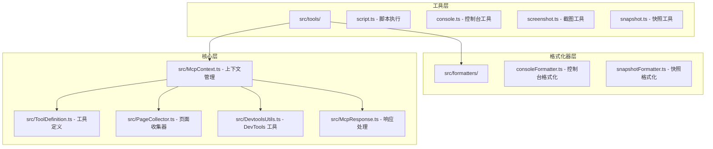

**图表来源**
- [src/tools/script.ts](file://src/tools/script.ts#L1-L87)
- [src/tools/console.ts](file://src/tools/console.ts#L1-L105)
- [src/tools/screenshot.ts](file://src/tools/screenshot.ts#L1-L102)
- [src/tools/snapshot.ts](file://src/tools/snapshot.ts#L1-L54)

**章节来源**
- [src/tools/script.ts](file://src/tools/script.ts#L1-L87)
- [src/tools/console.ts](file://src/tools/console.ts#L1-L105)
- [src/tools/screenshot.ts](file://src/tools/screenshot.ts#L1-L102)
- [src/tools/snapshot.ts](file://src/tools/snapshot.ts#L1-L54)

## 核心组件

### 调试工具架构

系统的核心是基于上下文的架构设计，通过McPContext类统一管理所有调试操作。每个工具都遵循相同的模式：参数验证、执行操作、结果格式化和响应处理。

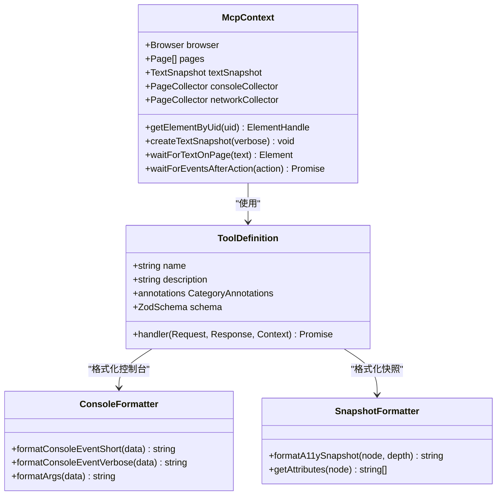

**图表来源**
- [src/McpContext.ts](file://src/McpContext.ts#L50-L150)
- [src/tools/ToolDefinition.ts](file://src/tools/ToolDefinition.ts#L10-L30)
- [src/formatters/consoleFormatter.ts](file://src/formatters/consoleFormatter.ts#L10-L30)
- [src/formatters/snapshotFormatter.ts](file://src/formatters/snapshotFormatter.ts#L10-L30)

**章节来源**
- [src/McpContext.ts](file://src/McpContext.ts#L50-L150)
- [src/tools/ToolDefinition.ts](file://src/tools/ToolDefinition.ts#L10-L30)

## 架构概览

整个调试系统采用事件驱动的异步架构，通过PageCollector管理各种资源的收集和存储。系统支持多页面并发操作，并提供完善的错误处理和超时机制。

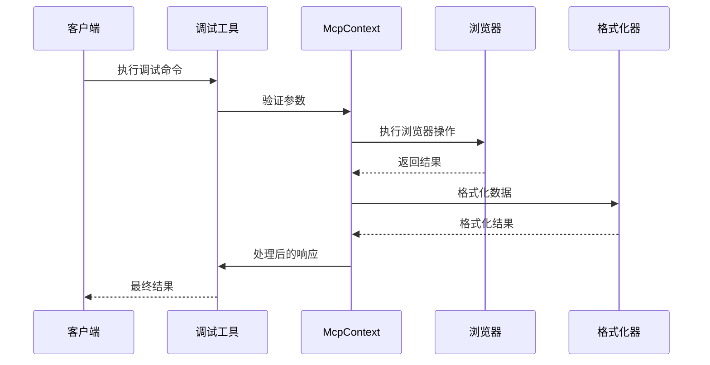

**图表来源**
- [src/tools/script.ts](file://src/tools/script.ts#L30-L80)
- [src/McpContext.ts](file://src/McpContext.ts#L400-L450)
- [src/formatters/consoleFormatter.ts](file://src/formatters/consoleFormatter.ts#L15-L40)

## 详细组件分析

### evaluate_script - 脚本执行工具

evaluate_script工具允许在选定页面上执行JavaScript代码，支持同步和异步函数调用。该工具通过Page.evaluate方法实现脚本执行，并确保返回值的JSON序列化。

#### 实现机制

脚本执行过程包括以下关键步骤：

1. **参数解析和元素处理**：工具首先解析传入的UID参数，通过getElementByUid方法获取对应的元素句柄
2. **框架一致性检查**：确保所有参数元素来自同一框架，避免跨框架执行问题
3. **脚本编译和执行**：使用Page.evaluateHandle编译函数，并通过evaluate执行最终结果
4. **结果处理**：将执行结果转换为JSON字符串格式，便于传输和显示

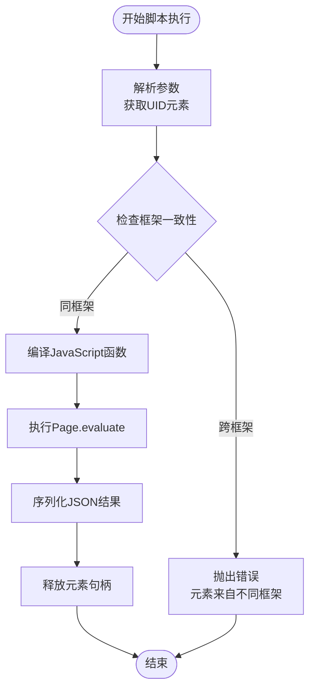

**图表来源**
- [src/tools/script.ts](file://src/tools/script.ts#L30-L80)

#### 使用示例场景

**基础脚本执行**：
```typescript
// 获取页面标题
const script = "() => { return document.title; }";

// 执行异步脚本
const asyncScript = "async () => { return await fetch('/api/data'); }";
```

**带参数的脚本执行**：
```typescript
// 操作DOM元素
const elementScript = "(element) => { return element.textContent; }";
const args = [{ uid: "1_5" }];
```

**章节来源**
- [src/tools/script.ts](file://src/tools/script.ts#L1-L87)

### consoleFormatter - 控制台消息格式化

consoleFormatter负责将浏览器控制台消息转换为人类可读的格式。它提供简洁和详细的两种格式，支持多种消息类型的标准化输出。

#### 格式化机制

控制台消息格式化分为两个层次：

1. **短格式**：提供基本信息摘要，包含消息ID、类型和参数数量
2. **详细格式**：包含完整的消息内容、类型标识和所有参数详情

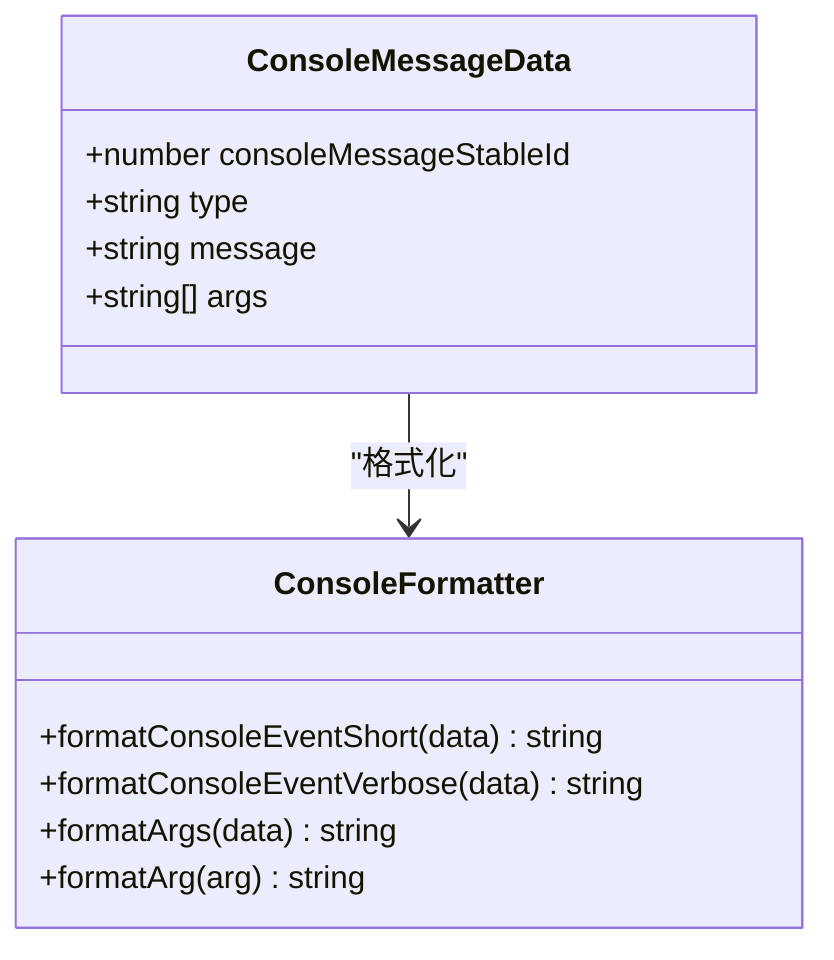

**图表来源**
- [src/formatters/consoleFormatter.ts](file://src/formatters/consoleFormatter.ts#L8-L20)

#### 参数处理逻辑

格式化器智能处理参数数组，当消息文本为空时，第一个参数作为主消息内容：

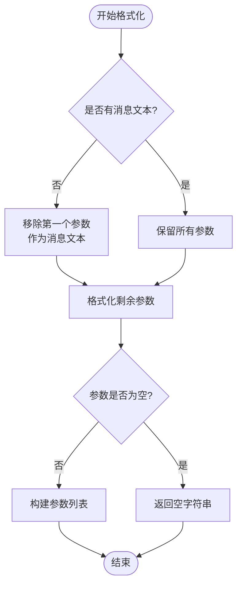

**图表来源**
- [src/formatters/consoleFormatter.ts](file://src/formatters/consoleFormatter.ts#L25-L60)

**章节来源**
- [src/formatters/consoleFormatter.ts](file://src/formatters/consoleFormatter.ts#L1-L60)

### list_console_messages 和 get_console_message - 控制台消息管理

这两个工具协同工作，提供控制台消息的查询和检索功能。list_console_messages支持分页和过滤，而get_console_message提供精确的消息获取。

#### 消息收集机制

系统使用PageCollector类管理控制台消息的收集和存储。更新后，ConsoleCollector类现在能够处理来自`Audits.issueAdded` CDP事件的问题。

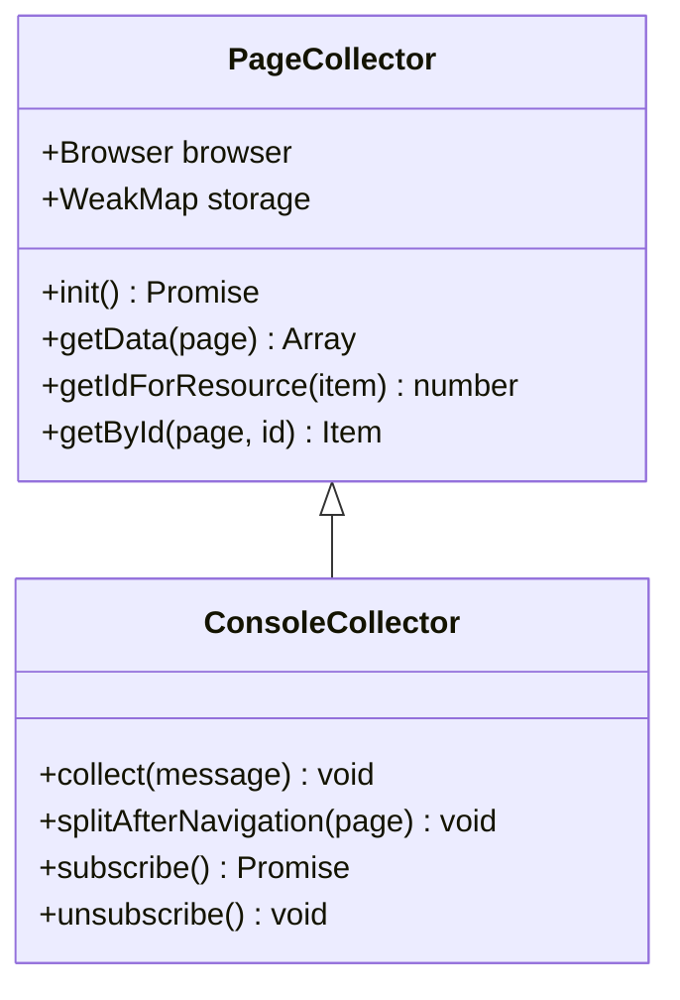

**图表来源**
- [src/PageCollector.ts](file://src/PageCollector.ts#L30-L80)

#### 分页和过滤功能

list_console_messages工具支持灵活的消息筛选：

| 参数 | 类型 | 描述 |
|------|------|------|
| pageSize | number | 每页最大消息数，默认返回所有 |
| pageIdx | number | 页码索引（从0开始） |
| types | string[] | 消息类型过滤器 |
| includePreservedMessages | boolean | 是否包含历史消息 |

**章节来源**
- [src/tools/console.ts](file://src/tools/console.ts#L1-L105)
- [src/PageCollector.ts](file://src/PageCollector.ts#L1-L100)

### take_screenshot - 截图功能

截图工具提供灵活的页面和元素截图功能，支持多种图像格式和质量设置。系统自动处理大尺寸截图的文件保存。

#### 图像处理流程

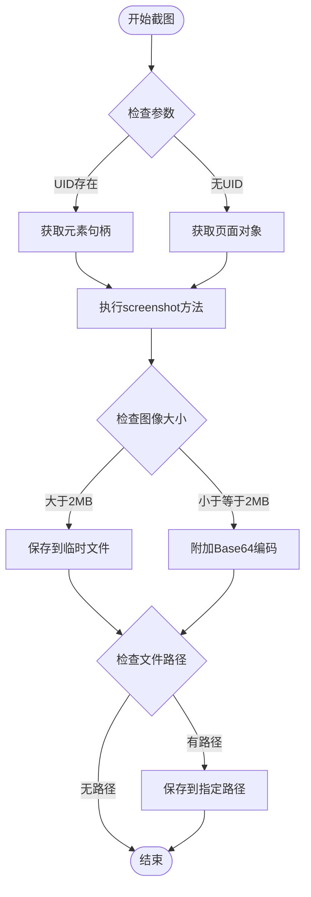

**图表来源**
- [src/tools/screenshot.ts](file://src/tools/screenshot.ts#L40-L100)

#### 支持的图像格式

| 格式 | 描述 | 质量选项 |
|------|------|----------|
| png | 无损压缩，支持透明度 | 不适用 |
| jpeg | 有损压缩，适合照片 | 0-100 |
| webp | 现代格式，支持透明度 | 0-100 |

**章节来源**
- [src/tools/screenshot.ts](file://src/tools/screenshot.ts#L1-L102)

### take_snapshot - 页面快照

快照工具利用无障碍（Accessibility）API生成页面的结构化表示，为后续的元素定位和交互提供基础。

#### 快照生成机制

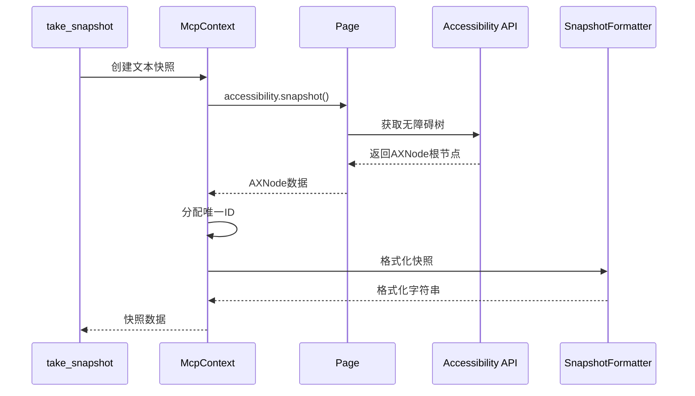

**图表来源**
- [src/McpContext.ts](file://src/McpContext.ts#L350-L400)
- [src/formatters/snapshotFormatter.ts](file://src/formatters/snapshotFormatter.ts#L10-L30)

#### 快照格式化特性

快照格式化器将无障碍节点转换为带ID的树形结构：

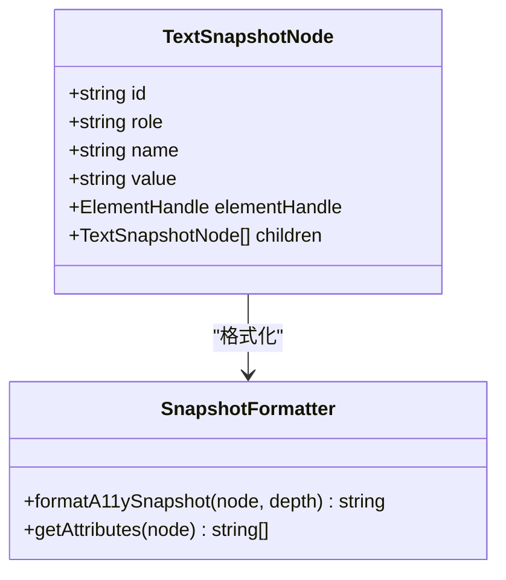

**图表来源**
- [src/formatters/snapshotFormatter.ts](file://src/formatters/snapshotFormatter.ts#L10-L67)

#### 属性映射规则

快照格式化器智能处理各种属性：

| 原始属性 | 映射名称 | 描述 |
|----------|----------|------|
| role | ignored/role | 角色映射，none转为ignored |
| disabled | disableable | 禁用状态标记 |
| expanded | expandable | 可展开状态标记 |
| focused | focusable | 可聚焦状态标记 |
| selected | selectable | 可选择状态标记 |

**章节来源**
- [src/tools/snapshot.ts](file://src/tools/snapshot.ts#L1-L54)
- [src/formatters/snapshotFormatter.ts](file://src/formatters/snapshotFormatter.ts#L1-L67)

### waitFor - 元素等待工具

waitFor工具提供智能的元素等待功能，结合了文本匹配和无障碍API的优势。

#### 等待机制

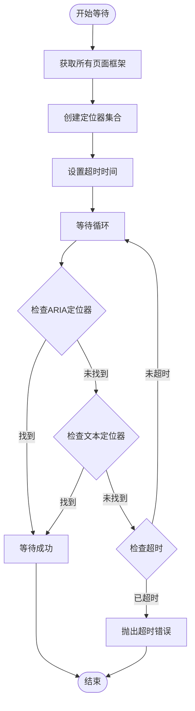

**图表来源**
- [src/McpContext.ts](file://src/McpContext.ts#L450-L485)

**章节来源**
- [src/tools/snapshot.ts](file://src/tools/snapshot.ts#L30-L54)

### 新增功能：问题诊断系统集成

#### 问题收集机制

系统已更新以支持新的问题诊断系统。ConsoleCollector类现在订阅`'Audits.issueAdded'` CDP事件，并使用IssueAggregator来聚合和处理问题。

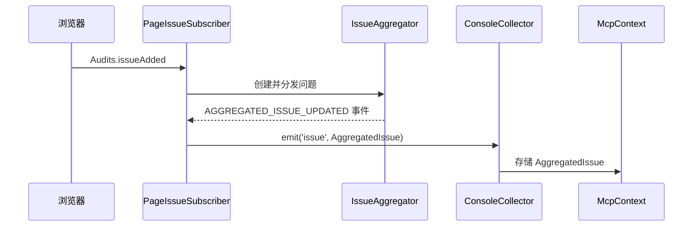

**章节来源**
- [src/PageCollector.ts](file://src/PageCollector.ts#L248-L353)
- [src/McpContext.ts](file://src/McpContext.ts#L128-L146)

#### IssueAggregator 工作流程

IssueAggregator负责将来自CDP的原始问题聚合为标准化的AggregatedIssue对象。

1. **初始化**：创建FakeIssuesManager和IssueAggregator实例
2. **订阅事件**：监听`Audits.issueAdded` CDP事件
3. **问题转换**：使用`createIssuesFromProtocolIssue`将协议问题转换为DevTools问题
4. **聚合**：使用IssueAggregator对相同问题进行聚合
5. **去重**：通过primaryKey确保问题不重复
6. **分发**：通过`page.emit('issue')`将聚合后的问题分发给上层

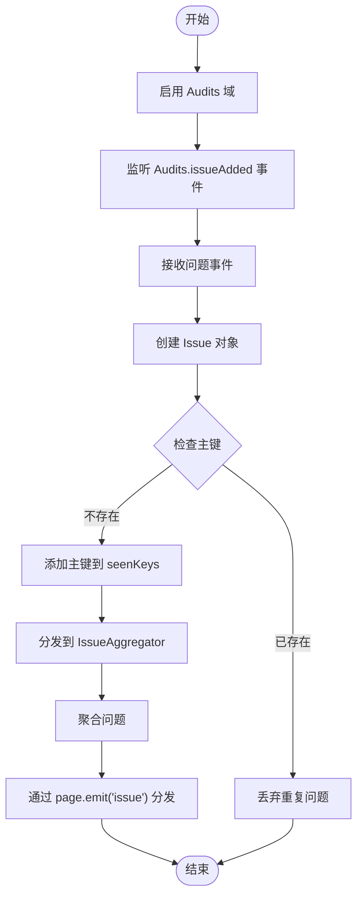

**章节来源**
- [src/PageCollector.ts](file://src/PageCollector.ts#L326-L353)

#### 问题格式化

consoleFormatter现在能够格式化AggregatedIssue对象，提供详细的诊断信息。

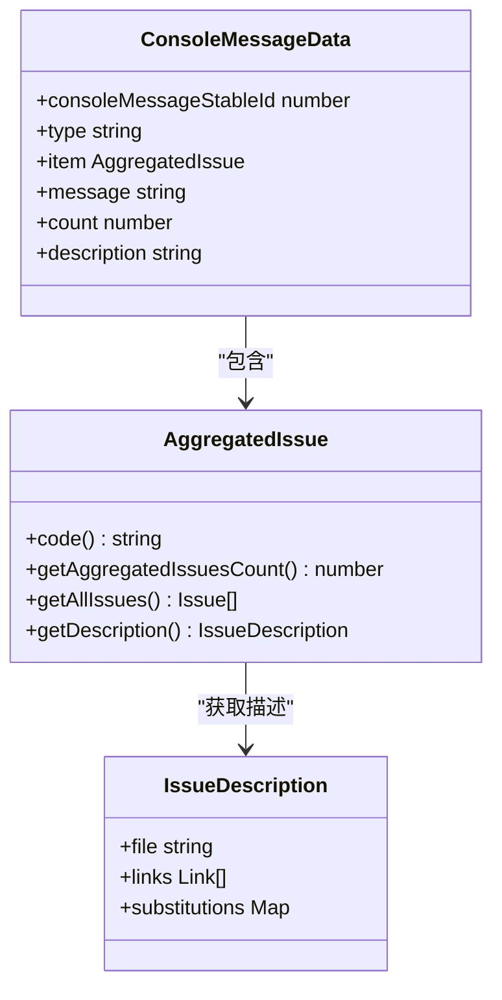

**章节来源**
- [src/formatters/consoleFormatter.ts](file://src/formatters/consoleFormatter.ts#L73-L165)
- [src/DevtoolsUtils.ts](file://src/DevtoolsUtils.ts#L98-L138)

#### 问题描述加载

系统通过issue-descriptions模块加载问题的详细描述文档。

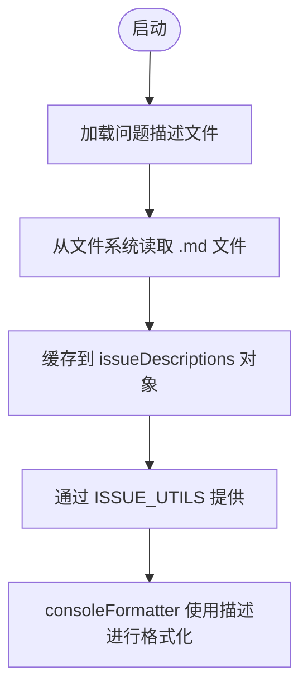

**章节来源**
- [src/issue-descriptions.ts](file://src/issue-descriptions.ts#L1-L55)

## 依赖关系分析

系统的依赖关系呈现清晰的分层结构，从底层的浏览器API到顶层的用户接口：

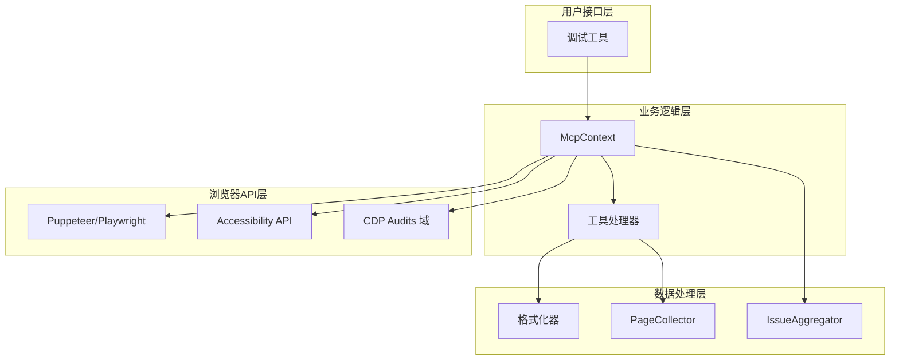

**图表来源**
- [src/McpContext.ts](file://src/McpContext.ts#L1-L50)
- [src/tools/ToolDefinition.ts](file://src/tools/ToolDefinition.ts#L1-L30)

### 关键依赖项

| 组件 | 依赖项 | 用途 |
|------|--------|------|
| McpContext | Browser, Debugger, Locator | 浏览器连接和定位器 |
| PageCollector | Browser, ListenerMap | 页面事件收集 |
| ToolDefinition | ZodSchema, Context | 参数验证和工具定义 |
| ConsoleCollector | Audits CDP 域, IssueAggregator | 问题诊断和聚合 |
| consoleFormatter | AggregatedIssue, issue-descriptions | 问题消息格式化 |

**章节来源**
- [src/McpContext.ts](file://src/McpContext.ts#L1-L100)
- [src/tools/ToolDefinition.ts](file://src/tools/ToolDefinition.ts#L1-L50)
- [src/PageCollector.ts](file://src/PageCollector.ts#L248-L353)

## 性能考虑

### 内存管理

系统实现了完善的内存管理机制：

1. **元素句柄清理**：evaluate_script工具确保所有JSHandle在使用后正确释放
2. **快照缓存策略**：只保留最新的快照，避免内存泄漏
3. **临时文件管理**：大截图自动保存为临时文件，避免内存占用过高
4. **问题去重**：使用seenKeys和seenIssues集合避免重复处理问题

### 异步操作优化

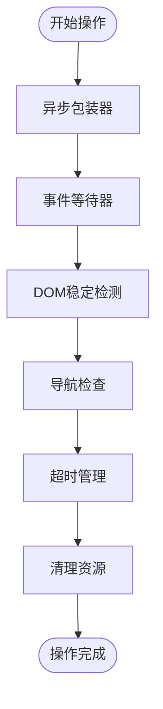

**图表来源**
- [src/WaitForHelper.ts](file://src/WaitForHelper.ts#L28-L70)

### 超时和重试机制

系统为各种操作设置了合理的超时时间：

| 操作类型 | 默认超时 | 导致因素 |
|----------|----------|----------|
| 一般等待 | 5秒 | CPU节流倍增 |
| 导航超时 | 10秒 | 网络条件倍增 |
| DOM稳定 | 3秒 | CPU节流倍增 |
| 导航开始 | 100毫秒 | 网络条件倍增 |

## 故障排除指南

### 常见问题和解决方案

#### 快照相关问题

**问题**：无法获取元素句柄
```
错误：No snapshot found. Use take_snapshot to capture one.
```
**解决方案**：在操作元素前先执行`take_snapshot`命令获取页面快照。

**问题**：使用过期的UID
```
错误：This uid is coming from a stale snapshot. Call take_snapshot to get a fresh snapshot.
```
**解决方案**：重新执行`take_snapshot`获取最新快照。

#### 脚本执行问题

**问题**：跨框架元素执行失败
```
错误：Elements from different frames can't be evaluated together.
```
**解决方案**：确保所有参数元素来自同一框架，或分别对每个框架执行脚本。

#### 截图问题

**问题**：大截图文件保存失败
```
错误：Could not save a screenshot to a file
```
**解决方案**：检查目标目录权限，或使用较小的图像质量设置。

#### 问题诊断系统问题

**问题**：无法订阅问题事件
```
错误：Error subscribing to issues
```
**解决方案**：检查浏览器是否支持Audits域，或CDP连接是否正常。

**问题**：问题描述文件缺失
```
错误：no markdown {filename} found for issue: {code}
```
**解决方案**：确保node_modules/chrome-devtools-frontend中的问题描述文件已正确安装。

**章节来源**
- [src/McpContext.ts](file://src/McpContext.ts#L280-L340)
- [src/tools/script.ts](file://src/tools/script.ts#L30-L50)
- [src/PageCollector.ts](file://src/PageCollector.ts#L284-L286)
- [src/DevtoolsUtils.ts](file://src/DevtoolsUtils.ts#L110-L111)

### 调试最佳实践

1. **快照优先**：始终先执行`take_snapshot`获取页面结构
2. **元素定位**：使用快照中的UID精确定位元素
3. **脚本测试**：先在浏览器控制台测试脚本，确保语法正确
4. **错误处理**：合理设置超时时间，避免无限等待
5. **资源清理**：及时释放不需要的元素句柄和临时文件
6. **问题诊断**：利用`list_console_messages`查看问题诊断信息，特别是`issue`类型的消息

## 结论

Chrome DevTools MCP的调试工具系统提供了一个完整、高效的网页调试解决方案。通过evaluate_script、get_console_message、list_console_messages、take_screenshot和take_snapshot这五大核心工具，开发者可以实现：

- **全面的页面检查**：通过快照和截图深入了解页面结构
- **动态脚本执行**：实时运行JavaScript代码并与页面交互
- **详细的控制台监控**：跟踪所有控制台消息和错误
- **智能元素定位**：基于无障碍API的精确元素识别
- **灵活的等待机制**：智能等待动态内容加载完成

系统最近的重大更新集成了新的问题诊断系统。ConsoleCollector类现在订阅`'Audits.issueAdded'` CDP事件，并使用IssueAggregator创建和发送AggregatedIssue对象。这一增强使得系统能够捕获和处理来自浏览器审计面板的各种问题，如混合内容、可访问性违规等，并将这些问题作为控制台消息的一部分进行标准化和格式化。通过`consoleFormatter`的`formatIssue`函数，问题详情、影响资源和学习链接都被整合到响应中，为开发者提供了强大的诊断能力。

该系统的设计充分考虑了性能、可靠性和易用性，为现代Web开发和测试提供了强大的调试支持。通过合理的工具组合使用，开发者可以高效地诊断和解决复杂的网页问题。