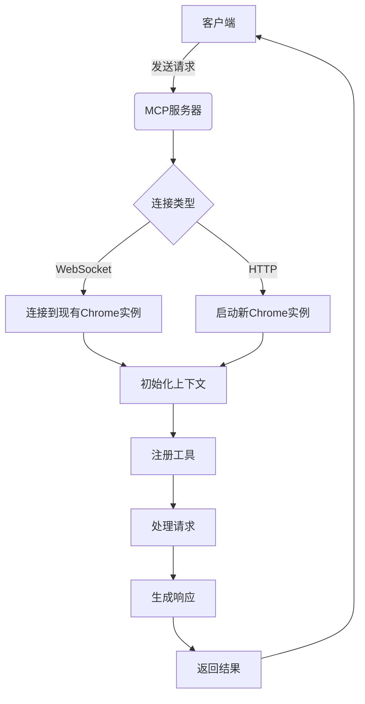
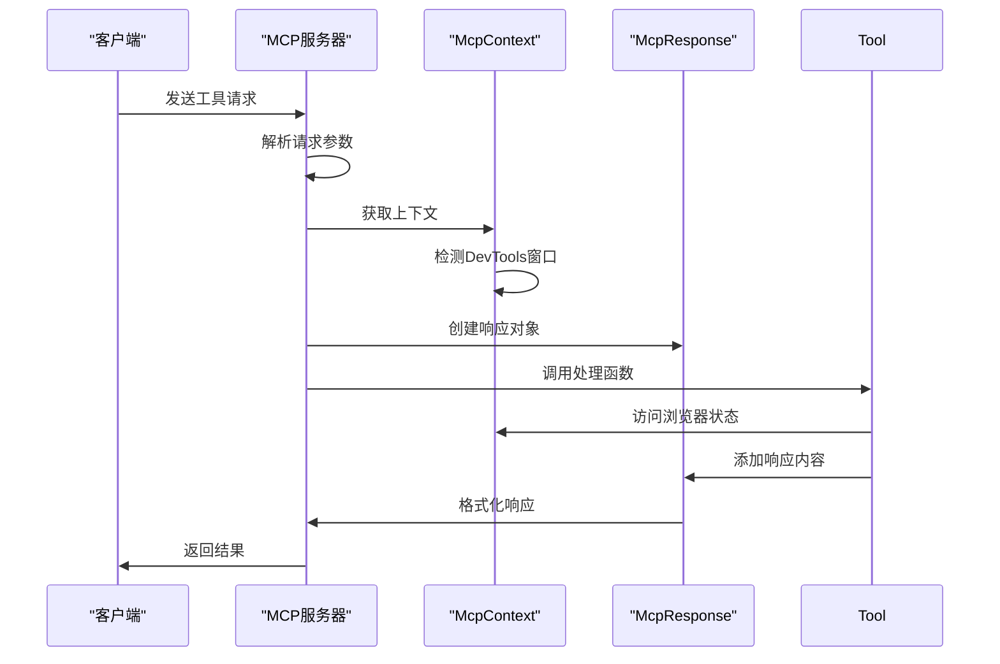
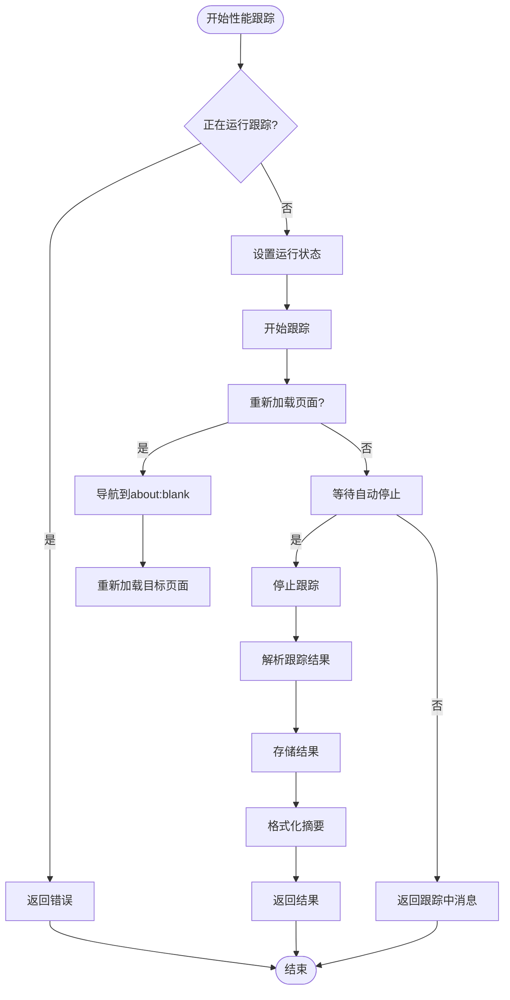
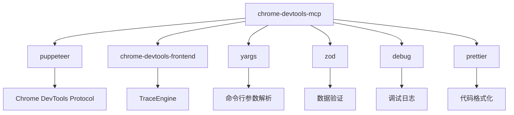

# 问题诊断系统

<cite>
**本文档中引用的文件**   
- [README.md](file://README.md)
- [package.json](file://package.json)
- [main.ts](file://src/main.ts)
- [index.ts](file://src/index.ts)
- [cli.ts](file://src/cli.ts)
- [McpContext.ts](file://src/McpContext.ts)
- [browser.ts](file://src/browser.ts)
- [McpResponse.ts](file://src/McpResponse.ts)
- [ToolDefinition.ts](file://src/tools/ToolDefinition.ts)
- [console.ts](file://src/tools/console.ts)
- [performance.ts](file://src/tools/performance.ts)
- [network.ts](file://src/tools/network.ts)
- [PageCollector.ts](file://src/PageCollector.ts)
- [parse.ts](file://src/trace-processing/parse.ts)
- [features.ts](file://src/features.ts)
</cite>

## 目录
1. [简介](#简介)
2. [项目结构](#项目结构)
3. [核心组件](#核心组件)
4. [架构概述](#架构概述)
5. [详细组件分析](#详细组件分析)
6. [依赖分析](#依赖分析)
7. [性能考虑](#性能考虑)
8. [故障排除指南](#故障排除指南)
9. [结论](#结论)

## 简介

问题诊断系统是一个基于Model-Context-Protocol (MCP) 的服务器，旨在为AI编码助手（如Gemini、Claude、Cursor或Copilot）提供对Chrome浏览器的完全控制和深度检查能力。该系统通过集成Chrome DevTools，使AI助手能够执行可靠的自动化、深入的调试和性能分析。系统支持多种工具，涵盖输入自动化、导航自动化、性能分析、网络请求监控和调试功能。用户可以通过配置MCP客户端来使用这些功能，从而实现对浏览器行为的全面控制和分析。

## 项目结构

该项目采用模块化设计，主要分为以下几个目录：
- `docs/`：包含文档文件，如CLAUDE.md、tool-reference.md和troubleshooting.md。
- `scripts/`：包含各种脚本文件，如eslint规则、文档生成、构建后处理等。
- `src/`：源代码目录，包含表单格式化器、工具定义、跟踪处理、实用工具等。
- `tests/`：测试文件目录，包含各个模块的测试用例。

```mermaid
graph TB
subgraph "根目录"
docs[docs/]
scripts[scripts/]
src[src/]
tests[tests/]
package_json[package.json]
README_md[README.md]
end
subgraph "文档"
docs --> CLAUDE_md[CLAUDE.md]
docs --> tool_reference_md[tool-reference.md]
docs --> troubleshooting_md[troubleshooting.md]
end
subgraph "脚本"
scripts --> eslint_rules[eslint_rules/]
scripts --> generate_docs_ts[generate-docs.ts]
scripts --> post_build_ts[post-build.ts]
scripts --> prepare_ts[prepare.ts]
scripts --> sed_ts[sed.ts]
scripts --> verify_server_json_version_ts[verify-server-json-version.ts]
end
subgraph "源代码"
src --> formatters[formatters/]
src --> third_party[third_party/]
src --> tools[tools/]
src --> trace_processing[trace-processing/]
src --> utils[utils/]
src --> DevToolsConnectionAdapter_ts[DevToolsConnectionAdapter.ts]
src --> DevtoolsUtils_ts[DevtoolsUtils.ts]
src --> McpContext_ts[McpContext.ts]
src --> McpResponse_ts[McpResponse.ts]
src --> Mutex_ts[Mutex.ts]
src --> PageCollector_ts[PageCollector.ts]
src --> WaitForHelper_ts[WaitForHelper.ts]
src --> browser_ts[browser.ts]
src --> cli_ts[cli.ts]
src --> devtools_d_ts[devtools.d.ts]
src --> features_ts[features.ts]
src --> index_ts[index.ts]
src --> issue_descriptions_ts[issue-descriptions.ts]
src --> logger_ts[logger.ts]
src --> main_ts[main.ts]
src --> polyfill_ts[polyfill.ts]
end
subgraph "测试"
tests --> formatters_tests[formatters/]
tests --> tools_tests[tools/]
tests --> trace_processing_tests[trace-processing/]
tests --> DevtoolsUtils_test_ts[DevtoolsUtils.test.ts]
tests --> McpContext_test_ts[McpContext.test.ts]
tests --> McpResponse_test_ts[McpResponse.test.ts]
tests --> PageCollector_test_ts[PageCollector.test.ts]
tests --> browser_test_ts[browser.test.ts]
tests --> cli_test_ts[cli.test.ts]
tests --> index_test_ts[index.test.ts]
tests --> server_ts[server.ts]
tests --> setup_ts[setup.ts]
tests --> snapshot_ts[snapshot.ts]
tests --> utils_ts[utils.ts]
end
```



**Diagram sources**
- [README.md](file://README.md#L1-L526)
- [package.json](file://package.json#L1-L76)

**Section sources**
- [README.md](file://README.md#L1-L526)
- [package.json](file://package.json#L1-L76)

## 核心组件

该系统的核心组件包括主入口文件`main.ts`、命令行接口`cli.ts`、浏览器连接管理`browser.ts`、上下文管理`McpContext.ts`和响应处理`McpResponse.ts`。这些组件协同工作，确保MCP服务器能够正确启动、连接到浏览器实例，并处理来自客户端的请求。

**Section sources**
- [main.ts](file://src/main.ts#L1-L196)
- [cli.ts](file://src/cli.ts#L1-L232)
- [browser.ts](file://src/browser.ts#L1-L188)
- [McpContext.ts](file://src/McpContext.ts#L1-L655)
- [McpResponse.ts](file://src/McpResponse.ts#L1-L579)

## 架构概述

该系统的架构基于MCP协议，通过Node.js实现。系统启动时，首先解析命令行参数，然后根据配置连接到Chrome实例或启动新的浏览器实例。一旦连接成功，系统会初始化上下文，并注册各种工具供客户端使用。每个工具都有明确的分类和功能，如输入自动化、导航自动化、性能分析等。系统通过`McpContext`管理浏览器状态，并通过`McpResponse`处理和格式化响应数据。



**Diagram sources**
- [main.ts](file://src/main.ts#L1-L196)
- [browser.ts](file://src/browser.ts#L1-L188)
- [McpContext.ts](file://src/McpContext.ts#L1-L655)

## 详细组件分析

### 主入口分析

主入口文件`main.ts`负责启动MCP服务器并注册所有可用工具。它通过`parseArguments`函数解析命令行参数，并根据配置决定是连接到现有Chrome实例还是启动新的浏览器实例。服务器启动后，会注册一系列工具，这些工具按类别组织，如输入自动化、导航自动化、性能分析等。

#### 主入口类图
```mermaid
classDiagram
class McpServer {
+name : string
+title : string
+version : string
+registerTool(name : string, tool : ToolDefinition) : void
+connect(transport : StdioServerTransport) : Promise<void>
}
class ToolDefinition {
+name : string
+description : string
+annotations : {category : ToolCategory, readOnlyHint : boolean}
+schema : zod.ZodRawShape
+handler : (request : Request, response : Response, context : Context) => Promise<void>
}
class McpContext {
+browser : Browser
+logger : Debugger
+getSelectedPage() : Page
+createPagesSnapshot() : Promise<Page[]>
+createTextSnapshot(verbose : boolean, devtoolsData : DevToolsData) : Promise<void>
}
class McpResponse {
+appendResponseLine(value : string) : void
+setIncludePages(value : boolean) : void
+setIncludeNetworkRequests(value : boolean, options : PaginationOptions) : void
+setIncludeConsoleData(value : boolean, options : PaginationOptions) : void
+includeSnapshot(params : SnapshotParams) : void
+attachImage(value : ImageContentData) : void
+attachNetworkRequest(reqid : number) : void
+attachConsoleMessage(msgid : number) : void
}
McpServer --> ToolDefinition : "注册"
McpServer --> McpContext : "使用"
McpServer --> McpResponse : "使用"
ToolDefinition --> McpContext : "访问"
ToolDefinition --> McpResponse : "使用"
```

**Diagram sources**
- [main.ts](file://src/main.ts#L1-L196)
- [McpContext.ts](file://src/McpContext.ts#L1-L655)
- [McpResponse.ts](file://src/McpResponse.ts#L1-L579)

### 工具注册流程

工具注册流程是系统的核心部分，它决定了客户端可以使用哪些功能。每个工具都通过`defineTool`函数定义，并包含名称、描述、分类、输入模式和处理函数。处理函数接收请求参数、响应对象和上下文对象，执行相应的操作并生成响应。

#### 工具注册序列图


**Diagram sources**
- [main.ts](file://src/main.ts#L1-L196)
- [McpContext.ts](file://src/McpContext.ts#L1-L655)
- [McpResponse.ts](file://src/McpResponse.ts#L1-L579)

### 性能分析工具

性能分析工具是系统的重要组成部分，它允许用户记录和分析页面性能。`performance_start_trace`工具启动性能跟踪，`performance_stop_trace`工具停止跟踪并解析结果，`performance_analyze_insight`工具提供详细的性能洞察。

#### 性能分析流程图


**Diagram sources**
- [performance.ts](file://src/tools/performance.ts#L1-L194)
- [parse.ts](file://src/trace-processing/parse.ts#L1-L131)

## 依赖分析

该系统依赖于多个外部库，包括`puppeteer`用于浏览器自动化，`chrome-devtools-frontend`用于性能分析，`yargs`用于命令行参数解析。这些依赖项在`package.json`中定义，并通过`npm`进行管理。系统还使用`zod`进行数据验证，确保输入参数的正确性。



**Diagram sources**
- [package.json](file://package.json#L1-L76)
- [main.ts](file://src/main.ts#L1-L196)

**Section sources**
- [package.json](file://package.json#L1-L76)
- [main.ts](file://src/main.ts#L1-L196)

## 性能考虑

系统在设计时考虑了性能因素，特别是在处理大量网络请求和控制台消息时。通过分页机制，系统可以有效地管理大量数据，避免内存溢出。此外，系统还支持网络和CPU节流，允许用户模拟不同的网络条件和设备性能。

**Section sources**
- [McpResponse.ts](file://src/McpResponse.ts#L1-L579)
- [McpContext.ts](file://src/McpContext.ts#L1-L655)

## 故障排除指南

如果遇到问题，可以参考[故障排除指南](./docs/troubleshooting.md)。常见问题包括无法连接到Chrome实例、权限问题和配置错误。确保Chrome实例已正确启动并启用了远程调试端口。如果使用沙箱环境，可能需要禁用沙箱或手动启动Chrome实例。

**Section sources**
- [README.md](file://README.md#L279-L280)
- [docs/troubleshooting.md](file://docs/troubleshooting.md)

## 结论

问题诊断系统提供了一个强大的平台，使AI编码助手能够深入分析和控制Chrome浏览器。通过集成多种工具和功能，系统能够满足各种自动化和调试需求。未来的工作可以包括增加更多工具、优化性能和增强安全性。