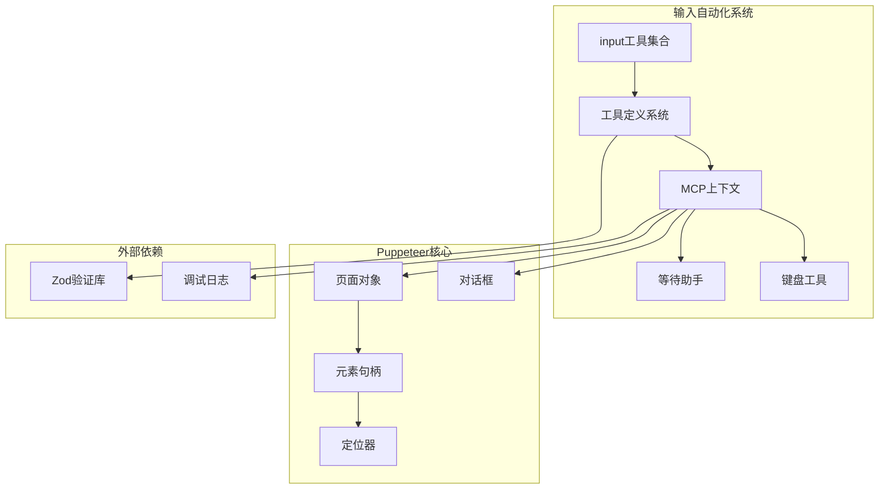
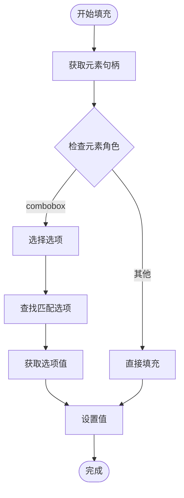
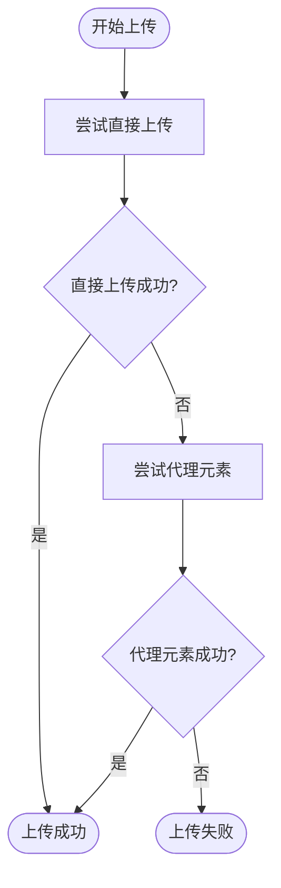
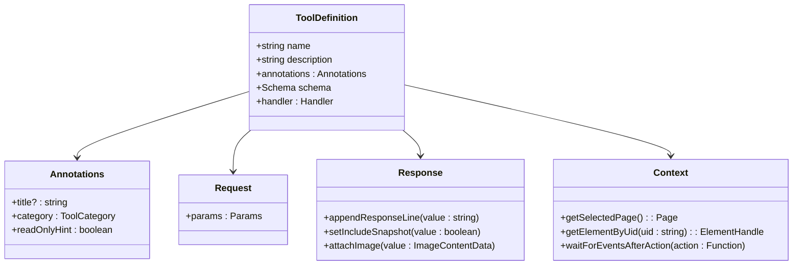
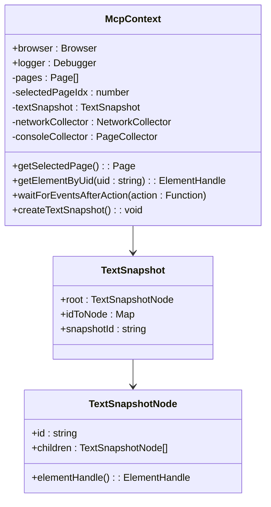
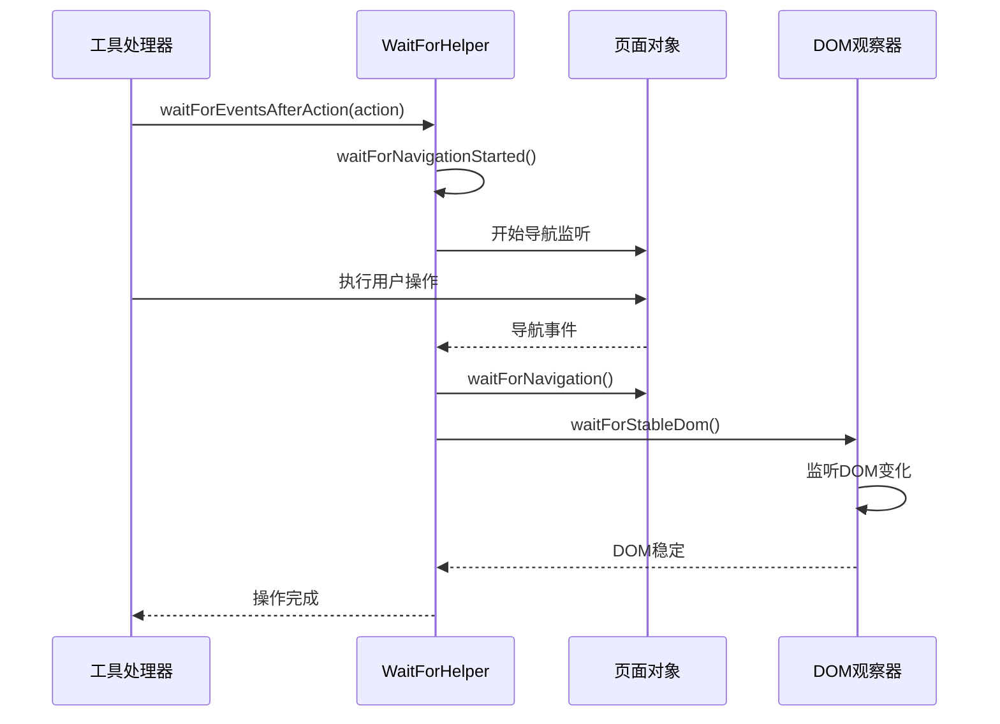
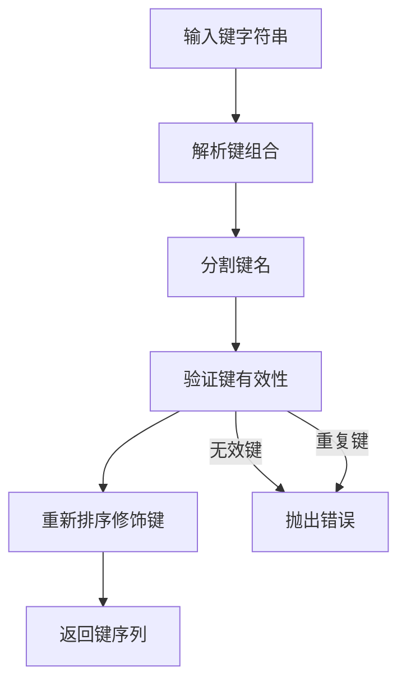

# 输入自动化工具详细文档

<cite>
**本文档中引用的文件**
- [src/tools/input.ts](file://src/tools/input.ts)
- [src/tools/ToolDefinition.ts](file://src/tools/ToolDefinition.ts)
- [src/McpContext.ts](file://src/McpContext.ts)
- [src/utils/keyboard.ts](file://src/utils/keyboard.ts)
- [src/WaitForHelper.ts](file://src/WaitForHelper.ts)
- [src/tools/categories.ts](file://src/tools/categories.ts)
- [tests/tools/input.test.ts](file://tests/tools/input.test.ts)
- [src/third_party/index.ts](file://src/third_party/index.ts)
</cite>

## 目录
1. [简介](#简介)
2. [项目架构概览](#项目架构概览)
3. [核心工具详解](#核心工具详解)
4. [工具定义系统](#工具定义系统)
5. [MCP上下文管理](#MCP上下文管理)
6. [异步操作与错误处理](#异步操作与错误处理)
7. [键盘事件处理](#键盘事件处理)
8. [实际调用示例](#实际调用示例)
9. [性能优化考虑](#性能优化考虑)
10. [故障排除指南](#故障排除指南)
11. [总结](#总结)

## 简介

Chrome DevTools MCP项目提供了一套强大的输入自动化工具，支持模拟用户在Web页面上的各种交互行为。该系统包含8个核心输入工具：`click`、`drag`、`fill`、`fill_form`、`handle_dialog`、`hover`、`press_key`和`upload_file`。这些工具通过MCP（Model Context Protocol）客户端与Chrome浏览器进行交互，实现了高度可配置和可靠的自动化测试功能。

## 项目架构概览

输入自动化系统采用模块化架构设计，主要组件包括：



**图表来源**
- [src/tools/input.ts](file://src/tools/input.ts#L1-L310)
- [src/tools/ToolDefinition.ts](file://src/tools/ToolDefinition.ts#L1-L124)
- [src/McpContext.ts](file://src/McpContext.ts#L1-L487)

**章节来源**
- [src/tools/input.ts](file://src/tools/input.ts#L1-L50)
- [src/tools/ToolDefinition.ts](file://src/tools/ToolDefinition.ts#L1-L30)

## 核心工具详解

### click - 点击工具

点击工具提供了基础的鼠标点击功能，支持单击和双击操作。

#### 工具定义
```typescript
export const click = defineTool({
  name: 'click',
  description: '点击提供的元素',
  annotations: {
    category: ToolCategory.INPUT,
    readOnlyHint: false,
  },
  schema: {
    uid: zod.string().describe('页面快照中元素的UID'),
    dblClick: zod.boolean().optional().describe('设置为true进行双击，默认为false'),
  },
  handler: async (request, response, context) => { /* 实现 */ }
});
```

#### 执行逻辑
1. **元素定位**：通过UID从快照中获取元素句柄
2. **事件等待**：使用`waitForEventsAfterAction`等待可能的导航事件
3. **点击执行**：根据参数决定单击或双击
4. **资源清理**：确保元素句柄被正确释放

#### Puppeteer API映射
- `handle.asLocator().click()` - 基础点击
- `handle.asLocator().click({count: 2})` - 双击操作

**章节来源**
- [src/tools/input.ts](file://src/tools/input.ts#L14-L42)

### hover - 悬停工具

悬停工具用于模拟鼠标悬停在元素上的操作。

#### 工具定义
```typescript
export const hover = defineTool({
  name: 'hover',
  description: '悬停在提供的元素上',
  schema: {
    uid: zod.string().describe('页面快照中元素的UID'),
  },
  handler: async (request, response, context) => { /* 实现 */ }
});
```

#### 执行流程
1. 获取目标元素句柄
2. 执行悬停操作
3. 等待DOM稳定
4. 返回操作结果

**章节来源**
- [src/tools/input.ts](file://src/tools/input.ts#L44-L68)

### fill - 填充工具

填充工具是最复杂的输入工具之一，支持多种表单元素类型的值填充。

#### 工具定义
```typescript
export const fill = defineTool({
  name: 'fill',
  description: '在输入框、文本区域或下拉列表中输入文本',
  schema: {
    uid: zod.string().describe('页面快照中元素的UID'),
    value: zod.string().describe('要填充的值'),
  },
  handler: async (request, response, context) => { /* 实现 */ }
});
```

#### 高级功能
- **组合框支持**：自动处理`combobox`角色的元素
- **选项选择**：通过文本匹配选择下拉选项
- **通用填充**：支持标准输入元素的直接填充

#### 实现细节


**图表来源**
- [src/tools/input.ts](file://src/tools/input.ts#L85-L120)

**章节来源**
- [src/tools/input.ts](file://src/tools/input.ts#L70-L120)

### fill_form - 表单填充工具

表单填充工具允许一次性填充多个表单字段。

#### 工具定义
```typescript
export const fillForm = defineTool({
  name: 'fill_form',
  description: '一次性填充多个表单元素',
  schema: {
    elements: zod.array(zod.object({
      uid: zod.string().describe('要填充的元素UID'),
      value: zod.string().describe('元素值'),
    })).describe('要填充的快照元素'),
  },
  handler: async (request, response, context) => { /* 实现 */ }
});
```

#### 使用场景
- 多字段表单提交
- 用户注册流程
- 订单填写过程

**章节来源**
- [src/tools/input.ts](file://src/tools/input.ts#L122-L148)

### drag - 拖拽工具

拖拽工具实现了元素间的拖放操作。

#### 工具定义
```typescript
export const drag = defineTool({
  name: 'drag',
  description: '将一个元素拖放到另一个元素上',
  schema: {
    from_uid: zod.string().describe('要拖动的元素UID'),
    to_uid: zod.string().describe('要放置到的元素UID'),
  },
  handler: async (request, response, context) => { /* 实现 */ }
});
```

#### 执行步骤
1. 获取源元素和目标元素句柄
2. 执行拖拽操作
3. 添加延迟确保操作完成
4. 执行放置操作

**章节来源**
- [src/tools/input.ts](file://src/tools/input.ts#L150-L178)

### upload_file - 文件上传工具

文件上传工具支持两种上传模式：直接文件输入和代理元素触发。

#### 工具定义
```typescript
export const uploadFile = defineTool({
  name: 'upload_file',
  description: '通过提供的元素上传文件',
  schema: {
    uid: zod.string().describe('文件输入元素或触发文件选择器的元素UID'),
    filePath: zod.string().describe('本地文件路径'),
  },
  handler: async (request, response, context) => { /* 实现 */ }
});
```

#### 上传策略


**图表来源**
- [src/tools/input.ts](file://src/tools/input.ts#L226-L272)

**章节来源**
- [src/tools/input.ts](file://src/tools/input.ts#L180-L272)

### press_key - 键盘按键工具

键盘按键工具支持单键和组合键操作。

#### 工具定义
```typescript
export const pressKey = defineTool({
  name: 'press_key',
  description: '按下键或键组合。当其他输入方法无法使用时使用（如键盘快捷键、导航键或特殊键组合）',
  schema: {
    key: zod.string().describe('键或组合（如"Enter"、"Control+A"、"Control++"、"Control+Shift+R"）'),
  },
  handler: async (request, response, context) => { /* 实现 */ }
});
```

#### 键盘解析
工具使用专门的键盘解析器处理键组合：
- 支持修饰键：Control、Shift、Alt、Meta
- 自动处理键顺序
- 验证键的有效性

**章节来源**
- [src/tools/input.ts](file://src/tools/input.ts#L274-L310)

### handle_dialog - 对话框处理工具

对话框处理工具用于管理浏览器弹出的各种对话框。

#### 工具定义
```typescript
export const handleDialog = defineTool({
  name: 'handle_dialog',
  description: '如果打开了浏览器对话框，请使用此命令处理它',
  schema: {
    action: zod.enum(['accept', 'dismiss']).describe('是否要忽略或接受对话框'),
    promptText: zod.string().optional().describe('可选的提示文本，输入到对话框中'),
  },
  handler: async (request, response, context) => { /* 实现 */ }
});
```

#### 对话框类型
- **Alert**：确认对话框
- **Confirm**：确认取消对话框  
- **Prompt**：带输入框的对话框

**章节来源**
- [src/tools/pages.ts](file://src/tools/pages.ts#L180-L232)

## 工具定义系统

### ToolDefinition接口

所有输入工具都遵循统一的定义规范：



**图表来源**
- [src/tools/ToolDefinition.ts](file://src/tools/ToolDefinition.ts#L15-L50)

### 参数验证系统

工具使用Zod进行参数验证，确保输入数据的正确性：

| 工具 | 必需参数 | 可选参数 | 类型验证 |
|------|----------|----------|----------|
| click | uid | dblClick | string, boolean |
| hover | uid | - | string |
| fill | uid, value | - | string, string |
| fill_form | elements | - | array |
| drag | from_uid, to_uid | - | string, string |
| upload_file | uid, filePath | - | string, string |
| press_key | key | - | string |

**章节来源**
- [src/tools/ToolDefinition.ts](file://src/tools/ToolDefinition.ts#L15-L80)

## MCP上下文管理

### McpContext类

MCP上下文是整个输入自动化系统的核心协调器：



**图表来源**
- [src/McpContext.ts](file://src/McpContext.ts#L60-L120)

### 页面管理

MCP上下文维护多页面状态，支持：
- 当前页面选择
- 页面生命周期管理
- 快照状态同步

### 元素定位机制

通过唯一标识符（UID）系统精确定位页面元素：

1. **快照创建**：使用Puppeteer的可访问性API生成元素树
2. **UID分配**：为每个元素分配唯一的标识符
3. **元素检索**：通过UID快速定位对应元素句柄

**章节来源**
- [src/McpContext.ts](file://src/McpContext.ts#L60-L200)

## 异步操作与错误处理

### WaitForHelper系统

WaitForHelper类负责处理复杂的异步操作和事件等待：



**图表来源**
- [src/WaitForHelper.ts](file://src/WaitForHelper.ts#L124-L160)

### 超时管理

系统实现了智能超时管理：
- **CPU节流**：根据CPU限制调整超时时间
- **网络条件**：根据网络状况动态调整
- **默认值**：提供合理的默认超时设置

### 错误恢复机制

1. **异常捕获**：捕获所有异步操作中的异常
2. **资源清理**：确保所有资源被正确释放
3. **状态重置**：在错误发生后重置系统状态

**章节来源**
- [src/WaitForHelper.ts](file://src/WaitForHelper.ts#L10-L160)

## 键盘事件处理

### 键盘解析系统

键盘工具使用专门的解析器处理复杂的键组合：



**图表来源**
- [src/utils/keyboard.ts](file://src/utils/keyboard.ts#L280-L305)

### 支持的键类型

键盘系统支持广泛的键类型：

| 类别 | 示例键 | 描述 |
|------|--------|------|
| 数字键 | '0'-'9', 'Digit0'-'Digit9' | 数字字符键 |
| 字母键 | 'A'-'Z', 'KeyA'-'KeyZ' | 字母字符键 |
| 功能键 | 'F1'-'F24' | 功能键 |
| 控制键 | 'Shift', 'Control', 'Alt', 'Meta' | 修饰键 |
| 导航键 | 'ArrowUp', 'ArrowDown', 'Home', 'End' | 导航键 |
| 特殊键 | 'Enter', 'Escape', 'Backspace', 'Delete' | 特殊功能键 |

### 键盘事件合成

系统能够准确模拟真实的键盘事件序列：

1. **修饰键按压**：按正确的顺序按下调制键
2. **主键按下**：执行主要按键操作
3. **修饰键释放**：逆序释放修饰键

**章节来源**
- [src/utils/keyboard.ts](file://src/utils/keyboard.ts#L10-L280)

## 实际调用示例

### 基础点击操作

```typescript
// 单击按钮
await click.handler({
  params: {
    uid: '1_1',
  },
}, response, context);

// 双击操作
await click.handler({
  params: {
    uid: '1_1',
    dblClick: true,
  },
}, response, context);
```

### 表单填充示例

```typescript
// 单字段填充
await fill.handler({
  params: {
    uid: '1_2',
    value: '用户名@example.com',
  },
}, response, context);

// 复杂表单填充
await fillForm.handler({
  params: {
    elements: [
      { uid: '1_2', value: 'John Doe' },
      { uid: '1_4', value: 'john@example.com' },
      { uid: '1_6', value: 'password123' }
    ],
  },
}, response, context);
```

### 文件上传示例

```typescript
// 直接文件输入上传
await uploadFile.handler({
  params: {
    uid: '1_1',
    filePath: '/path/to/document.pdf',
  },
}, response, context);

// 代理元素触发上传
await uploadFile.handler({
  params: {
    uid: '1_2',
    filePath: '/path/to/image.png',
  },
}, response, context);
```

### 键盘操作示例

```typescript
// 基本按键
await pressKey.handler({
  params: {
    key: 'Enter',
  },
}, response, context);

// 组合键操作
await pressKey.handler({
  params: {
    key: 'Control+A',
  },
}, response, context);

// 复杂组合键
await pressKey.handler({
  params: {
    key: 'Control+Shift+R',
  },
}, response, context);
```

### 对话框处理示例

```typescript
// 接受确认对话框
await handleDialog.handler({
  params: {
    action: 'accept',
  },
}, response, context);

// 取消对话框
await handleDialog.handler({
  params: {
    action: 'dismiss',
  },
}, response, context);

// 带输入的提示对话框
await handleDialog.handler({
  params: {
    action: 'accept',
    promptText: '确认删除',
  },
}, response, context);
```

**章节来源**
- [tests/tools/input.test.ts](file://tests/tools/input.test.ts#L25-L496)

## 性能优化考虑

### 内存管理

系统实现了严格的资源管理：
- **自动清理**：所有元素句柄在使用后自动释放
- **弱引用**：使用WeakMap存储页面特定状态
- **批量操作**：表单填充支持批量处理减少开销

### 网络优化

- **条件模拟**：根据网络状况动态调整超时
- **CPU节流**：支持CPU限制模拟
- **请求过滤**：智能过滤不必要的网络请求

### 并发控制

- **互斥锁**：防止并发操作冲突
- **队列管理**：有序处理工具调用
- **超时保护**：避免无限等待

## 故障排除指南

### 常见问题及解决方案

| 问题类型 | 症状 | 解决方案 |
|----------|------|----------|
| 元素未找到 | "No such element found in the snapshot" | 确保快照是最新的，重新调用`take_snapshot` |
| 点击失败 | 点击操作无响应 | 检查元素是否可交互，考虑使用`hover`先激活 |
| 文件上传失败 | "Failed to upload file" | 确认文件路径正确，检查元素类型 |
| 键盘事件无效 | 键盘操作不生效 | 验证键名称是否在支持列表中 |
| 对话框处理失败 | "No open dialog found" | 确保对话框已出现再调用处理 |

### 调试技巧

1. **启用快照**：每次操作后包含快照以便调试
2. **检查上下文**：验证MCP上下文状态
3. **监控网络**：使用网络收集器跟踪请求
4. **日志记录**：启用详细日志输出

### 性能监控

- **操作时间**：监控各工具的执行时间
- **内存使用**：定期检查内存占用
- **错误率**：统计失败操作比例

**章节来源**
- [src/McpContext.ts](file://src/McpContext.ts#L400-L487)

## 总结

Chrome DevTools MCP的输入自动化工具提供了一个完整、可靠且高性能的Web自动化解决方案。通过统一的工具定义系统、智能的MCP上下文管理和强大的异步处理能力，这些工具能够满足各种复杂的自动化测试需求。

### 主要优势

1. **类型安全**：基于Zod的严格参数验证
2. **异步友好**：完善的异步操作和错误处理
3. **资源管理**：自动化的资源清理和内存管理
4. **扩展性强**：模块化设计便于功能扩展
5. **调试友好**：丰富的调试信息和错误报告

### 最佳实践建议

1. **及时更新快照**：在关键操作前后确保快照是最新的
2. **合理设置超时**：根据操作复杂度调整超时时间
3. **错误处理**：始终包含适当的错误处理逻辑
4. **资源清理**：确保所有临时资源被正确释放
5. **测试覆盖**：为关键工作流程编写充分的测试

这套输入自动化工具为开发者提供了强大而灵活的Web自动化能力，是构建高质量自动化测试的重要基础设施。