# Chrome DevTools MCP 开发者指南

<cite>
**本文档引用的文件**
- [package.json](file://package.json)
- [README.md](file://README.md)
- [src/main.ts](file://src/main.ts)
- [src/McpContext.ts](file://src/McpContext.ts)
- [src/tools/ToolDefinition.ts](file://src/tools/ToolDefinition.ts)
- [src/tools/categories.ts](file://src/tools/categories.ts)
- [src/tools/console.ts](file://src/tools/console.ts)
- [src/tools/pages.ts](file://src/tools/pages.ts)
- [src/tools/screenshot.ts](file://src/tools/screenshot.ts)
- [src/cli.ts](file://src/cli.ts)
- [src/logger.ts](file://src/logger.ts)
- [rollup.config.mjs](file://rollup.config.mjs)
- [tsconfig.json](file://tsconfig.json)
- [tests/setup.ts](file://tests/setup.ts)
- [CONTRIBUTING.md](file://CONTRIBUTING.md)
</cite>

## 目录
1. [项目概述](#项目概述)
2. [开发环境设置](#开发环境设置)
3. [项目架构](#项目架构)
4. [添加新工具的完整流程](#添加新工具的完整流程)
5. [McpContext 核心机制](#mcpcontext-核心机制)
6. [构建系统详解](#构建系统详解)
7. [测试框架与质量保证](#测试框架与质量保证)
8. [调试技巧](#调试技巧)
9. [发布流程与版本管理](#发布流程与版本管理)
10. [最佳实践与安全考虑](#最佳实践与安全考虑)

## 项目概述

Chrome DevTools MCP 是一个 Model-Context-Protocol (MCP) 服务器，为 AI 编码助手提供对 Chrome DevTools 的完全访问权限。该项目允许您的编码代理（如 Gemini、Claude、Cursor 或 Copilot）控制和检查实时 Chrome 浏览器实例。

### 核心特性
- **性能洞察获取**：使用 Chrome DevTools 记录跟踪并提取可操作的性能见解
- **高级浏览器调试**：分析网络请求、截图和检查浏览器控制台
- **可靠自动化**：使用 Puppeteer 自动化 Chrome 中的操作并自动等待操作结果

### 技术栈
- **语言**：TypeScript (ES2023)
- **包管理**：npm
- **构建工具**：Rollup
- **测试框架**：Node.js 内置测试运行器
- **代码质量**：ESLint、Prettier、TypeScript 类型检查

**章节来源**
- [package.json](file://package.json#L1-L75)
- [README.md](file://README.md#L1-L50)

## 开发环境设置

### 系统要求
- **Node.js**：v20.19 或更高版本（支持的维护 LTS 版本）
- **Chrome**：当前稳定版本或更新版本
- **npm**：包管理器

### 安装步骤

```bash
# 克隆仓库
git clone https://github.com/ChromeDevTools/chrome-devtools-mcp.git
cd chrome-devtools-mcp

# 安装依赖
npm ci

# 构建项目
npm run build
```

### 开发工作流

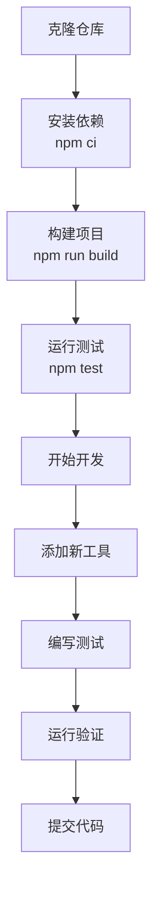

**章节来源**
- [CONTRIBUTING.md](file://CONTRIBUTING.md#L30-L45)
- [package.json](file://package.json#L8-L25)

## 项目架构

### 整体架构概览

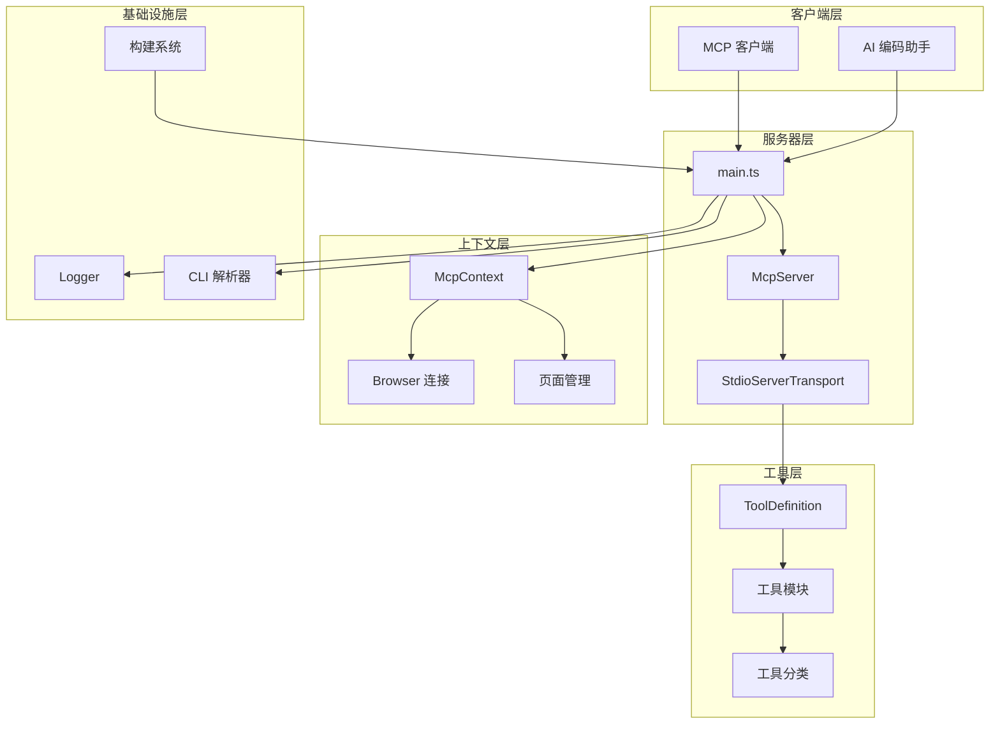

**图表来源**
- [src/main.ts](file://src/main.ts#L1-L50)
- [src/McpContext.ts](file://src/McpContext.ts#L1-L100)

### 目录结构分析

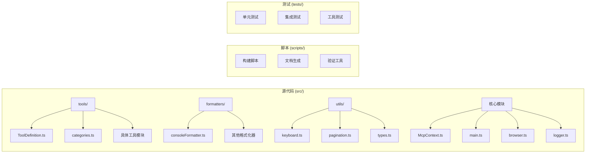

**图表来源**
- [src/main.ts](file://src/main.ts#L15-L35)
- [src/tools/ToolDefinition.ts](file://src/tools/ToolDefinition.ts#L1-L30)

**章节来源**
- [src/main.ts](file://src/main.ts#L1-L191)
- [tsconfig.json](file://tsconfig.json#L1-L63)

## 添加新工具的完整流程

### 步骤 1：创建工具模块

在 `src/tools/` 目录下创建新的工具文件，例如 `myTool.ts`：

```typescript
// 示例：创建自定义工具
import {defineTool} from './ToolDefinition.js';
import {ToolCategory} from './categories.js';

export const myCustomTool = defineTool({
  name: 'my_custom_tool',
  description: '这是一个自定义工具的描述',
  annotations: {
    category: ToolCategory.INPUT,  // 选择合适的分类
    readOnlyHint: false,          // 根据工具是否修改环境设置
  },
  schema: {
    // 定义输入参数
    target: zod.string().describe('目标元素的选择器'),
    action: zod.enum(['click', 'hover']).describe('要执行的动作'),
  },
  handler: async (request, response, context) => {
    // 实现工具逻辑
    const page = context.getSelectedPage();
    const element = await page.$(request.params.target);
    
    if (element) {
      if (request.params.action === 'click') {
        await element.click();
        response.appendResponseLine('元素点击完成');
      } else {
        await element.hover();
        response.appendResponseLine('元素悬停完成');
      }
    } else {
      response.appendResponseLine('未找到指定元素');
    }
  },
});
```

### 步骤 2：定义工具接口

所有工具必须实现 `ToolDefinition` 接口：

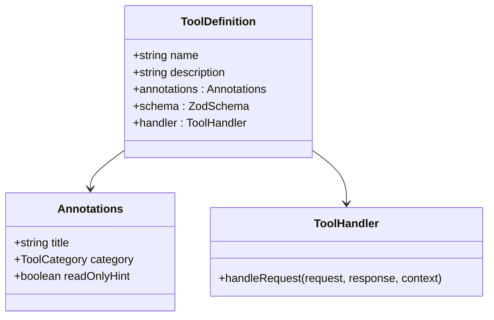

**图表来源**
- [src/tools/ToolDefinition.ts](file://src/tools/ToolDefinition.ts#L15-L35)

### 步骤 3：注册工具到主程序

在 `src/main.ts` 中导入并注册新工具：

```typescript
// 在文件顶部导入
import * as myTool from './tools/myTool.js';

// 在工具注册部分添加
const tools = [
  // ... 现有工具
  ...Object.values(myTool),
] as ToolDefinition[];
```

### 步骤 4：编写测试用例

为新工具创建对应的测试文件：

```typescript
// tests/tools/myTool.test.ts
import {test} from 'node:test';
import assert from 'node:assert';
import {myCustomTool} from '../../src/tools/myTool.js';

test('myCustomTool 基本功能测试', async () => {
  // 测试实现
});
```

### 步骤 5：更新文档

运行以下命令生成最新的工具参考文档：

```bash
npm run docs
```

**章节来源**
- [src/tools/ToolDefinition.ts](file://src/tools/ToolDefinition.ts#L1-L124)
- [src/main.ts](file://src/main.ts#L150-L191)
- [CONTRIBUTING.md](file://CONTRIBUTING.md#L80-L89)

## McpContext 核心机制

### McpContext 概述

`McpContext` 是 Chrome DevTools MCP 的核心类，提供了对浏览器操作的统一接口。它管理浏览器连接、页面状态、网络请求和控制台消息等关键资源。

### 核心功能架构

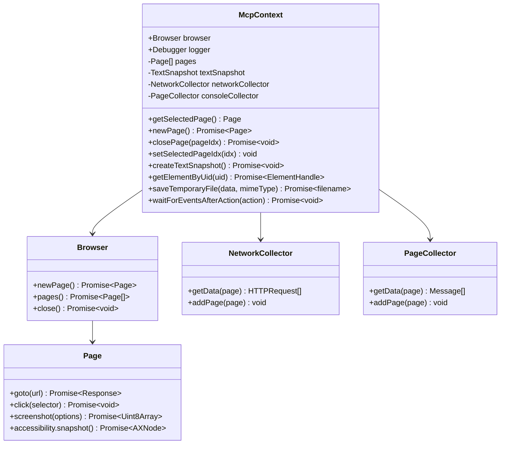

**图表来源**
- [src/McpContext.ts](file://src/McpContext.ts#L70-L150)

### 关键接口方法

| 方法名 | 描述 | 返回类型 | 使用场景 |
|--------|------|----------|----------|
| `getSelectedPage()` | 获取当前选中的页面 | `Page` | 执行页面相关操作 |
| `newPage()` | 创建新页面 | `Promise<Page>` | 打开新标签页 |
| `closePage(pageIdx)` | 关闭指定页面 | `Promise<void>` | 清理资源 |
| `getElementByUid(uid)` | 通过 UID 获取元素 | `Promise<ElementHandle>` | 元素定位 |
| `createTextSnapshot()` | 创建页面快照 | `Promise<void>` | 可访问性分析 |
| `saveTemporaryFile()` | 保存临时文件 | `Promise<{filename}>` | 文件处理 |

### 页面管理机制

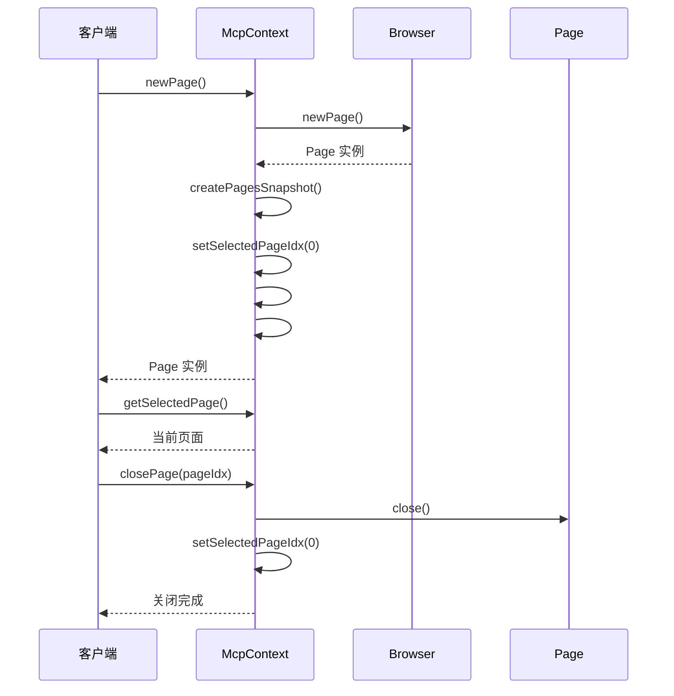

**图表来源**
- [src/McpContext.ts](file://src/McpContext.ts#L150-L200)

### 快照系统

文本快照是 McpContext 的重要功能，用于创建页面内容的可访问性树：

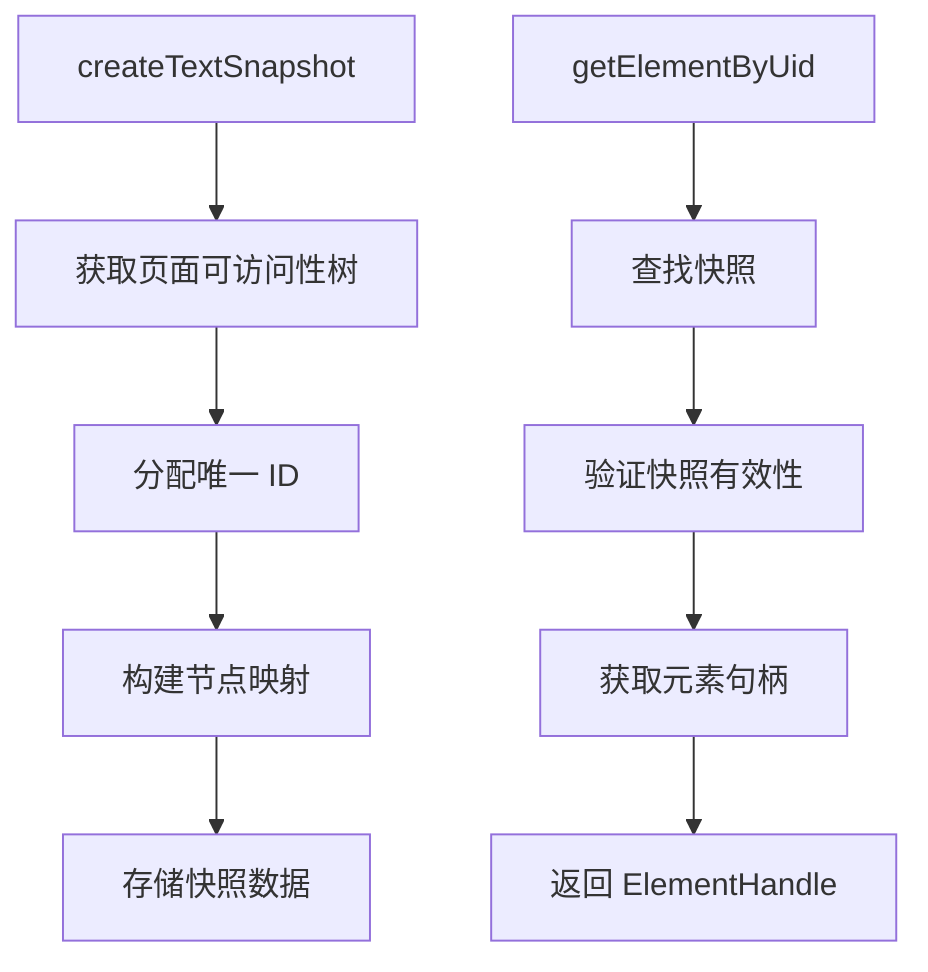

**图表来源**
- [src/McpContext.ts](file://src/McpContext.ts#L350-L420)

**章节来源**
- [src/McpContext.ts](file://src/McpContext.ts#L1-L487)

## 构建系统详解

### Rollup 配置分析

项目使用 Rollup 作为主要的打包工具，配置位于 `rollup.config.mjs`：

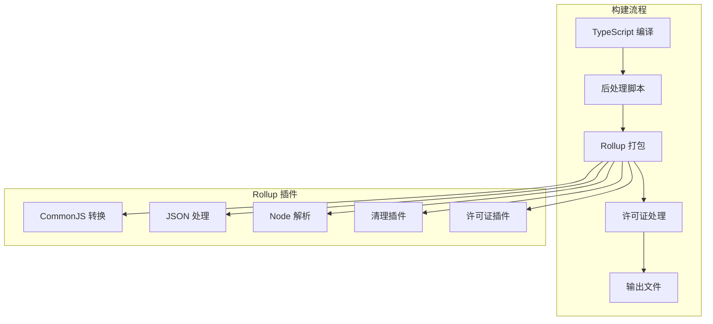

**图表来源**
- [rollup.config.mjs](file://rollup.config.mjs#L1-L50)

### 构建脚本详解

| 脚本命令 | 功能 | 输出位置 | 用途 |
|----------|------|----------|------|
| `npm run clean` | 清理构建目录 | `build/` | 清理旧文件 |
| `npm run build` | 完整构建流程 | `build/src/` | 生产部署 |
| `npm run typecheck` | 类型检查 | 控制台输出 | 开发验证 |
| `npm run format` | 代码格式化 | 源文件 | 代码规范 |
| `npm run docs` | 文档生成 | 自动生成 | 更新文档 |

### TypeScript 配置

项目使用严格的 TypeScript 配置：

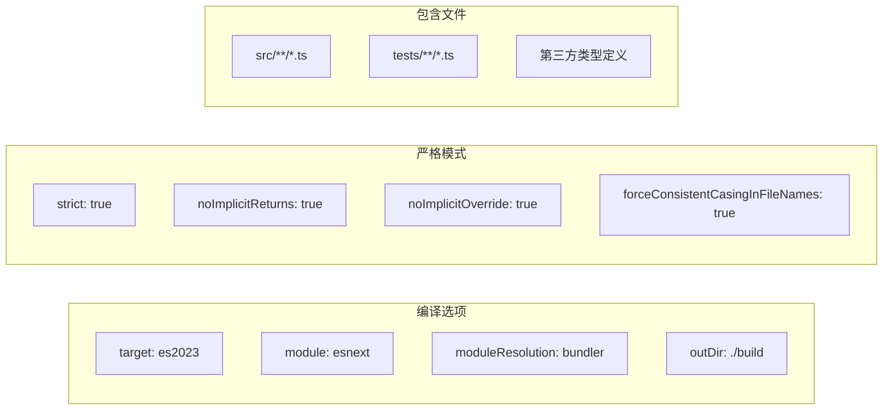

**图表来源**
- [tsconfig.json](file://tsconfig.json#L1-L30)

**章节来源**
- [rollup.config.mjs](file://rollup.config.mjs#L1-L136)
- [tsconfig.json](file://tsconfig.json#L1-L63)
- [package.json](file://package.json#L8-L25)

## 测试框架与质量保证

### 测试架构

项目采用 Node.js 内置测试运行器，结合快照测试和模拟技术：

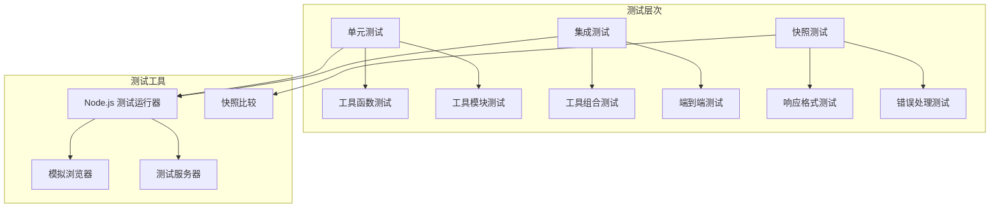

**图表来源**
- [tests/setup.ts](file://tests/setup.ts#L1-L34)

### 测试命令

| 命令 | 功能 | 使用场景 |
|------|------|----------|
| `npm test` | 运行所有测试 | 完整验证 |
| `npm run test:only` | 运行特定测试 | 调试单个功能 |
| `npm run test:update-snapshots` | 更新快照 | 修改预期输出 |
| `npm run test:node20` | Node.js 20 测试 | 版本兼容性 |

### 代码质量工具

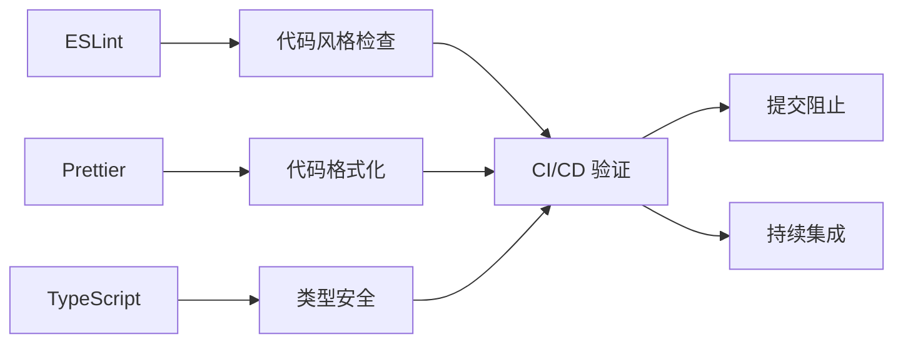

**图表来源**
- [eslint.config.mjs](file://eslint.config.mjs#L1-L60)

### 测试最佳实践

1. **模拟外部依赖**：使用模拟对象隔离测试
2. **快照测试**：确保输出格式的一致性
3. **错误边界测试**：验证错误处理逻辑
4. **异步操作测试**：正确处理 Promise 和回调

**章节来源**
- [tests/setup.ts](file://tests/setup.ts#L1-L34)
- [package.json](file://package.json#L15-L25)
- [CONTRIBUTING.md](file://CONTRIBUTING.md#L45-L60)

## 调试技巧

### 日志系统

项目使用 `debug` 库提供分层的日志记录功能：

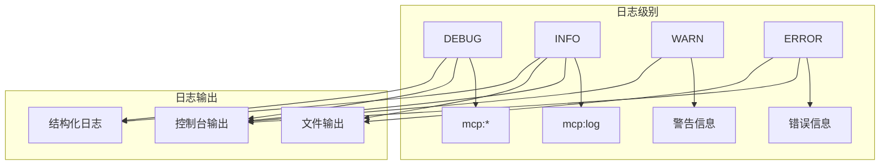

**图表来源**
- [src/logger.ts](file://src/logger.ts#L1-L34)

### 启用调试日志

```bash
# 启用详细日志
DEBUG=mcp:* npm run start-debug

# 指定特定模块日志
DEBUG=mcp:log npm run start-debug

# 输出到文件
npm run start-debug -- --log-file=./debug.log
```

### 断点调试技巧

1. **IDE 断点**：在 VS Code 中设置断点进行逐步调试
2. **条件断点**：根据变量值设置条件断点
3. **日志断点**：使用 `logger()` 函数替代断点
4. **远程调试**：使用 Chrome DevTools 进行远程调试

### 常见调试场景

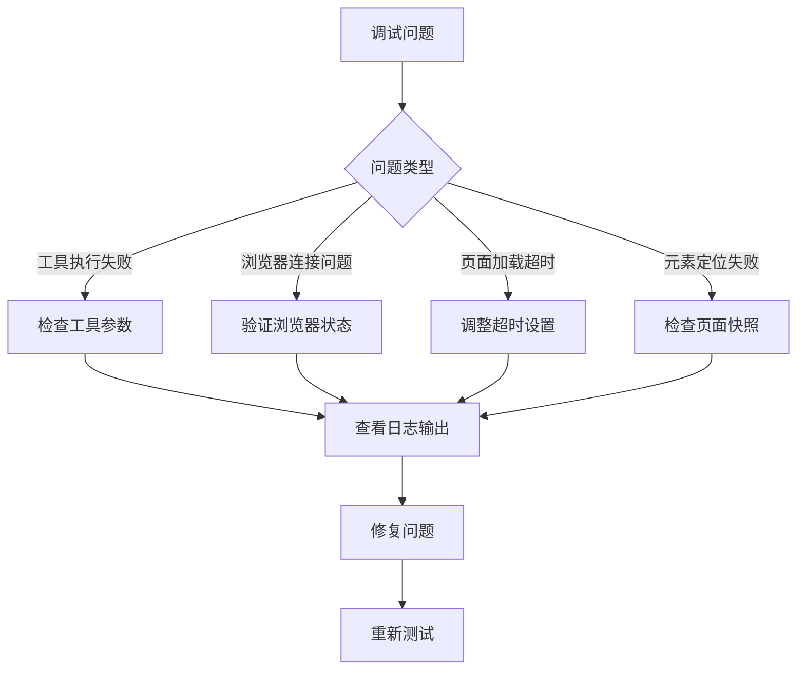

**章节来源**
- [src/logger.ts](file://src/logger.ts#L1-L34)
- [src/cli.ts](file://src/cli.ts#L150-L180)
- [CONTRIBUTING.md](file://CONTRIBUTING.md#L70-L80)

## 发布流程与版本管理

### 版本管理策略

项目使用语义化版本控制（SemVer），版本号在多个地方维护：

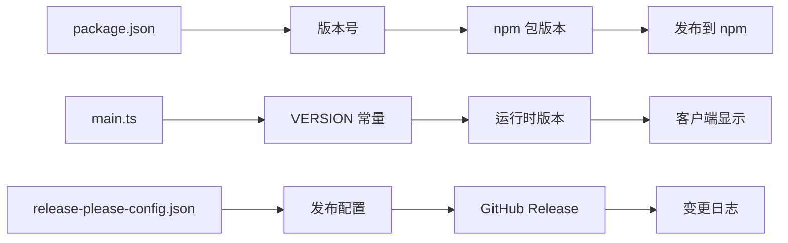

**图表来源**
- [src/main.ts](file://src/main.ts#L35-L40)
- [package.json](file://package.json#L2-L3)

### 发布工作流

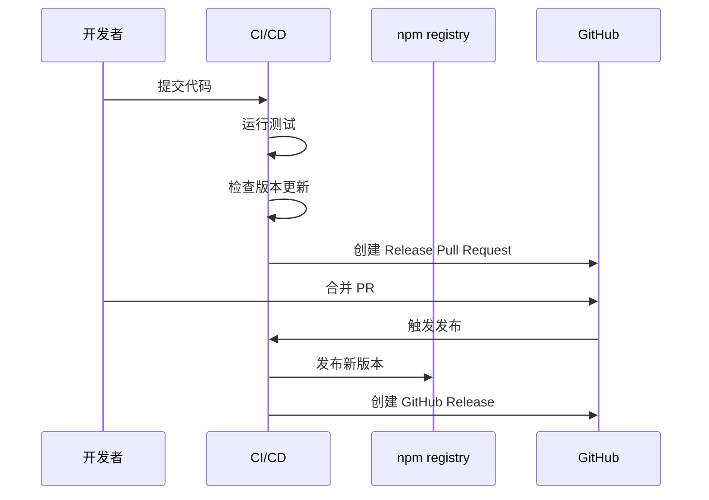

### 版本更新流程

1. **本地开发**：修改代码和版本号
2. **测试验证**：运行完整的测试套件
3. **文档更新**：生成最新的工具参考文档
4. **提交代码**：使用约定式提交格式
5. **自动发布**：通过 CI/CD 自动发布

### 发布命令

```bash
# 本地测试
npm test

# 生成文档
npm run docs

# 构建项目
npm run build

# 验证版本
npm run verify-server-json-version

# 发布到 npm
npm publish
```

**章节来源**
- [src/main.ts](file://src/main.ts#L35-L40)
- [package.json](file://package.json#L2-L3)
- [CONTRIBUTING.md](file://CONTRIBUTING.md#L1-L30)

## 最佳实践与安全考虑

### 安全最佳实践

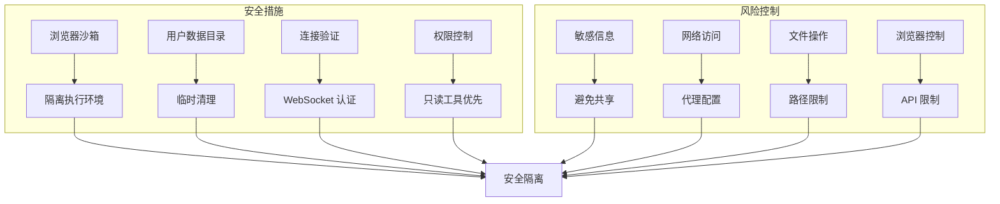

### 性能优化建议

1. **资源管理**：及时关闭不需要的页面和连接
2. **内存优化**：定期清理快照和缓存
3. **并发控制**：使用互斥锁防止竞态条件
4. **超时设置**：合理设置各种操作的超时时间

### 错误处理策略

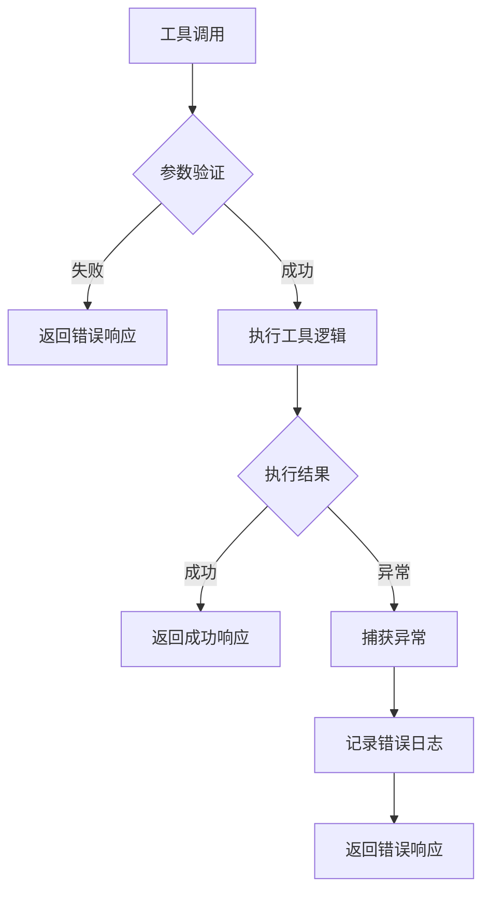

### 兼容性考虑

- **Node.js 版本**：支持 v20.19+ 和 v22.12+
- **Chrome 版本**：兼容当前稳定版 Chrome
- **MCP 协议**：遵循 Model-Context-Protocol 标准
- **跨平台**：支持 Linux、macOS 和 Windows

### 贡献指南要点

1. **代码审查**：所有提交都需要代码审查
2. **测试覆盖**：新增功能必须包含测试
3. **文档更新**：修改需要同步更新文档
4. **向后兼容**：保持 API 的向后兼容性

**章节来源**
- [README.md](file://README.md#L20-L30)
- [src/McpContext.ts](file://src/McpContext.ts#L450-L487)
- [CONTRIBUTING.md](file://CONTRIBUTING.md#L1-L90)

## 结论

Chrome DevTools MCP 项目为开发者提供了一个强大而灵活的框架，用于扩展和定制浏览器自动化功能。通过遵循本指南中的最佳实践，开发者可以安全、高效地添加新工具，优化性能，并确保代码质量和安全性。

### 关键要点回顾

1. **工具开发**：遵循 `ToolDefinition` 接口规范，正确注册到主程序
2. **上下文管理**：充分利用 `McpContext` 提供的浏览器操作接口
3. **构建系统**：理解 Rollup 配置和 TypeScript 设置
4. **测试质量**：建立完善的测试体系确保代码可靠性
5. **调试技巧**：掌握日志记录和断点调试方法
6. **发布流程**：遵循版本管理和发布标准

### 下一步行动

- 查看现有的工具实现以获得灵感
- 运行测试套件验证开发环境
- 尝试添加第一个简单的工具
- 参与社区讨论和贡献

通过这些步骤，您将能够充分发挥 Chrome DevTools MCP 的潜力，为 AI 编码助手提供更强大的浏览器自动化能力。