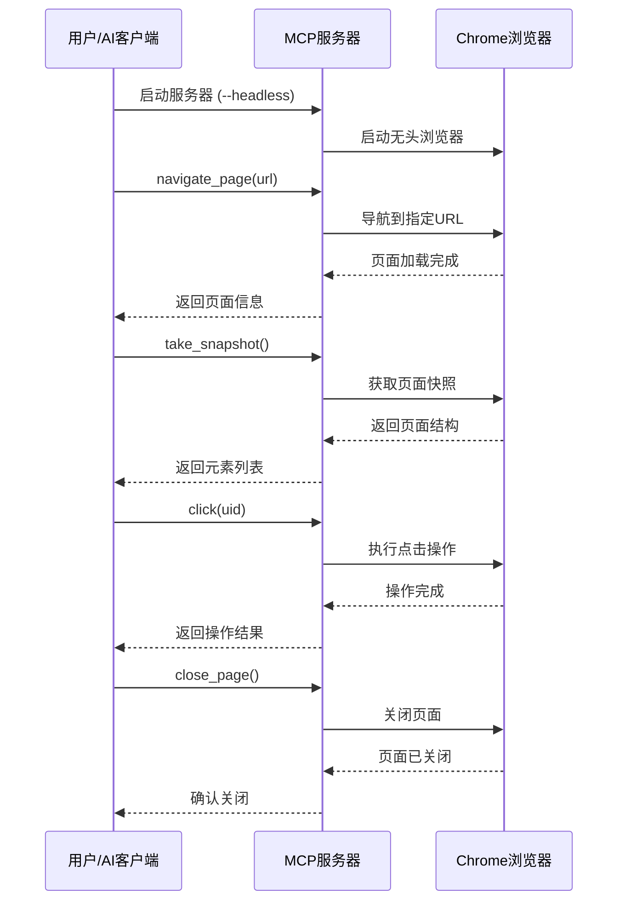
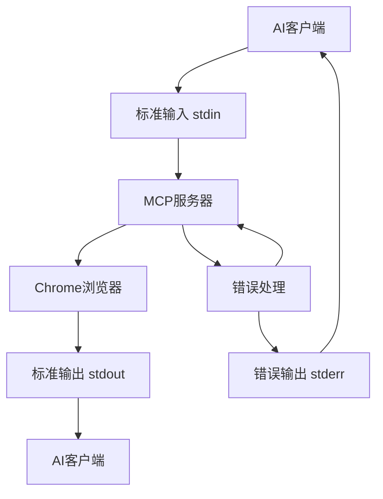
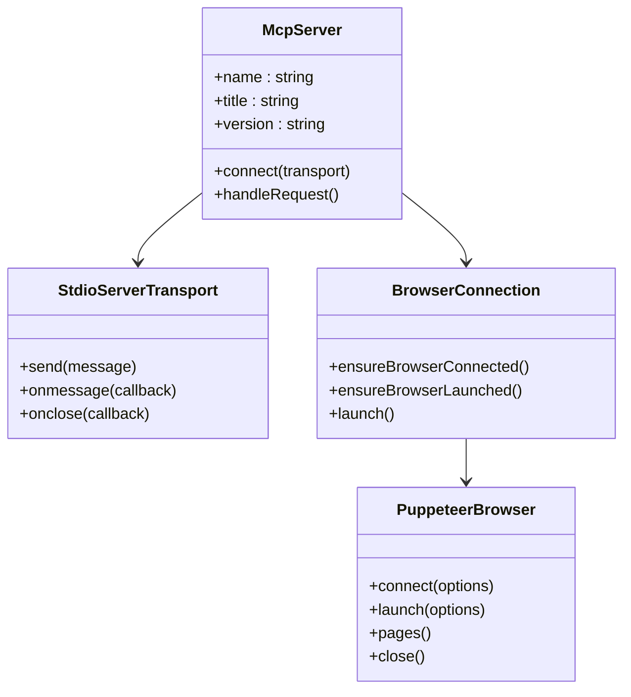

# 快速入门

<cite>
**本文档中引用的文件**
- [README.md](file://README.md)
- [package.json](file://package.json)
- [src/cli.ts](file://src/cli.ts)
- [src/main.ts](file://src/main.ts)
- [src/browser.ts](file://src/browser.ts)
- [src/tools/pages.ts](file://src/tools/pages.ts)
- [src/tools/snapshot.ts](file://src/tools/snapshot.ts)
- [src/tools/input.ts](file://src/tools/input.ts)
- [server.json](file://server.json)
- [tests/index.test.ts](file://tests/index.test.ts)
</cite>

## 目录
1. [简介](#简介)
2. [系统要求](#系统要求)
3. [安装和配置](#安装和配置)
4. [基本概念](#基本概念)
5. [端到端工作流示例](#端到端工作流示例)
6. [CLI参数详解](#cli参数详解)
7. [JSON-RPC通信机制](#json-rpc通信机制)
8. [常见问题解决](#常见问题解决)
9. [下一步学习](#下一步学习)

## 简介

Chrome DevTools MCP是一个Model-Context-Protocol (MCP)服务器，它让你的AI编码助手能够控制和检查实时的Chrome浏览器。这个工具提供了Chrome DevTools的全部功能，支持可靠的自动化、深度调试和性能分析。

### 核心特性
- **性能洞察**：使用Chrome DevTools记录跟踪并提取可操作的性能洞察
- **高级浏览器调试**：分析网络请求、截图和检查浏览器控制台
- **可靠自动化**：使用puppeteer自动化Chrome中的操作并自动等待操作结果

## 系统要求

在开始之前，请确保你的系统满足以下要求：
- **Node.js**：v20.19或更高版本（最新的维护LTS版本）
- **Chrome**：当前稳定版本或更新版本
- **npm**：包管理器

**章节来源**
- [README.md](file://README.md#L25-L30)
- [package.json](file://package.json#L68-L70)

## 安装和配置

### MCP客户端配置

首先，在你的MCP客户端中添加以下配置：

```json
{
  "mcpServers": {
    "chrome-devtools": {
      "command": "npx",
      "args": ["-y", "chrome-devtools-mcp@latest"]
    }
  }
}
```

### 支持的MCP客户端

以下是主要MCP客户端的配置方法：

#### Claude Code
```bash
claude mcp add chrome-devtools npx chrome-devtools-mcp@latest
```

#### Copilot CLI
```bash
copilot
/mcp add
# 配置服务器名称为 chrome-devtools
# 命令设置为 npx -y chrome-devtools-mcp@latest
```

#### Gemini CLI
```bash
gemini mcp add chrome-devtools npx chrome-devtools-mcp@latest
```

#### VS Code
```bash
code --add-mcp '{"name":"chrome-devtools","command":"npx","args":["chrome-devtools-mcp@latest"]}'
```

### 验证安装

启动你的MCP客户端，输入以下提示来验证安装是否成功：

```
检查 https://developers.chrome.com 的性能
```

如果一切正常，MCP客户端应该会打开浏览器并记录性能跟踪。

**章节来源**
- [README.md](file://README.md#L32-L120)

## 基本概念

### 什么是MCP？

Model-Context-Protocol (MCP) 是一种协议，允许AI模型与本地应用程序和服务进行交互。Chrome DevTools MCP服务器就是这样一个桥梁，它将Chrome浏览器的功能暴露给AI助手。

### 工具分类

Chrome DevTools MCP提供了多种类型的工具：

- **输入自动化**（8个工具）：点击、拖拽、填写表单等
- **导航自动化**（7个工具）：页面导航、历史记录、新页面等
- **模拟**（3个工具）：CPU模拟、网络模拟、页面调整
- **性能**（3个工具）：性能分析、开始跟踪、停止跟踪
- **网络**（2个工具）：获取网络请求、列出网络请求
- **调试**（5个工具）：截图、快照、控制台消息等

### 通信模式

MCP服务器支持两种通信模式：
1. **stdio模式**：标准输入输出通信（默认）
2. **WebSocket模式**：直接连接到Chrome实例

**章节来源**
- [README.md](file://README.md#L122-L180)

## 端到端工作流示例

让我们通过一个完整的示例来演示如何使用Chrome DevTools MCP。我们将执行以下步骤：

### 步骤1：启动MCP服务器

```bash
npx chrome-devtools-mcp@latest --headless
```

这将以无头模式启动服务器，不会显示浏览器界面。

### 步骤2：使用AI客户端调用navigate_page工具

```json
{
  "name": "navigate_page",
  "arguments": {
    "url": "https://example.com",
    "timeout": 30000
  }
}
```

**预期响应：**
```
# navigate_page response
## Pages
0: https://example.com [selected]
```

### 步骤3：调用take_snapshot获取页面结构

```json
{
  "name": "take_snapshot",
  "arguments": {
    "verbose": false
  }
}
```

**预期响应：**
```
# take_snapshot response
## Snapshot
- uid: 1
  role: heading
  name: Example Domain
- uid: 2
  role: paragraph
  name: This domain is for use in illustrative examples in documents.
```

### 步骤4：调用click与页面元素交互

假设我们想点击页面上的某个按钮，首先需要知道元素的UID：

```json
{
  "name": "click",
  "arguments": {
    "uid": "2",
    "dblClick": false
  }
}
```

**预期响应：**
```
# click response
Successfully clicked on the element
## Snapshot
- uid: 1
  role: heading
  name: Example Domain
- uid: 2
  role: paragraph
  name: This domain is for use in illustrative examples in documents.
  (已点击)
```

### 步骤5：关闭页面

```json
{
  "name": "close_page",
  "arguments": {
    "pageIdx": 0
  }
}
```

**预期响应：**
```
# close_page response
Page closed successfully
## Pages
No open pages
```

### 完整的工作流程图



**图表来源**
- [src/tools/pages.ts](file://src/tools/pages.ts#L1-L234)
- [src/tools/snapshot.ts](file://src/tools/snapshot.ts#L1-L54)
- [src/tools/input.ts](file://src/tools/input.ts#L1-L310)

**章节来源**
- [tests/index.test.ts](file://tests/index.test.ts#L15-L102)

## CLI参数详解

### 基本参数

#### --headless
```bash
npx chrome-devtools-mcp@latest --headless
```
- **类型**：布尔值
- **默认值**：false
- **作用**：以无头模式运行，不显示浏览器界面

#### --browserUrl (-u)
```bash
npx chrome-devtools-mcp@latest --browserUrl http://127.0.0.1:9222
```
- **类型**：字符串
- **作用**：连接到现有的Chrome实例，使用端口转发

#### --wsEndpoint (-w)
```bash
npx chrome-devtools-mcp@latest --wsEndpoint ws://127.0.0.1:9222/devtools/browser/abc123
```
- **类型**：字符串
- **作用**：WebSocket端点，连接到运行中的Chrome实例

### 高级配置参数

#### --channel
```bash
npx chrome-devtools-mcp@latest --channel canary
```
- **类型**：字符串
- **选项**：stable, canary, beta, dev
- **作用**：指定要使用的Chrome渠道版本

#### --executablePath (-e)
```bash
npx chrome-devtools-mcp@latest --executablePath /usr/bin/google-chrome
```
- **类型**：字符串
- **作用**：自定义Chrome可执行文件路径

#### --isolated
```bash
npx chrome-devtools-mcp@latest --isolated
```
- **类型**：布尔值
- **默认值**：false
- **作用**：创建临时用户数据目录，使用完后自动清理

#### --viewport
```bash
npx chrome-devtools-mcp@latest --viewport 1280x720
```
- **类型**：字符串
- **格式**：`宽度x高度`
- **作用**：设置初始视口大小

### WebSocket认证配置

```bash
npx chrome-devtools-mcp@latest \
  --wsEndpoint ws://127.0.0.1:9222/devtools/browser/abc123 \
  --wsHeaders '{"Authorization":"Bearer YOUR_TOKEN"}'
```

### 参数组合示例

```bash
# 使用Chrome Canary并设置视口
npx chrome-devtools-mcp@latest \
  --channel canary \
  --viewport 1920x1080 \
  --headless

# 连接到现有Chrome实例
npx chrome-devtools-mcp@latest \
  --browserUrl http://127.0.0.1:9222 \
  --isolated

# 高级配置：自定义Chrome路径和代理
npx chrome-devtools-mcp@latest \
  --executablePath /Applications/Google\ Chrome.app/Contents/MacOS/Google\ Chrome \
  --proxyServer http://proxy.company.com:8080 \
  --chromeArg="--no-sandbox" \
  --chromeArg="--disable-setuid-sandbox"
```

**章节来源**
- [src/cli.ts](file://src/cli.ts#L10-L216)

## JSON-RPC通信机制

### stdio通信模式

Chrome DevTools MCP使用stdio（标准输入输出）作为默认通信方式。这种模式下，服务器通过标准输入接收命令，通过标准输出返回结果。

#### 工作原理



**图表来源**
- [src/main.ts](file://src/main.ts#L170-L190)

#### 通信示例

**请求格式：**
```json
{
  "jsonrpc": "2.0",
  "id": 1,
  "method": "callTool",
  "params": {
    "name": "navigate_page",
    "arguments": {
      "url": "https://example.com"
    }
  }
}
```

**响应格式：**
```json
{
  "jsonrpc": "2.0",
  "id": 1,
  "result": {
    "content": [
      {
        "type": "text",
        "text": "# navigate_page response\n## Pages\n0: https://example.com [selected]"
      }
    ]
  }
}
```

### WebSocket通信模式

对于更高级的使用场景，可以使用WebSocket连接到现有的Chrome实例：

```bash
# 获取WebSocket端点
curl http://127.0.0.1:9222/json/version
# 查找 webSocketDebuggerUrl 字段
```

然后使用该端点连接：

```bash
npx chrome-devtools-mcp@latest \
  --wsEndpoint ws://127.0.0.1:9222/devtools/browser/<id>
```

### 浏览器连接机制



**图表来源**
- [src/main.ts](file://src/main.ts#L40-L80)
- [src/browser.ts](file://src/browser.ts#L40-L80)

**章节来源**
- [src/main.ts](file://src/main.ts#L170-L190)
- [src/browser.ts](file://src/browser.ts#L40-L80)

## 常见问题解决

### 连接问题

#### 问题：无法连接到Chrome浏览器
**解决方案：**
1. 确保Chrome浏览器已正确安装
2. 检查端口是否被占用
3. 使用`--isolated`参数避免冲突

```bash
npx chrome-devtools-mcp@latest --isolated --headless
```

#### 问题：WebSocket连接失败
**解决方案：**
1. 验证WebSocket端点格式
2. 检查防火墙设置
3. 确认Chrome远程调试端口已启用

```bash
# 启用Chrome远程调试
"/Applications/Google Chrome.app/Contents/MacOS/Google Chrome" \
  --remote-debugging-port=9222 \
  --user-data-dir=/tmp/chrome-profile-stable
```

### 性能问题

#### 问题：页面加载缓慢
**解决方案：**
1. 使用`--headless`模式
2. 设置合理的超时时间
3. 考虑使用网络模拟

```bash
npx chrome-devtools-mcp@latest \
  --headless \
  --chromeArg="--disable-extensions" \
  --chromeArg="--disable-images"
```

### 权限问题

#### 问题：沙箱环境中的权限错误
**解决方案：**
1. 在MCP客户端中禁用沙箱
2. 使用`--browserUrl`连接到外部Chrome实例
3. 使用`--isolated`避免权限冲突

```bash
npx chrome-devtools-mcp@latest \
  --browserUrl http://127.0.0.1:9222 \
  --isolated
```

### 调试技巧

#### 启用详细日志
```bash
DEBUG=* npx chrome-devtools-mcp@latest --logFile debug.log
```

#### 检查工具可用性
```bash
# 列出所有可用工具
npx chrome-devtools-mcp@latest --help
```

**章节来源**
- [README.md](file://README.md#L400-L482)

## 下一步学习

恭喜！你已经成功完成了Chrome DevTools MCP的首次使用。接下来你可以：

### 探索更多工具

- **性能分析**：使用`performance_analyze_insight`分析页面性能
- **网络监控**：使用`list_network_requests`监控网络活动
- **控制台调试**：使用`get_console_message`查看控制台输出

### 高级配置

- 学习如何配置代理服务器
- 探索不同Chrome渠道版本的使用
- 了解如何自定义Chrome启动参数

### 实际应用

- 自动化网站测试
- 数据抓取和爬虫开发
- 用户体验分析
- 故障排除和调试

### 参考文档

- [工具参考手册](file://docs/tool-reference.md)
- [故障排除指南](file://docs/troubleshooting.md)
- [贡献指南](file://CONTRIBUTING.md)

记住，Chrome DevTools MCP是一个强大的工具，可以大大提升你的开发效率。随着你对工具的熟悉，你会发现更多创新的使用方式！