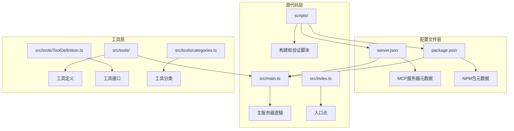
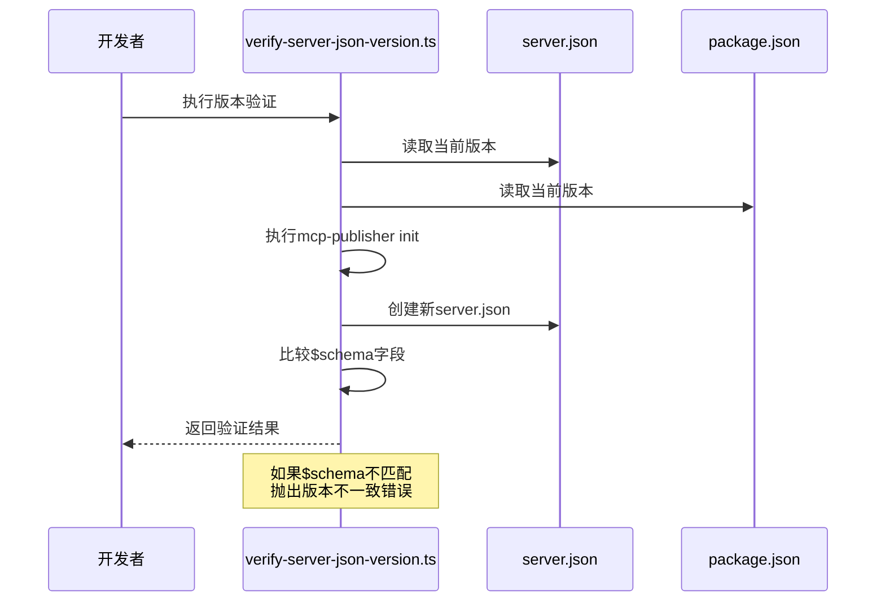
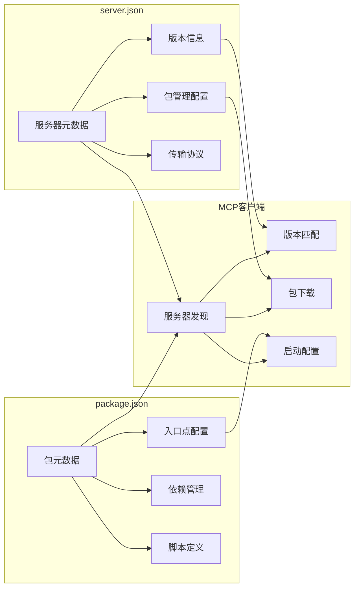
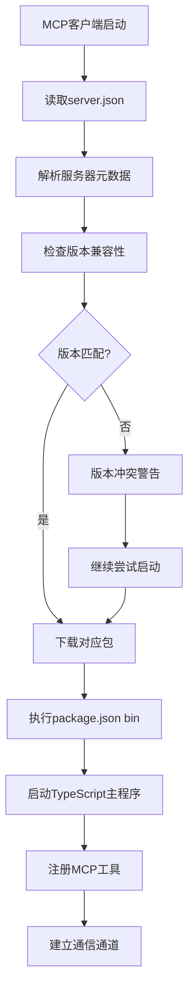
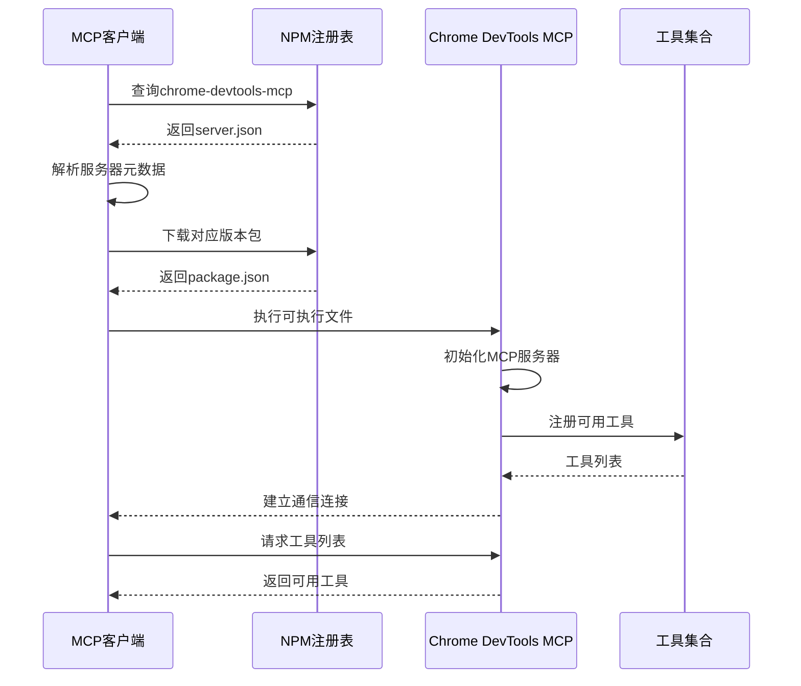
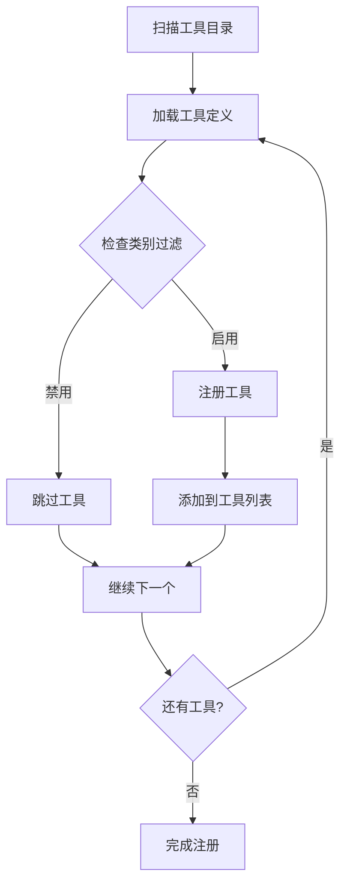

# 配置文件

<cite>
**本文档中引用的文件**
- [server.json](file://server.json)
- [package.json](file://package.json)
- [src/main.ts](file://src/main.ts)
- [src/index.ts](file://src/index.ts)
- [scripts/verify-server-json-version.ts](file://scripts/verify-server-json-version.ts)
- [src/tools/ToolDefinition.ts](file://src/tools/ToolDefinition.ts)
- [src/tools/categories.ts](file://src/tools/categories.ts)
- [README.md](file://README.md)
</cite>

## 目录
1. [简介](#简介)
2. [项目结构概览](#项目结构概览)
3. [server.json配置详解](#serverjson配置详解)
4. [package.json配置详解](#packagejson配置详解)
5. [配置文件协作机制](#配置文件协作机制)
6. [MCP生态系统集成](#mcp生态系统集成)
7. [最佳实践指南](#最佳实践指南)
8. [故障排除](#故障排除)
9. [总结](#总结)

## 简介

Chrome DevTools MCP项目是一个Model-Context-Protocol (MCP) 服务器，它为AI编程助手提供了访问Chrome DevTools的强大能力。该项目通过精心设计的配置文件系统，实现了MCP客户端的自动发现、服务器识别和功能注册。本文档深入解析了两个核心配置文件：`server.json`和`package.json`，以及它们在MCP生态系统中的重要作用。

## 项目结构概览

该项目采用模块化的架构设计，配置文件位于项目根目录，与其他源代码文件协同工作：



**图表来源**
- [server.json](file://server.json#L1-L23)
- [package.json](file://package.json#L1-L75)
- [src/main.ts](file://src/main.ts#L1-L191)

**章节来源**
- [server.json](file://server.json#L1-L23)
- [package.json](file://package.json#L1-L75)

## server.json配置详解

`server.json`是MCP服务器的核心配置文件，负责定义服务器的元数据、版本信息和包管理信息。该文件遵循MCP标准模式，确保客户端能够正确识别和连接到服务器。

### 基础字段解析

#### $schema字段
```json
"$schema": "https://static.modelcontextprotocol.io/schemas/2025-10-17/server.schema.json"
```
- **作用**: 指定JSON模式验证URL，确保配置文件符合MCP标准
- **重要性**: 防止配置错误，提供类型检查和自动补全支持
- **版本管理**: 使用特定日期版本确保向后兼容性

#### name字段
```json
"name": "io.github.ChromeDevTools/chrome-devtools-mcp"
```
- **命名规范**: 采用反向域名表示法（reverse-DNS）
- **唯一标识**: 提供全局唯一的服务器标识符
- **组织归属**: 明确表明项目属于Chrome DevTools团队

#### description字段
```json
"description": "MCP server for Chrome DevTools"
```
- **功能概述**: 简洁明了地描述服务器的主要功能
- **用户引导**: 帮助MCP客户端用户快速理解服务器用途
- **国际化**: 支持多语言环境下的描述展示

#### version字段
```json
"version": "0.9.0"
```
- **语义化版本**: 遵循SemVer规范
- **发布管理**: 支持版本控制和更新通知
- **兼容性**: 影响客户端的版本匹配策略

### 包管理配置

#### packages数组结构
```json
"packages": [
  {
    "registryType": "npm",
    "registryBaseUrl": "https://registry.npmjs.org",
    "identifier": "chrome-devtools-mcp",
    "version": "0.9.0",
    "transport": {
      "type": "stdio"
    },
    "environmentVariables": []
  }
]
```

##### registryType和registryBaseUrl
- **registryType**: 指定包注册表类型（此处为NPM）
- **registryBaseUrl**: 定义包下载的基础URL
- **生态集成**: 确保与NPM生态系统无缝集成

##### identifier和version
- **identifier**: 包在注册表中的唯一名称
- **version**: 包的具体版本号
- **一致性保证**: 确保配置版本与实际包版本同步

##### transport配置
```json
"transport": {
  "type": "stdio"
}
```
- **通信方式**: 标准输入输出流（stdio）传输协议
- **跨平台兼容**: 在所有操作系统上都可用
- **性能优化**: 减少网络开销，提高响应速度

##### environmentVariables
- **环境变量**: 定义运行时所需的环境变量
- **配置灵活性**: 支持动态环境配置
- **安全性**: 可用于传递敏感配置信息

### repository配置

```json
"repository": {
  "url": "https://github.com/ChromeDevTools/chrome-devtools-mcp",
  "source": "github"
}
```
- **源码位置**: 明确指向GitHub仓库地址
- **版本控制**: 支持源码审查和贡献
- **社区协作**: 便于开发者参与项目开发

**章节来源**
- [server.json](file://server.json#L1-L23)
- [scripts/verify-server-json-version.ts](file://scripts/verify-server-json-version.ts#L1-L37)

## package.json配置详解

`package.json`是Node.js项目的标准配置文件，对于MCP服务器而言，它不仅定义了NPM包的基本信息，还包含了MCP特定的配置项。

### 基础包信息

#### name和version字段
```json
"name": "chrome-devtools-mcp",
"version": "0.9.0",
"description": "MCP server for Chrome DevTools"
```
- **包标识**: 与server.json保持一致的包名
- **版本同步**: 确保所有配置文件的版本一致性
- **功能描述**: 清晰的功能概述

#### type字段
```json
"type": "module"
```
- **ES模块**: 使用现代JavaScript模块系统
- **未来兼容**: 支持最新的JavaScript特性
- **性能优化**: 启用Tree Shaking等优化技术

### 可执行入口配置

#### bin字段
```json
"bin": "./build/src/index.js"
```
- **入口点定义**: 指定可执行文件的入口路径
- **构建产物**: 引用经过编译的TypeScript源码
- **分发准备**: 确保包发布时包含正确的可执行文件

### 主入口配置

#### main字段
```json
"main": "index.js"
```
- **CommonJS入口**: 兼容传统Node.js环境
- **开发调试**: 方便本地开发和测试
- **向后兼容**: 支持不支持ES模块的旧版本Node.js

### 脚本配置

#### 构建脚本
```json
"scripts": {
  "clean": "node -e \"require('fs').rmSync('build', {recursive: true, force: true})\"",
  "build": "npm run clean && tsc && node --experimental-strip-types --no-warnings=ExperimentalWarning scripts/post-build.ts && rollup -c rollup.config.mjs",
  "typecheck": "tsc --noEmit",
  "format": "eslint --cache --fix . && prettier --write --cache .",
  "check-format": "eslint --cache . && prettier --check --cache .;"
}
```
- **自动化构建**: 完整的构建流程管理
- **代码质量**: 集成ESLint和Prettier进行代码格式化
- **类型检查**: TypeScript类型安全验证

#### 测试脚本
```json
"test:node20": "node --require ./build/tests/setup.js --test-reporter spec --test-force-exit --test build/tests",
"test": "npm run build && node --require ./build/tests/setup.js --no-warnings=ExperimentalWarning --test-reporter spec --test-force-exit --test \"build/tests/**/*.test.js\"",
"test:only": "npm run build && node --require ./build/tests/setup.js --no-warnings=ExperimentalWarning --test-reporter spec --test-force-exit --test --test-only \"build/tests/**/*.test.js\"",
"test:update-snapshots": "npm run build && node --require ./build/tests/setup.js --no-warnings=ExperimentalWarning --test-force-exit --test --test-update-snapshots \"build/tests/**/*.test.js\""
```
- **全面测试**: 支持多种测试场景
- **快照测试**: 自动处理UI测试的快照更新
- **CI/CD集成**: 便于持续集成环境使用

### 文件包含配置

```json
"files": [
  "build/src",
  "build/node_modules",
  "LICENSE",
  "!*.tsbuildinfo"
]
```
- **发布内容**: 控制哪些文件包含在NPM包中
- **构建产物**: 包含编译后的JavaScript文件
- **许可证**: 包含必要的法律文件
- **排除文件**: 排除不必要的TypeScript构建缓存

### 开发依赖配置

#### MCP相关依赖
```json
"@modelcontextprotocol/sdk": "1.20.1"
```
- **SDK版本**: 明确指定使用的MCP SDK版本
- **兼容性**: 确保与特定版本的MCP协议兼容
- **稳定性**: 避免因SDK更新导致的兼容性问题

#### 工具链依赖
- **TypeScript**: 类型安全的JavaScript超集
- **Rollup**: 模块打包工具
- **ESLint**: 代码质量检查
- **Prettier**: 代码格式化

### 引擎要求

```json
"engines": {
  "node": "^20.19.0 || ^22.12.0 || >=23"
}
```
- **版本范围**: 支持多个长期支持（LTS）版本
- **兼容性**: 确保在主流Node.js版本上正常运行
- **安全性**: 推荐使用最新的稳定版本

### MCP特定配置

#### mcpName字段
```json
"mcpName": "io.github.ChromeDevTools/chrome-devtools-mcp"
```
- **MCP标识**: 专门用于MCP客户端识别
- **标准化**: 符合MCP命名约定
- **唯一性**: 确保在MCP生态系统中的唯一性

**章节来源**
- [package.json](file://package.json#L1-L75)
- [src/index.ts](file://src/index.ts#L1-L35)

## 配置文件协作机制

两个配置文件通过精心设计的协作机制，为MCP生态系统提供完整的元数据支持。

### 版本同步机制



**图表来源**
- [scripts/verify-server-json-version.ts](file://scripts/verify-server-json-version.ts#L1-L37)

#### 自动化验证流程
配置文件通过专门的验证脚本确保版本一致性：

1. **读取现有配置**: 分别读取server.json和package.json
2. **重新生成配置**: 使用`mcp-publisher init`命令重新生成server.json
3. **字段比较**: 重点验证`$schema`字段的一致性
4. **错误报告**: 如发现不一致，提供详细的错误信息

#### 版本管理策略
- **语义化版本**: 遵循SemVer规范进行版本管理
- **同步更新**: 修改时同时更新两个配置文件
- **自动化验证**: 通过脚本确保版本一致性

### 元数据共享机制



**图表来源**
- [server.json](file://server.json#L1-L23)
- [package.json](file://package.json#L1-L75)

#### 元数据映射关系
两个配置文件之间存在明确的映射关系：

| server.json字段 | package.json字段 | 用途 |
|----------------|------------------|------|
| name | name | 服务器标识符 |
| version | version | 版本同步 |
| packages[].identifier | name | 包名匹配 |
| packages[].version | version | 版本一致性 |
| bin | - | 可执行入口 |
| main | - | 主入口 |

### 启动流程协调



**图表来源**
- [src/main.ts](file://src/main.ts#L1-L191)
- [src/index.ts](file://src/index.ts#L1-L35)

**章节来源**
- [scripts/verify-server-json-version.ts](file://scripts/verify-server-json-version.ts#L1-L37)
- [src/main.ts](file://src/main.ts#L1-L191)

## MCP生态系统集成

配置文件在MCP生态系统中扮演着关键角色，为客户端发现、服务器识别和功能注册提供基础支持。

### 客户端发现机制

#### 配置文件作为索引
MCP客户端通过以下方式发现和识别Chrome DevTools MCP服务器：

1. **包管理器查询**: 通过NPM注册表查询`chrome-devtools-mcp`包
2. **版本解析**: 解析server.json中的版本信息
3. **元数据提取**: 提取描述、作者、许可证等信息
4. **入口点定位**: 通过package.json的bin字段定位可执行文件

#### 自动更新机制
```json
{
  "mcpServers": {
    "chrome-devtools": {
      "command": "npx",
      "args": ["-y", "chrome-devtools-mcp@latest"]
    }
  }
}
```
- **@latest标签**: 确保客户端始终使用最新版本
- **自动下载**: 客户端自动下载并安装最新包
- **无缝升级**: 用户无需手动更新配置

### 服务器识别流程



**图表来源**
- [src/main.ts](file://src/main.ts#L40-L50)
- [src/tools/ToolDefinition.ts](file://src/tools/ToolDefinition.ts#L1-L124)

### 工具注册机制

配置文件不仅定义服务器基本信息，还为工具注册提供框架支持：

#### 工具分类体系
```typescript
export enum ToolCategory {
  INPUT = 'input',
  NAVIGATION = 'navigation',
  EMULATION = 'emulation',
  PERFORMANCE = 'performance',
  NETWORK = 'network',
  DEBUGGING = 'debugging',
}
```
- **分类管理**: 将工具按功能领域分类
- **过滤机制**: 支持按类别启用或禁用工具
- **用户体验**: 帮助用户快速找到所需功能

#### 动态工具注册


**图表来源**
- [src/main.ts](file://src/main.ts#L120-L180)
- [src/tools/categories.ts](file://src/tools/categories.ts#L1-L24)

**章节来源**
- [src/main.ts](file://src/main.ts#L40-L191)
- [src/tools/categories.ts](file://src/tools/categories.ts#L1-L24)

## 最佳实践指南

基于对配置文件的设计分析，以下是推荐的最佳实践：

### 版本管理策略

#### 语义化版本控制
- **主版本号**: 当有不兼容的API变更时递增
- **次版本号**: 当以向后兼容的方式添加功能时递增
- **修订号**: 当进行向后兼容的问题修正时递增

#### 发布前验证
```bash
# 运行版本验证脚本
npm run verify-server-json-version

# 检查构建产物
npm run build

# 运行测试套件
npm test
```

#### 自动化发布流程
- **Git标签**: 使用语义化版本标签标记发布
- **变更日志**: 自动生成CHANGELOG.md
- **包发布**: 自动发布到NPM注册表

### 描述文案编写规范

#### server.json描述规范
```json
{
  "description": "MCP server for Chrome DevTools providing automated browser testing, performance analysis, and debugging capabilities."
}
```
- **简洁明了**: 一句话概括主要功能
- **功能列举**: 包含核心功能特性
- **目标用户**: 明确服务对象

#### package.json描述规范
```json
{
  "description": "MCP server for Chrome DevTools - enables AI agents to control and inspect live Chrome browsers for automation, debugging, and performance analysis."
}
```
- **详细说明**: 提供更全面的功能描述
- **应用场景**: 说明典型使用场景
- **技术特点**: 突出技术优势

### 配置文件维护

#### 定期检查清单
- [ ] 版本号同步验证
- [ ] $schema版本更新
- [ ] 依赖包版本检查
- [ ] 许可证信息更新
- [ ] 文档链接有效性

#### 自动化工具
```json
{
  "scripts": {
    "verify-config": "node scripts/verify-server-json-version.ts",
    "update-schema": "node scripts/update-schema.ts",
    "validate-config": "node scripts/validate-config.ts"
  }
}
```

### 性能优化建议

#### 启动时间优化
- **延迟加载**: 按需加载工具模块
- **预热机制**: 预先初始化常用组件
- **缓存策略**: 缓存频繁访问的数据

#### 内存使用优化
- **资源清理**: 及时释放不需要的资源
- **垃圾回收**: 合理配置Node.js垃圾回收参数
- **监控指标**: 监控内存使用情况

**章节来源**
- [scripts/verify-server-json-version.ts](file://scripts/verify-server-json-version.ts#L1-L37)
- [README.md](file://README.md#L1-L483)

## 故障排除

### 常见配置问题

#### 版本不一致问题
**症状**: `verify-server-json-version`脚本报错
**原因**: server.json和package.json版本不同步
**解决方案**:
1. 检查两个文件的版本号是否一致
2. 更新不一致的版本号
3. 重新运行验证脚本

#### $schema版本过期
**症状**: MCP客户端无法识别服务器
**原因**: server.json中的$schema版本过时
**解决方案**:
1. 更新$schema URL到最新版本
2. 运行`mcp-publisher init`重新生成配置
3. 验证配置文件格式

#### 可执行文件路径错误
**症状**: 客户端无法启动服务器
**原因**: package.json的bin字段指向错误路径
**解决方案**:
1. 检查build目录是否存在
2. 确认index.js文件路径正确
3. 重新构建项目

### 网络连接问题

#### NPM包下载失败
**症状**: 无法下载chrome-devtools-mcp包
**原因**: 网络连接或代理设置问题
**解决方案**:
```bash
# 设置NPM代理
npm config set proxy http://proxy.company.com:8080
npm config set https-proxy http://proxy.company.com:8080

# 使用镜像源
npm config set registry https://registry.npmmirror.com
```

#### WebSocket连接问题
**症状**: 无法连接到Chrome DevTools
**原因**: 端口被占用或防火墙阻止
**解决方案**:
1. 检查端口占用情况
2. 更改默认端口号
3. 配置防火墙规则

### 权限问题

#### 文件权限错误
**症状**: 无法写入配置文件或构建目录
**原因**: 文件系统权限不足
**解决方案**:
```bash
# 修改文件权限
chmod 644 server.json package.json
chmod 755 build/

# 修改所有权
sudo chown -R $(whoami) .
```

#### 系统权限限制
**症状**: 无法启动Chrome浏览器
**原因**: 系统沙盒或安全策略限制
**解决方案**:
1. 检查SELinux/AppArmor状态
2. 添加必要的权限
3. 使用隔离模式运行

**章节来源**
- [scripts/verify-server-json-version.ts](file://scripts/verify-server-json-version.ts#L20-L37)
- [src/index.ts](file://src/index.ts#L10-L35)

## 总结

Chrome DevTools MCP项目的配置文件系统展现了现代软件工程中配置管理的最佳实践。通过精心设计的`server.json`和`package.json`，项目实现了：

### 核心价值

1. **标准化**: 遵循MCP和NPM标准，确保生态系统兼容性
2. **自动化**: 通过脚本实现配置验证和版本同步
3. **可维护性**: 清晰的配置结构和完善的文档
4. **扩展性**: 支持灵活的工具注册和功能扩展

### 技术亮点

- **版本一致性**: 通过自动化脚本确保配置文件同步
- **元数据丰富**: 提供完整的服务器和包信息
- **生态集成**: 无缝集成MCP和NPM生态系统
- **开发友好**: 完善的构建和测试脚本

### 应用建议

对于希望集成MCP服务器的开发者：
- 严格按照本文档的配置规范进行设置
- 定期运行验证脚本确保配置正确性
- 关注版本更新，及时应用安全补丁
- 参考项目提供的完整示例配置

这套配置文件系统不仅为Chrome DevTools MCP服务器提供了坚实的基础，也为其他MCP项目的配置管理提供了宝贵的参考范例。通过持续的改进和优化，它将继续在AI驱动的开发工具生态系统中发挥重要作用。