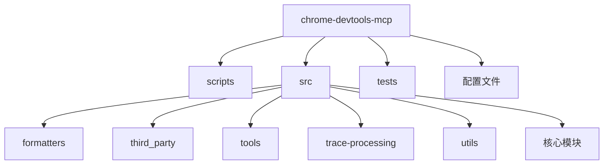
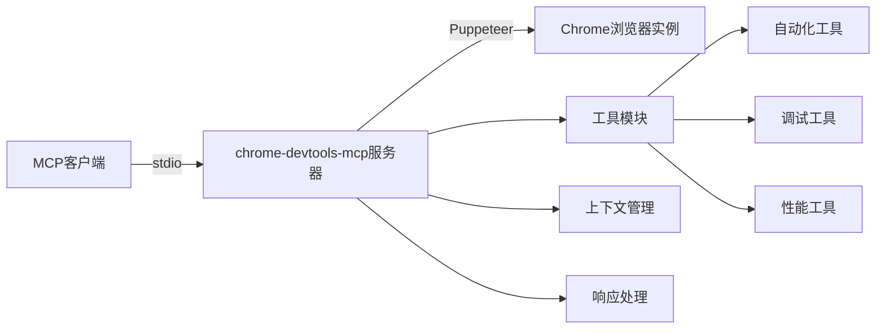
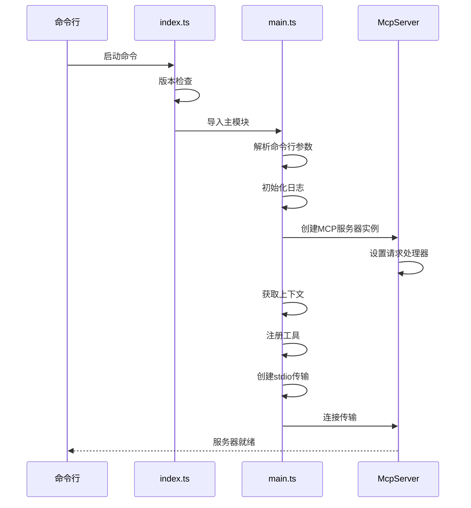
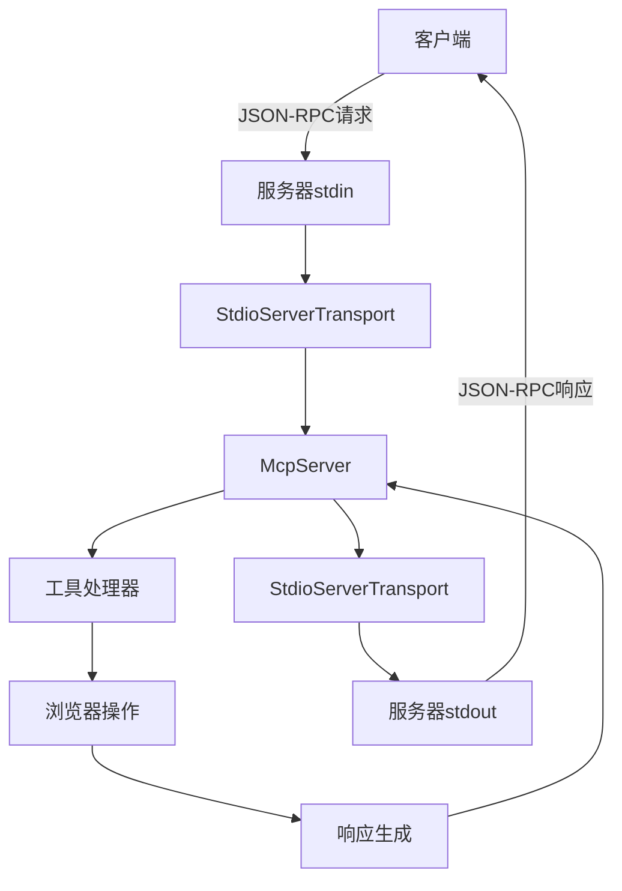
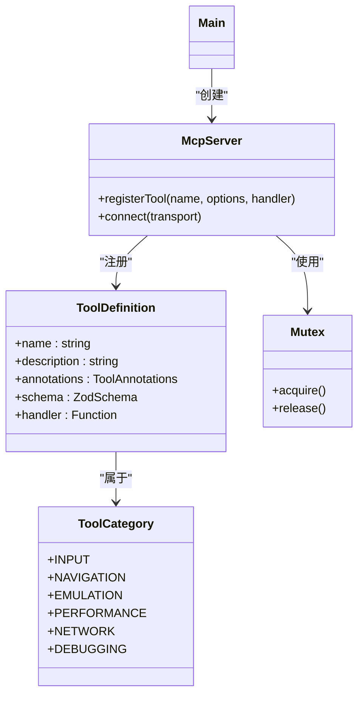
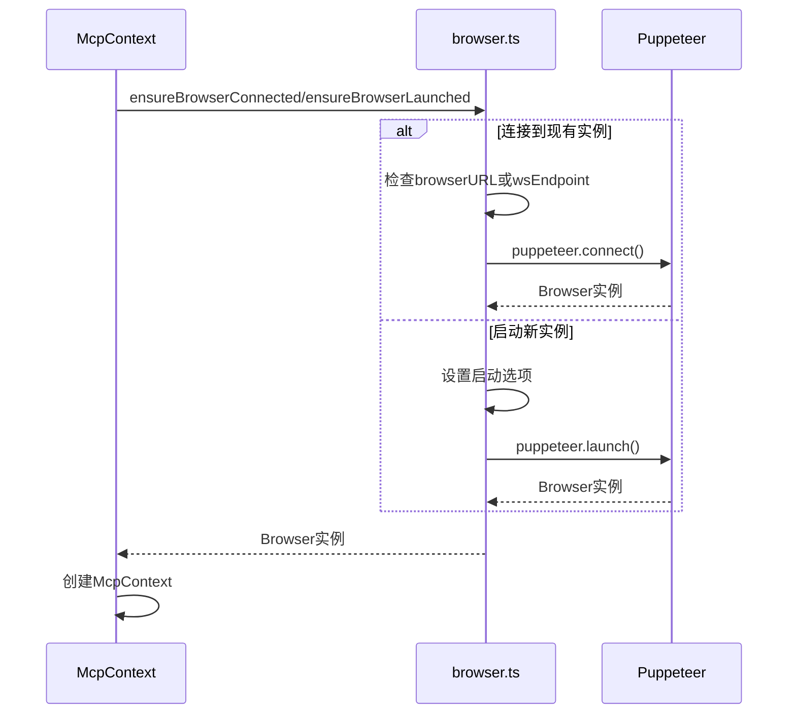
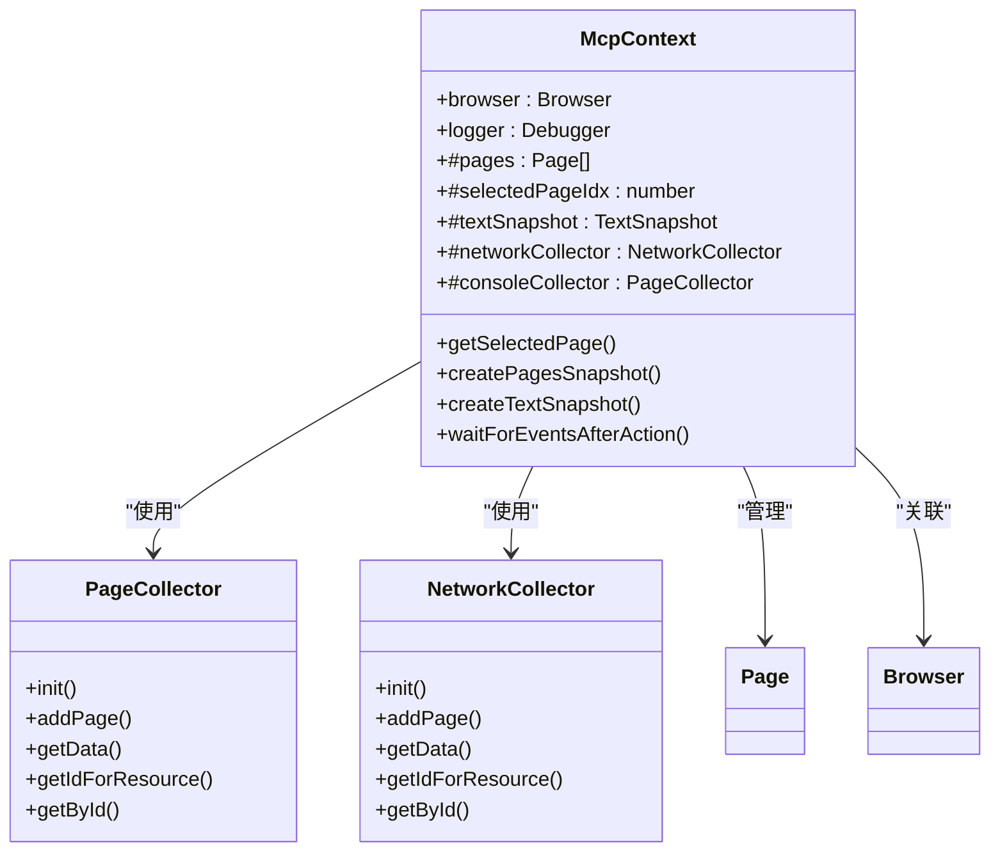
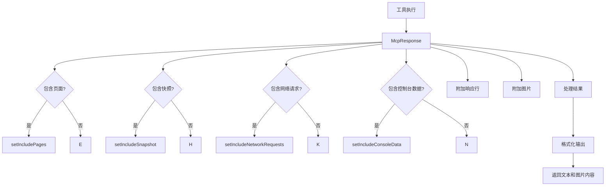
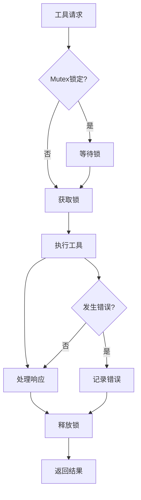

# 集成指南

<cite>
**本文档中引用的文件**  
- [README.md](file://README.md)
- [package.json](file://package.json)
- [main.ts](file://src/main.ts)
- [index.ts](file://src/index.ts)
- [server.json](file://server.json)
- [cli.ts](file://src/cli.ts)
- [browser.ts](file://src/browser.ts)
- [third_party/index.ts](file://src/third_party/index.ts)
- [McpContext.ts](file://src/McpContext.ts)
- [McpResponse.ts](file://src/McpResponse.ts)
- [logger.ts](file://src/logger.ts)
- [Mutex.ts](file://src/Mutex.ts)
- [ToolDefinition.ts](file://src/tools/ToolDefinition.ts)
- [pages.ts](file://src/tools/pages.ts)
- [screenshot.ts](file://src/tools/screenshot.ts)
- [performance.ts](file://src/tools/performance.ts)
</cite>

## 目录
1. [简介](#简介)
2. [项目结构](#项目结构)
3. [核心组件](#核心组件)
4. [架构概述](#架构概述)
5. [详细组件分析](#详细组件分析)
6. [依赖分析](#依赖分析)
7. [性能考虑](#性能考虑)
8. [故障排除指南](#故障排除指南)
9. [结论](#结论)

## 简介
Chrome DevTools MCP 服务器使您的编码代理（如 Gemini、Claude、Cursor 或 Copilot）能够控制和检查实时 Chrome 浏览器。它作为模型上下文协议（MCP）服务器，为您的 AI 编码助手提供对 Chrome DevTools 的完整访问权限，以实现可靠的自动化、深入的调试和性能分析。

本集成指南将详细介绍如何将 chrome-devtools-mcp 服务器与各种 MCP 客户端集成，包括 stdio 传输协议的工作机制、消息格式（JSON-RPC）、流控制、服务器生命周期管理以及高级集成场景。

## 项目结构
该项目采用模块化设计，主要分为以下几个目录：

- `scripts/`: 包含构建、文档生成和验证脚本
- `src/`: 核心源代码目录
  - `formatters/`: 格式化工具输出的模块
  - `third_party/`: 第三方依赖的入口
  - `tools/`: 各种功能工具的实现
  - `trace-processing/`: 跟踪数据处理模块
  - `utils/`: 工具函数
  - 其他核心模块文件
- `tests/`: 测试代码
- 根目录包含配置文件和文档



**Diagram sources**
- [README.md](file://README.md#L0-L482)
- [package.json](file://package.json#L0-L74)

**Section sources**
- [README.md](file://README.md#L0-L482)
- [package.json](file://package.json#L0-L74)

## 核心组件
核心组件包括 MCP 服务器实现、浏览器连接适配器、上下文管理器、响应处理器和各种工具模块。服务器通过 stdio 与 MCP 客户端通信，使用 Puppeteer 控制 Chrome 浏览器实例，并通过工具定义提供丰富的功能。

**Section sources**
- [main.ts](file://src/main.ts#L0-L190)
- [McpContext.ts](file://src/McpContext.ts#L0-L486)
- [McpResponse.ts](file://src/McpResponse.ts#L0-L520)

## 架构概述
系统架构采用客户端-服务器模式，MCP 客户端通过 stdio 与 chrome-devtools-mcp 服务器通信，服务器通过 Puppeteer 控制 Chrome 浏览器实例。



**Diagram sources**
- [main.ts](file://src/main.ts#L0-L190)
- [third_party/index.ts](file://src/third_party/index.ts#L0-L26)

## 详细组件分析

### 服务器启动与生命周期管理
服务器的生命周期管理包括启动、保持运行和优雅关闭。启动过程由 `index.ts` 和 `main.ts` 文件控制。



**Diagram sources**
- [index.ts](file://src/index.ts#L0-L34)
- [main.ts](file://src/main.ts#L0-L190)

**Section sources**
- [index.ts](file://src/index.ts#L0-L34)
- [main.ts](file://src/main.ts#L0-L190)

### stdio传输协议工作机制
服务器使用 stdio 作为传输协议，通过标准输入输出与 MCP 客户端通信，实现进程间通信。



**Diagram sources**
- [main.ts](file://src/main.ts#L0-L190)
- [third_party/index.ts](file://src/third_party/index.ts#L0-L26)

**Section sources**
- [main.ts](file://src/main.ts#L0-L190)
- [third_party/index.ts](file://src/third_party/index.ts#L0-L26)

### 工具注册与执行机制
工具注册机制通过 `registerTool` 函数实现，所有工具按类别组织并根据配置条件注册。



**Diagram sources**
- [main.ts](file://src/main.ts#L0-L190)
- [ToolDefinition.ts](file://src/tools/ToolDefinition.ts#L0-L123)

**Section sources**
- [main.ts](file://src/main.ts#L0-L190)
- [ToolDefinition.ts](file://src/tools/ToolDefinition.ts#L0-L123)

### 浏览器连接管理
浏览器连接管理通过 `browser.ts` 文件实现，支持连接到现有实例或启动新实例。



**Diagram sources**
- [browser.ts](file://src/browser.ts#L0-L183)
- [McpContext.ts](file://src/McpContext.ts#L0-L486)

**Section sources**
- [browser.ts](file://src/browser.ts#L0-L183)
- [McpContext.ts](file://src/McpContext.ts#L0-L486)

### 页面与上下文管理
页面和上下文管理通过 `McpContext` 类实现，维护浏览器状态和页面信息。



**Diagram sources**
- [McpContext.ts](file://src/McpContext.ts#L0-L486)
- [PageCollector.ts](file://src/PageCollector.ts#L0-L100)

**Section sources**
- [McpContext.ts](file://src/McpContext.ts#L0-L486)

### 响应处理机制
响应处理通过 `McpResponse` 类实现，负责格式化工具执行结果。



**Diagram sources**
- [McpResponse.ts](file://src/McpResponse.ts#L0-L520)
- [formatters](file://src/formatters)

**Section sources**
- [McpResponse.ts](file://src/McpResponse.ts#L0-L520)

## 依赖分析
项目依赖关系清晰，核心依赖包括 Puppeteer 用于浏览器自动化，@modelcontextprotocol/sdk 用于 MCP 协议实现，以及各种工具库。

```mermaid
graph TD
A[chrome-devtools-mcp] --> B[@modelcontextprotocol/sdk]
A --> C[puppeteer]
A --> D[yargs]
A --> E[debug]
A --> F[zod]
B --> G[MCP协议]
C --> H[Chrome DevTools]
D --> I[命令行参数解析]
E --> J[调试日志]
F --> K[数据验证]
subgraph "工具模块"
T1[pages.ts]
T2[screenshot.ts]
T3[performance.ts]
T4[console.ts]
T5[network.ts]
end
A --> T1
A --> T2
A --> T3
A --> T4
A --> T5
T1 --> A
T2 --> A
T3 --> A
T4 --> A
T5 --> A
```

**Diagram sources**
- [package.json](file://package.json#L0-L74)
- [main.ts](file://src/main.ts#L0-L190)

**Section sources**
- [package.json](file://package.json#L0-L74)

## 性能考虑
服务器性能考虑包括并发控制、资源管理和错误处理。使用 Mutex 确保工具调用的串行化，避免并发问题。



**Diagram sources**
- [Mutex.ts](file://src/Mutex.ts#L0-L41)
- [main.ts](file://src/main.ts#L0-L190)

## 故障排除指南
常见问题包括浏览器启动失败、连接问题和权限限制。通过日志记录和错误处理机制帮助诊断问题。

**Section sources**
- [logger.ts](file://src/logger.ts#L0-L33)
- [README.md](file://README.md#L0-L482)

## 结论
chrome-devtools-mcp 服务器提供了一个强大而灵活的框架，用于将 Chrome DevTools 功能集成到各种 MCP 客户端中。通过清晰的架构设计、模块化的组件和完善的错误处理，开发者可以轻松实现浏览器自动化、调试和性能分析功能。