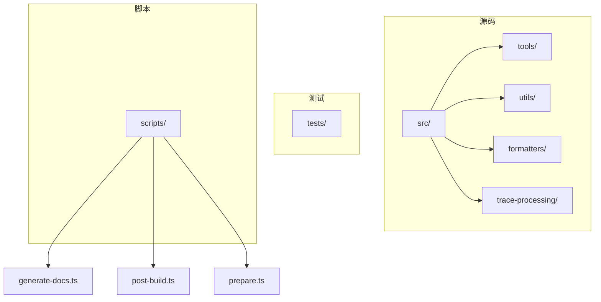
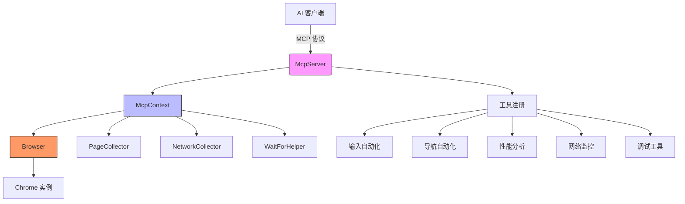
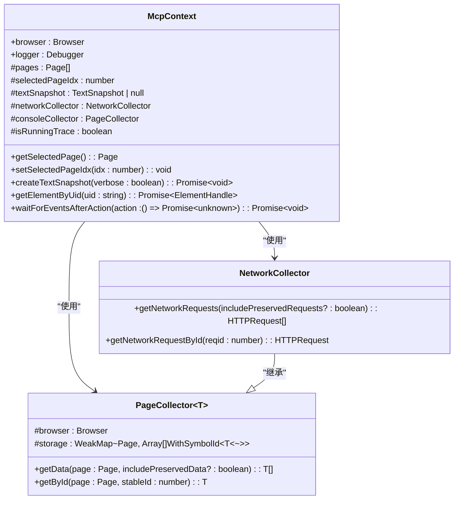
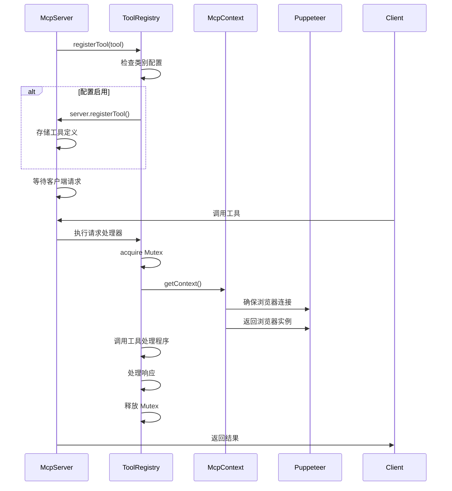
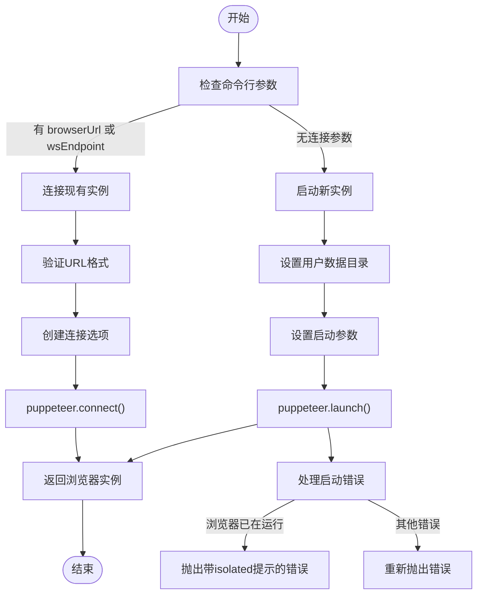

# 项目概述

<cite>
**本文档中引用的文件**  
- [README.md](file://README.md)
- [package.json](file://package.json)
- [src/index.ts](file://src/index.ts)
- [src/main.ts](file://src/main.ts)
- [src/McpContext.ts](file://src/McpContext.ts)
- [src/browser.ts](file://src/browser.ts)
- [src/cli.ts](file://src/cli.ts)
- [src/DevToolsConnectionAdapter.ts](file://src/DevToolsConnectionAdapter.ts)
- [src/tools/ToolDefinition.ts](file://src/tools/ToolDefinition.ts)
- [src/PageCollector.ts](file://src/PageCollector.ts)
- [src/tools/pages.ts](file://src/tools/pages.ts)
- [src/tools/performance.ts](file://src/tools/performance.ts)
- [src/tools/input.ts](file://src/tools/input.ts)
- [src/tools/categories.ts](file://src/tools/categories.ts)
- [src/logger.ts](file://src/logger.ts)
</cite>

## 目录
1. [简介](#简介)
2. [项目结构](#项目结构)
3. [核心组件](#核心组件)
4. [架构概述](#架构概述)
5. [详细组件分析](#详细组件分析)
6. [依赖分析](#依赖分析)
7. [性能考虑](#性能考虑)
8. [故障排除指南](#故障排除指南)
9. [结论](#结论)

## 简介
chrome-devtools-mcp 是一个 Model Context Protocol (MCP) 服务器，旨在为 AI 客户端（如 Gemini、Claude 等）提供对 Chrome DevTools 功能的标准化访问。该项目通过 MCP 协议暴露浏览器自动化、性能分析、网络监控和页面调试等核心能力，使 AI 助手能够可靠地控制和检查实时 Chrome 浏览器实例。项目基于 Puppeteer 控制 Chrome 实例，并通过模块化分层架构实现功能扩展，支持浏览器自动化、性能洞察、网络请求分析和页面调试等多种场景。

**Section sources**
- [README.md](file://README.md)

## 项目结构
chrome-devtools-mcp 项目采用清晰的模块化结构，主要分为 `src`、`tests`、`scripts` 等目录。`src` 目录包含核心功能实现，包括工具定义、上下文管理、浏览器连接和实用工具。`tests` 目录包含完整的测试套件，确保各功能模块的可靠性。`scripts` 目录包含构建、文档生成和验证脚本。项目使用 TypeScript 编写，通过 `package.json` 配置构建和依赖管理，整体结构遵循分层设计原则，便于维护和扩展。



**Diagram sources**
- [package.json](file://package.json)
- [src/index.ts](file://src/index.ts)

**Section sources**
- [package.json](file://package.json)
- [src/index.ts](file://src/index.ts)

## 核心组件
项目的核心组件包括 McpContext（上下文管理）、DevToolsConnectionAdapter（连接适配器）、工具注册机制和 CLI 配置解析。McpContext 采用单例模式管理浏览器状态，提供页面、网络请求和控制台消息的统一访问接口。DevToolsConnectionAdapter 实现适配器模式，将 Puppeteer 的连接传输适配为 DevTools 所需的连接格式。工具注册机制采用责任链模式，根据配置动态注册和启用不同类别的工具。CLI 配置解析模块处理命令行参数，支持连接现有浏览器实例或启动新实例。

**Section sources**
- [src/main.ts](file://src/main.ts)
- [src/McpContext.ts](file://src/McpContext.ts)
- [src/DevToolsConnectionAdapter.ts](file://src/DevToolsConnectionAdapter.ts)
- [src/cli.ts](file://src/cli.ts)

## 架构概述
chrome-devtools-mcp 采用基于 TypeScript 的模块化分层架构，核心设计原则包括单例模式的 McpContext 管理、适配器模式的 DevTools 连接处理以及责任链式的工具注册机制。系统通过 MCP 协议与 AI 客户端通信，接收工具调用请求，通过 Puppeteer 控制 Chrome 实例执行相应操作，并将结果返回给客户端。架构分为协议层、上下文管理层、工具执行层和浏览器控制层，各层职责分明，通过接口解耦，支持灵活扩展和配置。



**Diagram sources**
- [src/main.ts](file://src/main.ts)
- [src/McpContext.ts](file://src/McpContext.ts)
- [src/browser.ts](file://src/browser.ts)

**Section sources**
- [src/main.ts](file://src/main.ts)
- [src/McpContext.ts](file://src/McpContext.ts)
- [src/browser.ts](file://src/browser.ts)

## 详细组件分析

### McpContext 分析
McpContext 是项目的核心状态管理组件，采用单例模式确保全局状态一致性。它封装了浏览器实例、页面集合、网络请求收集器和控制台消息收集器，提供统一的 API 访问当前浏览器状态。组件通过 WeakMap 存储页面特定的状态（如网络条件、CPU 节流率），并在页面切换时自动更新超时设置。McpContext 还负责管理文本快照，通过 Accessibility API 生成页面的可访问性树，并为每个节点分配唯一 ID，支持基于 UID 的元素定位。



**Diagram sources**
- [src/McpContext.ts](file://src/McpContext.ts)
- [src/PageCollector.ts](file://src/PageCollector.ts)

**Section sources**
- [src/McpContext.ts](file://src/McpContext.ts)
- [src/PageCollector.ts](file://src/PageCollector.ts)

### 工具注册机制分析
工具注册机制采用责任链模式，通过 registerTool 函数根据配置条件动态注册工具。系统在启动时收集所有工具定义，根据类别配置（如 categoryEmulation、categoryPerformance）过滤并注册有效工具。每个工具注册时绑定请求处理器，处理器通过 Mutex 确保同一时间只有一个工具执行，避免状态冲突。请求处理器获取上下文，调用工具处理程序，并处理响应和错误，确保异常不会中断服务器运行。



**Diagram sources**
- [src/main.ts](file://src/main.ts)
- [src/McpContext.ts](file://src/McpContext.ts)
- [src/browser.ts](file://src/browser.ts)

**Section sources**
- [src/main.ts](file://src/main.ts)
- [src/McpContext.ts](file://src/McpContext.ts)
- [src/browser.ts](file://src/browser.ts)

### 浏览器连接分析
浏览器连接模块提供 ensureBrowserConnected 和 ensureBrowserLaunched 两个主要函数，分别用于连接现有浏览器实例和启动新实例。系统支持通过 --browserUrl 或 --wsEndpoint 参数连接远程调试端口，或自动启动 Chrome 实例。连接时使用 targetFilter 过滤内部页面，确保只关注用户页面。启动时支持配置用户数据目录、视口大小、代理服务器等选项，并处理不同操作系统下的路径差异。



**Diagram sources**
- [src/browser.ts](file://src/browser.ts)
- [src/cli.ts](file://src/cli.ts)

**Section sources**
- [src/browser.ts](file://src/browser.ts)
- [src/cli.ts](file://src/cli.ts)

## 依赖分析
项目依赖关系清晰，核心依赖包括 Puppeteer 用于浏览器自动化，@modelcontextprotocol/sdk 用于 MCP 协议实现，chrome-devtools-frontend 用于 DevTools 功能集成。项目通过 package.json 管理依赖版本，确保兼容性。内部模块间依赖遵循分层原则，上层模块依赖下层抽象，避免循环依赖。工具模块依赖 McpContext 和基础工具，McpContext 依赖浏览器控制和收集器模块，形成稳定的依赖树。

```mermaid
graph TD
A[chrome-devtools-mcp] --> B[Puppeteer]
A --> C[@modelcontextprotocol/sdk]
A --> D[chrome-devtools-frontend]
A --> E[core-js]
A --> F[debug]
A --> G[McpContext]
A --> H[DevToolsConnectionAdapter]
A --> I[PageCollector]
A --> J[cli]
G --> I
G --> H
H --> D
I --> B
J --> C
style A fill:#f9f,stroke:#333
style B fill:#bbf,stroke:#333
style C fill:#9f9,stroke:#333
```

**Diagram sources**
- [package.json](file://package.json)
- [src/main.ts](file://src/main.ts)

**Section sources**
- [package.json](file://package.json)
- [src/main.ts](file://src/main.ts)

## 性能考虑
项目在性能方面进行了多项优化。通过复用浏览器实例和页面，减少启动开销。使用 PageCollector 和 NetworkCollector 高效收集页面和网络数据，避免重复查询。在 McpContext 中缓存页面状态和快照，减少频繁的 DOM 查询。工具执行通过 Mutex 串行化，避免并发操作导致的性能问题和状态不一致。对于性能分析工具，系统支持自动停止跟踪和异步处理，确保不影响主线程响应。此外，项目支持 CPU 和网络节流，可模拟不同设备条件下的性能表现。

**Section sources**
- [src/McpContext.ts](file://src/McpContext.ts)
- [src/PageCollector.ts](file://src/PageCollector.ts)
- [src/tools/performance.ts](file://src/tools/performance.ts)

## 故障排除指南
项目提供详细的故障排除指南，常见问题包括浏览器启动失败、连接超时和权限问题。对于操作系统沙箱限制，建议禁用沙箱或使用 --browser-url 连接外部实例。对于 VM 到主机的端口转发问题，需检查网络配置和防火墙设置。项目支持通过 --logFile 参数记录调试日志，便于问题诊断。此外，通过环境变量 DEBUG=* 可启用详细日志输出，帮助定位问题根源。

**Section sources**
- [README.md](file://README.md)
- [src/logger.ts](file://src/logger.ts)

## 结论
chrome-devtools-mcp 项目成功实现了 MCP 服务器的核心功能，为 AI 客户端提供了对 Chrome DevTools 的标准化访问。项目采用模块化分层架构，通过单例模式、适配器模式和责任链模式等设计原则，实现了高内聚低耦合的系统设计。核心组件 McpContext 有效管理浏览器状态，工具注册机制灵活支持功能扩展。项目在 AI 与浏览器交互生态中具有重要价值，为 AI 驱动的网页导航、自动化表单填写和性能洞察分析等场景提供了强大支持。未来可进一步优化性能，增加更多 DevTools 功能集成，提升系统的稳定性和可用性。