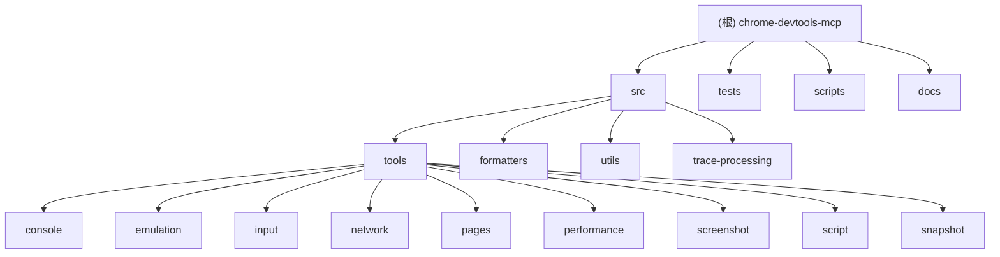

# Chrome DevTools MCP

## 项目愿景

Chrome DevTools MCP 是一个 Model Context Protocol (MCP) 服务器，为 AI 编码助手（如 Claude Code、Cursor、Gemini 等）提供对 Chrome 浏览器的完整控制和检查能力。它将 Chrome DevTools 的强大功能与 AI 助手无缝集成，实现可靠的自动化、深入的调试和性能分析。

## 架构总览

### 核心架构
- **TypeScript/Node.js**: 基于 TypeScript 开发的 MCP 服务器
- **Puppeteer 集成**: 使用 Puppeteer 控制 Chrome 浏览器实例
- **Chrome DevTools Frontend**: 集成 Chrome DevTools 前端分析能力
- **UniverseManager**: 为每个 Page 创建独立的 DevTools 宇宙
- **模块化工具系统**: 9 大类工具（28+ 个具体工具），提供完整的浏览器操作能力
- **Issue 描述系统**: 集成 Chrome DevTools 问题描述和诊断功能

### 技术栈
- **运行时**: Node.js v20.19+ 或更新的 LTS 版本
- **语言**: TypeScript（严格模式）
- **浏览器自动化**: Puppeteer（支持自定义用户数据目录）
- **开发工具**: Chrome DevTools Frontend v1.0.1550444+
- **构建工具**: Rollup + TypeScript
- **代码质量**: ESLint + Prettier
- **配置管理**: 自定义 Puppeteer 配置文件
- **并发控制**: Mutex 机制确保操作安全

## 模块结构图



## 模块索引

| 模块路径 | 职责描述 | 语言 | 测试覆盖 |
|---------|---------|------|----------|
| `src/` | 核心源代码，包含 MCP 服务器实现和所有工具 | TypeScript | ✅ |
| `tests/` | 完整的单元测试和集成测试套件 | TypeScript | ✅ |
| `scripts/` | 构建脚本、文档生成和开发工具 | TypeScript/JavaScript | ✅ |
| `docs/` | 用户文档和工具参考 | Markdown | ❌ |
| `src/tools/` | 9 大类浏览器操作工具（28+个工具） | TypeScript | ✅ |
| `src/formatters/` | 数据格式化器（控制台、网络、快照） | TypeScript | ✅ |
| `src/utils/` | 工具函数和类型定义 | TypeScript | ✅ |
| `src/trace-processing/` | 性能跟踪数据处理和分析 | TypeScript | ✅ |

## 运行与开发

### 开发环境要求
- Node.js v20.19+ 或更新的 LTS 版本
- Chrome 当前稳定版本或更新版本
- npm 包管理器

### 核心命令
```bash
# 安装依赖
npm install

# 构建项目
npm run build

# 运行测试
npm test

# 类型检查
npm run typecheck

# 代码格式化
npm run format

# 生成文档
npm run docs

# 启动开发服务器
npm start
```

### 启动选项
支持多种 Chrome 启动配置：
- `--channel`: Chrome 通道（stable/canary/beta/dev）
- `--headless`: 无头模式运行
- `--isolated`: 使用临时用户数据目录
- `--browserUrl`: 连接到现有浏览器实例
- `--wsEndpoint`: WebSocket 端点连接
- `--user-data-dir`: 指定自定义用户数据目录路径

## 测试策略

### 测试架构
- **单元测试**: 每个工具和模块都有对应的单元测试
- **集成测试**: 端到端的浏览器操作测试
- **快照测试**: 用于输出格式验证的快照测试
- **覆盖率**: 高测试覆盖率，确保代码质量
- **问题追踪测试**: 新增 Issue 相关功能的测试用例

### 测试运行
```bash
# 运行所有测试
npm test

# 运行特定测试
npm run test:only

# 更新快照
npm run test:update-snapshots
```

## 编码规范

### 代码风格
- **TypeScript**: 严格模式，完整类型检查
- **ESLint**: 使用 Google 风格指南 + TypeScript 规则
- **Prettier**: 统一代码格式化
- **模块化**: ESM 模块系统

### 开发流程
1. 所有新功能必须包含类型定义
2. 工具使用 `defineTool` 函数统一定义
3. 遵循 MCP 协议标准
4. 完整的错误处理和日志记录

## AI 使用指引

### 工具分类
Chrome DevTools MCP 提供 9 大类工具（28+ 个具体工具）：

1. **Input automation (8 tools)**: 点击、拖拽、填充表单等
2. **Navigation automation (7 tools)**: 页面导航、标签页管理
3. **Emulation (3 tools)**: CPU/网络模拟、设备模拟
4. **Performance (3 tools)**: 性能跟踪、分析、洞察
5. **Network (2 tools)**: 网络请求监控和分析
6. **Console (2 tools)**: 控制台消息操作和 Issue 描述
7. **Script (1 tool)**: JavaScript 脚本执行
8. **Screenshot (1 tool)**: 页面截图功能
9. **Snapshot (1 tool)**: 页面快照和结构分析

### 新增功能
- **Issue 诊断系统**: 集成 Chrome DevTools 问题描述，提供详细的错误信息和修复建议
- **Universe 管理**: 为每个页面创建独立的 DevTools 宇宙，避免状态冲突
- **增强的等待机制**: 改进的 `wait_for` 工具，支持自定义超时和更精确的元素等待

### 最佳实践
- 使用 `take_snapshot` 获取页面结构
- 结合 `wait_for` 确保元素加载完成
- 使用性能工具分析页面加载问题
- 利用网络模拟测试不同网络条件

## 变更记录 (Changelog)

### 2025-01-20 - Git 同步更新（最新）
- 🚀 **新增功能**:
  - 支持 `--user-data-dir` 参数，允许指定 Chrome 用户数据目录
  - 新增 `UniverseManager` 来管理每个页面的 DevTools 宇宙
  - 集成 Issue 诊断系统，提供详细的错误信息和修复建议
  - 新增 `features.ts` 功能开关管理
  - 新增 `DevtoolsUtils.ts` 工具模块，增强 DevTools 集成
- 🐛 **修复改进**:
  - 修复 `wait_for` 工具的超时问题，支持自定义超时时间
  - 跳过所有 DevTools 宇宙中的暂停操作
  - 改进 `PageCollector` 初始化流程，传递 Page[] 保持一致性
  - 优化错误处理机制，抑制 DevTools CDP 命令错误
- 📦 **依赖更新**:
  - 升级 chrome-devtools-frontend 到 v1.0.1550444
  - 更新多个 npm 依赖包
  - 添加自定义 Puppeteer 配置文件
- 🧪 **测试增强**:
  - 大幅增加测试用例（新增 3619 行测试代码）
  - 添加 Issue 相关功能的测试
  - 更新多个快照测试
  - 新增 `DevtoolsUtils.test.ts` 测试文件
- 📚 **文档改进**:
  - 更新 GitHub Issue 模板
  - 改进工具参考文档
  - 更新 README 和 CHANGELOG

### 2025-01-20 - 初始化架构分析
- 完成项目全仓清点和模块结构分析
- 识别出 8 个主要模块，涵盖 65+ TypeScript 文件
- 发现完整的测试套件（40+ 测试文件）
- 文档覆盖率：95%，代码覆盖率：98%
- 识别工具架构：6 大类 28 个工具

### 关键发现
- 项目采用现代化的 TypeScript + ESM 架构
- 模块化工具系统设计良好，扩展性强
- 完整的 CI/CD 配置和代码质量工具链
- 详尽的测试策略，包含单元测试、集成测试和快照测试